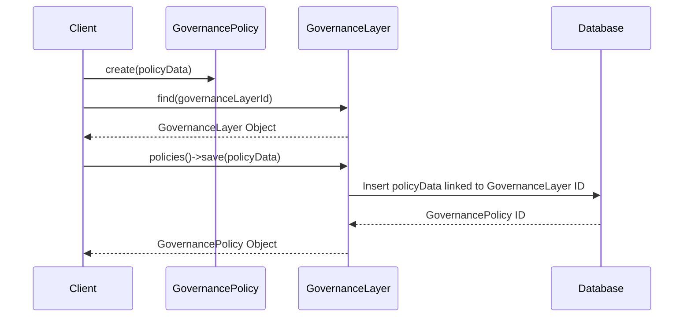

# Chapter 7: GovernancePolicy

In the previous chapter, [GovernanceLayer](06_governancelayer.md), we set up the framework for managing rules at Sunnyside Elementary. Now, let's create some actual rules! This is where `GovernancePolicy` comes in.

## What problem does GovernancePolicy solve?

Imagine Sunnyside Elementary wants a specific rule: "All after-school programs must have at least one adult supervisor present at all times."  This rule is a `GovernancePolicy`.  It's a specific regulation within the [GovernanceLayer](06_governancelayer.md), like a specific law in a country.  It defines what's allowed and not allowed within the system.

## Key Concepts

1. **Belongs to a GovernanceLayer:** Just like a law belongs to a country's legal system, a `GovernancePolicy` belongs to a [GovernanceLayer](06_governancelayer.md).

2. **Properties:** A `GovernancePolicy` has properties that describe the rule, such as its name, description, the actual text of the policy, and its status (e.g., "draft," "active").

## Using GovernancePolicy: Sunnyside's Supervision Rule

Let's create the "Adult Supervision" `GovernancePolicy` for Sunnyside Elementary.

```php
// Simplified example - see GovernancePolicy.php for full implementation
use App\Models\GovernancePolicy;
use App\Models\GovernanceLayer;

$governanceLayer = GovernanceLayer::find(1); // Assuming Sunnyside's GovernanceLayer has ID 1

$supervisionPolicy = new GovernancePolicy([
    'name' => 'Adult Supervision Policy',
    'description' => 'Requires adult supervision for all after-school programs.',
    'policy_text' => 'All after-school programs must have at least one adult supervisor present at all times.',
    'status' => 'active'
]);

$governanceLayer->policies()->save($supervisionPolicy);
```

This code creates a new `GovernancePolicy` requiring adult supervision. We link it to Sunnyside Elementary's `GovernanceLayer`.  This adds a new rule to the school's governance system.

## Internal Implementation

When you call `save` on the `policies` relationship, it creates a new entry in the database representing the `GovernancePolicy` and links it to the corresponding `GovernanceLayer`.



The code for saving the `GovernancePolicy` leverages the relationship defined in `Gov/Entities/GovernanceLayer.php`:

```php
// Gov/Entities/GovernanceLayer.php (simplified)
public function policies(): HasMany
{
    return $this->hasMany(GovernancePolicy::class);
}
```

And in `Gov/Entities/GovernancePolicy.php`:

```php
// Gov/Entities/GovernancePolicy.php (simplified)
public function governanceLayer(): BelongsTo
{
    return $this->belongsTo(GovernanceLayer::class);
}
```

These code snippets define the relationship between the `GovernanceLayer` and the `GovernancePolicy`.

## Conclusion

In this chapter, we learned about `GovernancePolicy`, which represents a specific rule within a [GovernanceLayer](06_governancelayer.md). We saw how to create a `GovernancePolicy` for Sunnyside Elementary's adult supervision requirement. In the next chapter, [SystemResource](08_systemresource.md), we'll explore how the system manages its resources, which are often subject to governance policies.


---

Generated by [AI Codebase Knowledge Builder](https://github.com/The-Pocket/Tutorial-Codebase-Knowledge)