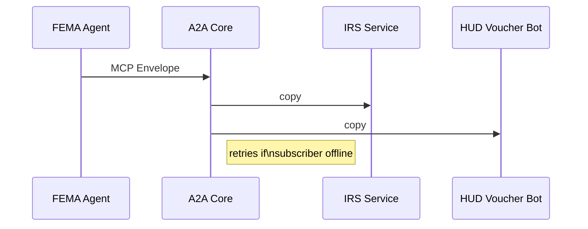
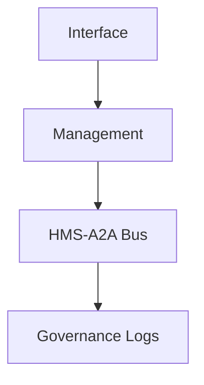

# Chapter 7: HMS-A2A Inter-Agency Messaging Bus

*[← Back to Chapter&nbsp;6: HMS-AGX Specialized Agent Extensions](06_hms_agx_specialized_agent_extensions_.md)*  

---

## 0. Why Do We Need A2A? — The “Disaster Relief Ping-Pong” Problem  

A tornado tears through Missouri.  
A citizen files an online **Disaster Relief Claim** that, behind the scenes, must:

1. Pull tax-return data from **IRS** (income verification).  
2. Fetch inspection photos from **FEMA** (damage assessment).  
3. Push a temporary-housing voucher to **HUD**.

Without a shared highway, each agency builds direct, brittle links to the other two—³× the integration work, endless “missing fax” errors.

**HMS-A2A** is that shared highway: a secure, always-on *messaging bus* where any agency can “publish once” and every subscribed agency gets the data instantly. Think digital pneumatic tubes covered in bubble-wrap and compliance stickers.

---

## 1. Key Concepts (Beginner-Friendly Cheat Sheet)

| Term | Kid-Friendly Analogy | One-Line Job |
|------|---------------------|--------------|
| Topic | Radio station (e.g., `disaster.claim.created`) | Channel you tune in to |
| Publisher | Radio DJ | Sends the message |
| Subscriber | Radio listener | Receives the message |
| Routing Key | Street address on the tube | Fine-grained delivery filter |
| Delivery Tier | “Signature required?” | `AT_MOST_ONCE`, `AT_LEAST_ONCE`, `EXACTLY_ONCE` |
| Dead-Letter Queue (DLQ) | Lost-and-found box | Stores undeliverable messages |

Memorize “**Topic → Publisher → Subscriber**”; everything else is garnish.

---

## 2. A 3-Step Mental Model

```mermaid
flowchart TD
  A[Publisher\n(FEMA Agent)] -->|sends| B[Topic:\n"disaster.claim.created"]
  B --> C[(HMS-A2A Bus)]
  C -->|routes| D[Subscriber\n(IRS Service)]
  C -->|routes| E[Subscriber\n(HUD Voucher Bot)]
```

1. Publisher drops a message on a **Topic**.  
2. **Bus** checks routing keys & delivery tier.  
3. Every matching **Subscriber** receives an MCP-wrapped copy—no extra code.

---

## 3. “Hello A2A” — 10 Lines to Publish, 10 Lines to Subscribe

### 3.1 Publisher (FEMA Agent)

```python
# publish_claim.py  (10 lines)
from hms_a2a import Bus, Envelope
bus = Bus("fema")

msg = Envelope.topic(
    "disaster.claim.created",
    payload={"claim_id": "CLM-456", "state": "MO"},
    delivery="AT_LEAST_ONCE"
)
bus.publish(msg)
```

Explanation  
1. `Bus("fema")` = get a client handle.  
2. `Envelope.topic(...)` builds an [MCP](02_model_context_protocol__hms_mcp__.md) envelope automatically.  
3. `publish` hands it to the bus; done.

### 3.2 Subscriber (IRS Service)

```python
# handle_claims.py  (≤10 lines)
from hms_a2a import Bus
bus = Bus("irs")

@bus.subscribe("disaster.claim.created", route="state=MO")
def process(claim):
    print("IRS got claim:", claim["claim_id"])
    # pull income data, then publish next topic...
bus.listen_forever()
```

Explanation  
1. `@bus.subscribe` listens to the same topic but only for Missouri claims.  
2. Function receives pure JSON; envelope metadata is available as `claim._meta` when needed.  

*Run both scripts in separate terminals and watch the message fly—no plumbing required.*

---

## 4. Under the Hood — What Happens After `publish`



Step-by-step:

1. Publisher sends an MCP envelope via HTTPS or gRPC.  
2. **A2A Core** logs the envelope (immutable), inspects the routing key, and places it on an internal queue (NATS).  
3. For each subscriber:  
   a. Push immediately if online.  
   b. Retry/back-off if offline.  
4. On failure after N retries, message moves to the **DLQ**; operators view it in [HMS-OPS](11_operational_nerve_center__hms_ops__.md).

---

## 5. Tiny Peek at Core Routing Logic (18 Lines)

```python
# hms_a2a/core.py  (simplified)
import json, uuid, time
class CoreBus:
    def publish(self, env):
        env["envelope"]["id"] = str(uuid.uuid4())
        env["envelope"]["timestamp"] = time.time()
        self._persist(env)                  # immutably log
        subs = self._match(env["topic"])
        for s in subs:
            self._deliver(env, s)

    def _match(self, topic):
        # pretend we do fancy routing-key math here
        return SUBSCRIBER_REGISTRY.get(topic, [])

    def _deliver(self, env, sub):
        try:
            sub.handle(json.dumps(env["payload"]))
        except Exception:
            self._retry_or_dlq(env, sub)
```

Beginner notes:  
• `_persist` writes to an append-only file; real code uses PostgreSQL.  
• `_match` returns a list of subscriber callbacks.  
• `_deliver` wraps basic retries before DLQ fallback.

---

## 6. Choosing the Right Delivery Tier

| Tier | When to Use | Trade-Off |
|------|-------------|-----------|
| AT_MOST_ONCE | Real-time dashboards | Risk of data loss |
| AT_LEAST_ONCE (default) | Financial records, citizen forms | May receive duplicates |
| EXACTLY_ONCE | Payment settlements | Higher latency, storage overhead |

Change tier with one line:

```python
Envelope.topic("disaster.voucher.issued", payload, delivery="EXACTLY_ONCE")
```

---

## 7. Common Pitfalls (and A2A Fixes)

Problem | Legacy | HMS-A2A
--------|--------|---------
Point-to-point spaghetti | 6 custom APIs for 4 agencies | One shared bus
Lost messages during outage | Silent failure | DLQ + retry dashboard in OPS
Version-mismatch headaches | Each team invents JSON | MCP envelope guarantees schema
Security nightmares | VPNs & firewall exceptions | Per-agency auth tokens + ESQ audit

---

## 8. Where A2A Lives in the GMI Cake



• Sits mostly on the **Management floor**—moving work items between agencies.  
• Every envelope also copies to Governance logs, allowing [HMS-ESQ](04_compliance___legal_reasoning__hms_esq__.md) audits later.

---

## 9. What You Learned

• HMS-A2A is the secure, agency-agnostic “pneumatic tube” for digital paperwork.  
• Publish/subscribe in under 20 lines using familiar MCP envelopes.  
• Built-in routing keys, delivery tiers, and DLQ keep data both speedy **and** safe.  
• Integrates seamlessly with earlier layers (ESQ audit, OPS monitoring).

Ready to orchestrate complex, multi-step workflows **across** those messages?  
Jump to [HMS-ACT Workflow Orchestrator](08_hms_act_workflow_orchestrator_.md).

---

---

Generated by [AI Codebase Knowledge Builder](https://github.com/The-Pocket/Tutorial-Codebase-Knowledge)