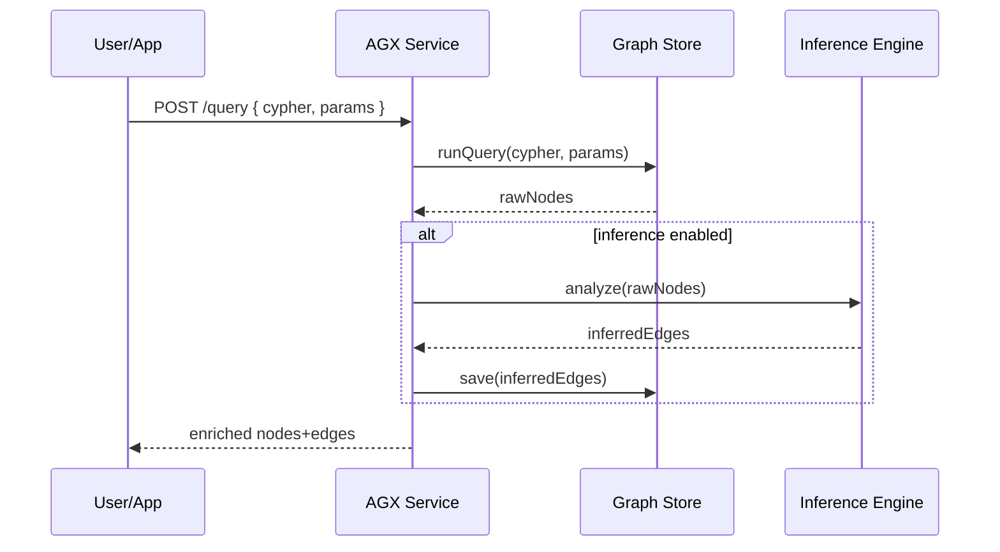

# Chapter 7: HMS-AGX (Knowledge Graph)

In [Chapter 6: HMS-API (Backend API)](06_hms_api__backend_api__.md) we learned how all services talk to our central “city hall.” Now we’ll build a **Knowledge Graph** that connects programs, past decisions, stakeholder feedback, and conflict resolutions—just like a policy think tank’s research library at your fingertips.

---

## 1. Motivation: Why a Knowledge Graph?

Imagine a policy analyst drafting a new **Emergency Housing Subsidy**. They need to know:

  - Which states passed similar bills?  
  - What stakeholder groups weighed in—and how?  
  - Which conflicts arose, and how were they resolved?  

Manually digging through meeting minutes, emails, and PDF reports takes hours or days. With HMS-AGX’s **Knowledge Graph**, an agent or AI can instantly surface:

  - Relevant programs and protocols  
  - Past approvals, rejections, and vote counts  
  - Stakeholder analyses and conflict-resolution memos  

This speeds up drafting, improves transparency, and avoids reinventing the wheel.

---

## 2. Key Concepts

1. **Nodes**  
   Entities like `Program`, `Decision`, `Stakeholder`, `Feedback`.

2. **Edges**  
   Relationships such as `supported_by`, `voted_on`, `commented_on`, `resolved`.

3. **Graph Store**  
   A database (e.g. Neo4j or RDF store) that keeps nodes and edges.

4. **Query Interface**  
   A simple API layer to ask questions like “show all stakeholders who opposed Program X.”

5. **Inference**  
   Optional AI routines that suggest new connections (e.g. “these two feedback entries are related”).

---

## 3. Using the Knowledge Graph

Here’s a minimal flow to **query** insights for “Emergency Housing Subsidy”.

### 3.1 Initialize the AGX Client

```js
// services/agxClient.js
const AGX = require('hms-agx-sdk');  
const client = new AGX({ apiUrl: 'https://agx.gov-ai.co' });
module.exports = client;
```
*We create an AGX client pointing to our Knowledge Graph API.*

### 3.2 Query Relevant Data

```js
// services/insightService.js
const agx = require('./agxClient');

async function getProgramInsights(programId) {
  return await agx.query(`
    MATCH (p:Program {id:$id})-[:voted_on|supported_by*1..2]-(x)
    RETURN x
  `, { id: programId });
}

// Example usage:
getProgramInsights(42).then(nodes => {
  console.log('Related nodes:', nodes);
});
```
*This Cypher-like query finds nodes 1–2 hops away—vote records, stakeholder comments, and resolutions.*

### 3.3 Sample Output

```json
[
  { "type": "Stakeholder", "name": "Housing Advocates" },
  { "type": "Decision",    "result": "Approved", "date": "2023-09-12" },
  { "type": "Feedback",    "comment": "Need more budget clarity" }
]
```
*We get a list of connected entities to guide our policy drafting.*

---

## 4. Under the Hood: Sequence Diagram



1. The client sends a graph query.  
2. AGX runs it on the graph store.  
3. If enabled, the inference engine adds new edges.  
4. The enriched result is returned.

---

## 5. Internal Implementation

Let’s peek at `lib/agx/graph.js` for two core functions.

### 5.1 Adding Nodes & Edges

```js
// lib/agx/graph.js
const db = require('./graphDb'); // wraps real graph DB calls

async function addNode(label, props) {
  // e.g. CREATE (n:Program {id:42,name:"Housing Subsidy"})
  return db.run(
    `CREATE (n:${label} $props) RETURN n`, { props }
  );
}
```
*Creates a node of given label with properties.*

```js
async function addEdge(fromId, toId, relType) {
  // MATCH two nodes then CREATE a relationship
  return db.run(`
    MATCH (a),(b)
    WHERE a.id=$from AND b.id=$to
    CREATE (a)-[:${relType}]->(b)
  `, { from: fromId, to: toId });
}
```
*Links two existing nodes.*

### 5.2 Querying the Graph

```js
// lib/agx/graph.js (continued)
async function query(cypher, params) {
  // A simple pass-through to the graph DB
  const result = await db.run(cypher, params);
  return result.records.map(r => r.toObject());
}

module.exports = { addNode, addEdge, query };
```
*We run any Cypher-like query and return plain JavaScript objects.*

---

## 6. Visualizing Results in a Frontend

In a web UI (e.g. HMS-GOV), we can show a graph with components like `v-block-base` or `slider-base`:

```vue
<template>
  <v-block-base>
    <h3>Program Insights</h3>
    <graph-view :nodes="nodes" :edges="edges" />
  </v-block-base>
</template>

<script>
import { getProgramInsights } from '@/services/insightService';
export default {
  data: () => ({ nodes: [], edges: [] }),
  async created() {
    const raw = await getProgramInsights(42);
    // transform raw into nodes/edges arrays...
    this.nodes = raw.filter(r=>r.type);
  }
};
</script>
```
*This shows how a UI component could render graph data.*

---

## 7. Conclusion

In this chapter you learned how **HMS-AGX** builds and queries a **Knowledge Graph** of programs, decisions, stakeholders, and feedback—just like a public-policy think tank database. You saw:

  - Core concepts: Nodes, Edges, Graph Store, Query Interface, Inference  
  - A simple client example fetching related entities  
  - Under-the-hood code for adding/querying graph data  
  - How to visualize insights in a frontend  

Next up, we’ll explore system-level metadata in [Chapter 8: HMS-NFO (System-Level Info)](08_hms_nfo__system_level_info__.md).

---

Generated by [AI Codebase Knowledge Builder](https://github.com/The-Pocket/Tutorial-Codebase-Knowledge)