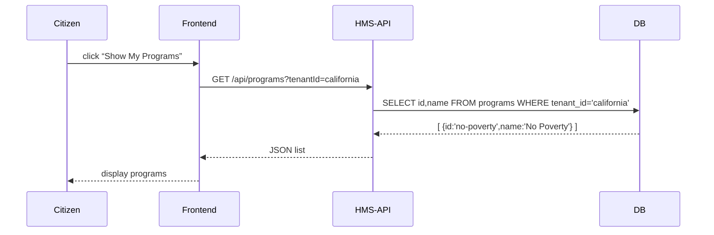

# Chapter 7: HMS-API (Backend API)

In [Chapter 6: AI Governance Framework](06_ai_governance_framework_.md) we wrapped our AI calls with policies and audits. Now we build the **central “brain”** of the HMS ecosystem—the **HMS-API**. Think of it as a government clerk’s office that:

1. Receives citizen requests (via portals).  
2. Follows policy rules and business logic.  
3. Reads/writes data in storage.  
4. Returns a clear response.

In this chapter we’ll show how to set up a minimal Express-based API, how requests flow through **Routers → Controllers → Services → Repositories**, and how data ultimately comes from your database.

---

## 1. Why HMS-API?

Use case: a citizen wants to view all available benefit programs for their state:

- They click “Show My Programs” on the frontend.  
- The frontend calls `GET /api/programs?tenantId=california`.  
- HMS-API checks auth, fetches programs for `california`, and returns JSON.

Without a central API, every frontend or agent would have to duplicate data access and business rules. HMS-API keeps everything in one place, ensuring consistency.

---

## 2. Key Concepts

1. Router  
   Defines URL paths and maps them to controllers.  
2. Controller  
   Handles `req`/`res`, extracts parameters, calls services.  
3. Service  
   Contains business logic and coordinates calls to repositories or other services.  
4. Repository  
   Encapsulates raw database queries (SQL, ORM, etc.).  
5. Middleware  
   Runs before controllers (e.g., auth, logging).

Together they form a chain:  
Citizen Request → Middleware → Router → Controller → Service → Repository → Database → back up the chain.

---

## 3. Building a Simple Endpoint

We’ll build `GET /api/programs` that returns a list of programs for a tenant.

### 3.1 Define the Route

```js
// src/api/routes/programs.js
const express = require('express')
const { getPrograms } = require('../controllers/programController')
const router = express.Router()

router.get('/', getPrograms)

module.exports = router
```
This creates a `/` route under `/api/programs` and forwards requests to our controller.

### 3.2 Write the Controller

```js
// src/api/controllers/programController.js
const programService = require('../../services/programService')

async function getPrograms(req, res) {
  const tenantId = req.query.tenantId
  const programs = await programService.list(tenantId)
  res.json(programs)
}

module.exports = { getPrograms }
```
The controller reads `tenantId` from the query string, calls the service, and returns JSON.

### 3.3 Implement the Service

```js
// src/services/programService.js
const programRepo = require('../repositories/programRepo')

async function list(tenantId) {
  // Here you could enforce policies or transform data
  return await programRepo.findByTenant(tenantId)
}

module.exports = { list }
```
The service layer is minimal now but is where you’d add business rules later.

### 3.4 Add the Repository

```js
// src/repositories/programRepo.js
const db = require('../db')  // simple DB client

function findByTenant(tenantId) {
  return db.query(
    'SELECT id, name FROM programs WHERE tenant_id = ?', 
    [tenantId]
  )
}

module.exports = { findByTenant }
```
The repository runs the SQL query to fetch programs filtered by tenant.

### 3.5 Wire It All Up

```js
// src/api/index.js
const express = require('express')
const programRoutes = require('./routes/programs')
const authMiddleware = require('../middleware/auth')

const app = express()
app.use(express.json())
app.use(authMiddleware)            // e.g., extracts user and tenant
app.use('/api/programs', programRoutes)

app.listen(3000, () => console.log('HMS-API running on port 3000'))
```
We mount our route under `/api/programs` and apply an `authMiddleware` globally.

---

## 4. Request Flow Walkthrough

Here’s what happens when a citizen’s browser requests `/api/programs?tenantId=california`:



1. **Frontend** sends an HTTP GET.  
2. **HMS-API** runs auth, routes to controller, and calls service.  
3. **Service** calls **Repository**, which queries the **DB**.  
4. Data flows back and is returned as JSON.

---

## 5. Under the Hood: File Structure

A minimal HMS-API might look like this:

```
src/
├── api/
│   ├── index.js              # Express setup
│   └── routes/
│       └── programs.js       # Route defs
│   └── controllers/
│       └── programController.js
├── services/
│   └── programService.js
├── repositories/
│   └── programRepo.js
├── middleware/
│   └── auth.js              # e.g., extracts user, tenant
└── db.js                     # simple DB client
```

Each layer has a single responsibility:  
- **api/** handles HTTP  
- **services/** contains logic  
- **repositories/** interact with the database  
- **middleware/** handles cross-cutting concerns  

---

## 6. Next Steps

You now know how to build a beginner-friendly backend API for HMS—our central “clerk’s office.” You saw how requests flow through middleware, routers, controllers, services, and repositories into the database and back. In the next chapter we’ll dive into the **Modules Directory**, where you organize and extend your business logic into reusable modules.

Continue to [Chapter 8: Modules Directory (Business Logic)](08_modules_directory__business_logic__.md).

---

Generated by [AI Codebase Knowledge Builder](https://github.com/The-Pocket/Tutorial-Codebase-Knowledge)