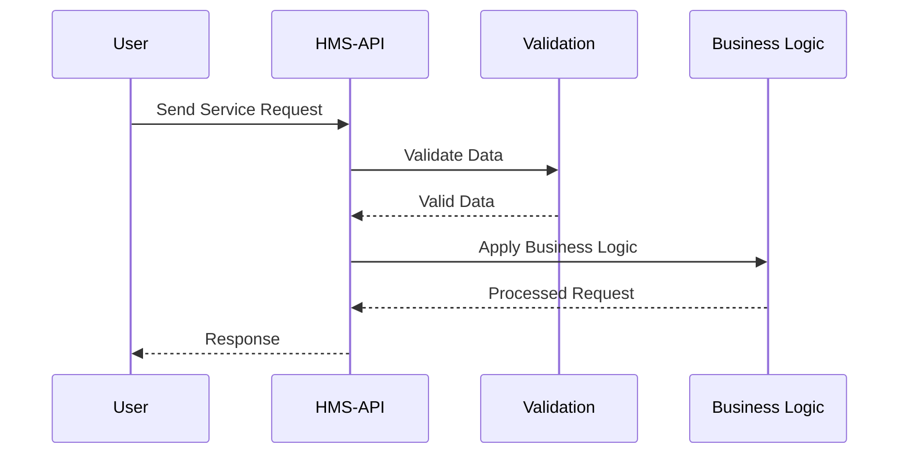

# Chapter 7: HMS-API

Welcome to Chapter 7, where we explore the HMS-API! If you've been following along, we've learned about the [AI Governance Framework](06_ai_governance_framework_.md), which ensures ethical operations within our systems. Now, let's dive into the HMS-API, the engine that powers our system by providing essential data and business logic for other components to function smoothly.

## Motivation and Use Case

Imagine a bustling restaurant kitchen. The HMS-API is like the head chef, orchestrating the entire flow of operations. It ensures that each dish is prepared correctly, coordinates between the pantry and the cooking stations, and keeps everything running smoothly.

Say you're managing a program to track government service requests. The HMS-API collects necessary data, checks against existing business rules, and provides the tools other systems need to process these requests efficiently.

## Understanding Key Concepts

Let's break down the HMS-API into simple concepts.

### Key Concept 1: Data Handling

The HMS-API acts like a skilled server who knows exactly what data to bring to each party at the table. It gathers, organizes, and serves the data needed for various components.

### Key Concept 2: Business Logic Management

Think of this as the secret recipe book. The API not only provides data but also applies important business rules and logic, ensuring processes adhere to specific guidelines before any action is taken.

## How to Use HMS-API

Let's explore how the HMS-API can be utilized to handle service requests.

```python
# Example usage of HMS-API to process service requests

class ServiceRequestAPI:
    def process_request(self, request):
        # Step 1: Validate request data
        # Step 2: Apply business logic
        # Step 3: Return response
        print("Processing completed for", request)

# Initialize the API
hms_api = ServiceRequestAPI()

# Make a service request
service_request = {"request_id": "REQ123", "type": "passport renewal"}

# Process the request
hms_api.process_request(service_request)
```

**Explanation:**

- **Class Definition**: We create a `ServiceRequestAPI` class to represent our HMS-API.
- **Method `process_request`**: This method simulates validating request data, applying business logic, and then responding.
- **Initialization & Request**: We initialize an instance and then call the `process_request` method to handle our request.

## Behind the Scenes

To understand what happens when a request is processed, let's visualize it.



**Step-by-Step Breakdown:**

1. **User Sends Request**: The user's service request enters the API.
2. **Data Validation**: The request is validated.
3. **Business Logic Application**: The API applies business rules.
4. **Response**: A response is sent back to the user.

## Internal Implementation

Now, let's look at a simplified representation of how the back-end might work.

```plaintext
# Internal workings of the HMS-API component
class HMS_API:
    def process_service(self, request):
        if self.validate(request):
            return self.apply_business_logic(request)
        return "Invalid request"

    def validate(self, request):
        # Placeholder validation logic
        return True

    def apply_business_logic(self, request):
        # Placeholder for business rules application
        return f"Request {request['request_id']} processed"
```

In this snippet, we have:

- **Validation**: Simplified logic to check request validity.
- **Business Logic**: Applies rules to ensure proper request processing, returning a message.

---

## Conclusion

In this chapter, we learned about the HMS-API and how it serves as the powerful engine driving data handling and business logic within systems. This API acts like a head chef organizing data, ensuring everything is prepped and ready for other components to do their job efficiently.

Ready to explore more? Let's head into [HMS-GOV](08_hms_gov_.md) in the next chapter, where we will delve into governance topics. Keep up the great work!

---

Generated by [AI Codebase Knowledge Builder](https://github.com/The-Pocket/Tutorial-Codebase-Knowledge)