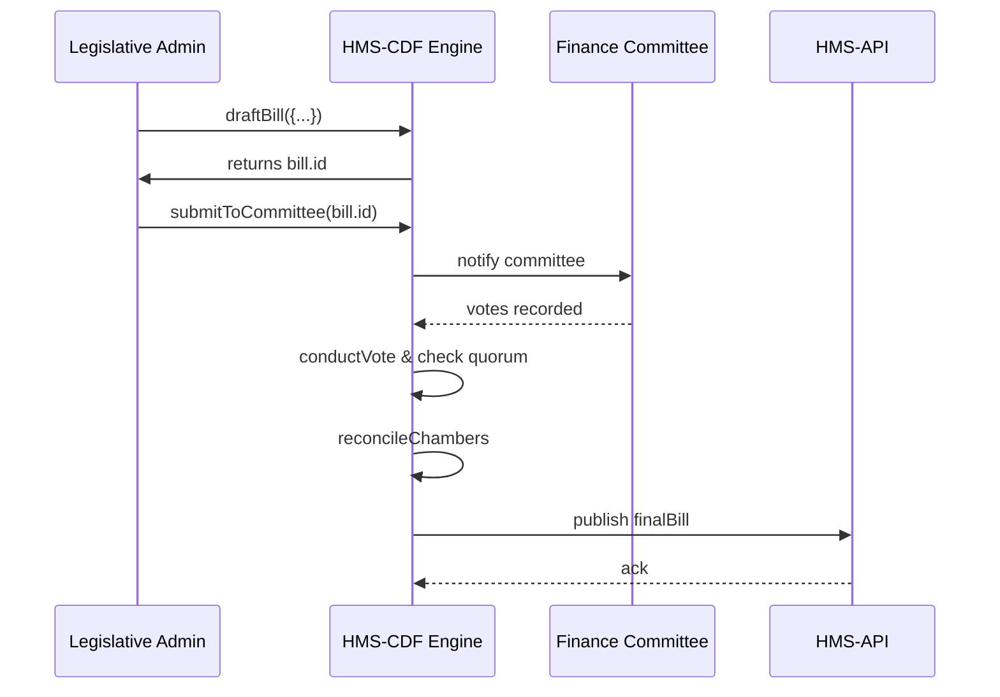

# Chapter 7: HMS-CDF (Legislative Engine)

In [Chapter 6: Policy Engine](06_policy_engine_.md) we learned how policies are defined, validated, and deployed. Now we’ll explore **HMS-CDF**, our high-performance engine that automates the entire lawmaking workflow—from drafting to voting to multi-chamber reconciliation—in minutes instead of months.

---

## 1. Motivation & Central Use Case

Problem: Traditional lawmaking is slow. Bills move paper-by-paper through drafting, committee reviews, floor votes in each chamber, then reconciliation. Tracking quorums, amendments and final publication can take months.

Use Case Example:  
The “No Poverty Act” needs to pass three bodies (House, Senate, Joint Committee) before it updates program rules in **HMS-API**. With HMS-CDF you:

1. Draft the bill text and sections.  
2. Assign it to a committee for review.  
3. Run votes in House and Senate with quorum checks.  
4. Reconcile differences and finalize the act.  
5. Automatically publish it so **HMS-API** applies new policy caps.

All of this happens in minutes, logged and auditable end-to-end.

---

## 2. Key Concepts

1. **Bill**  
   A digital object representing proposed legislation, made of sections and clauses.

2. **Committee Review**  
   A step where a small group examines the bill, suggests amendments, and votes to advance.

3. **Quorum Rule**  
   Minimum number of members required to hold a valid vote in each chamber.

4. **Vote Tally**  
   A record of votes (“yes”, “no”, “abstain”) used to decide if a bill passes a stage.

5. **Reconciliation**  
   The process of merging different versions passed by two chambers into a single final text.

---

## 3. Automating a Bill Workflow

Below is a minimal example flow using HMS-CDF’s API or SDK. Each code block is under 20 lines.

### 3.1 Drafting a Bill

```js
// draftBill.js
import { cdf } from './client'  

async function draft() {
  const bill = await cdf.draftBill({
    title: "No Poverty Act",
    sections: [
      { id: "sec1", text: "Set income cap at $30k" }
    ]
  })
  console.log("Drafted Bill ID:", bill.id)
}
draft()
```

This sends a request to create a new bill object. You get back a `bill.id` to track it.

### 3.2 Committee Review

```js
// submit to committee
await cdf.submitToCommittee(bill.id, {
  committeeId: "Finance",
  quorum: 5
})
console.log("Bill under Finance Committee review")
```

Here we assign the bill to the “Finance” committee and enforce a 5-member quorum before voting.

### 3.3 Voting in Chambers

```js
// cast votes in House
await cdf.conductVote(bill.id, {
  chamber: "House",
  votes: { yes: 220, no: 210, abstain: 5 }
})
console.log("House vote complete")
```

This step checks the quorum rule, tallies votes, and records if the bill passed or failed in the House.

### 3.4 Reconciliation & Publication

```js
// merge House & Senate texts
const finalBill = await cdf.reconcileChambers(bill.id, {
  chambers: ["House","Senate"]
})
// publish act so HMS-API picks up new rules
await cdf.publish(finalBill.id)
console.log("Bill passed and published")
```

Reconciliation merges both versions, then `publish()` makes the act active. Downstream, **HMS-API** sees the new policy caps instantly.

---

## 4. What Happens Under the Hood



1. Admin drafts and submits the bill.  
2. Committee members vote; CDF enforces quorum.  
3. CDF runs floor votes in each chamber.  
4. CDF reconciles versions and pushes the final act to **HMS-API**.

---

## 5. Internal Implementation

### 5.1 File Structure

```
hms-cdf/
├── src/
│   ├── controllers/
│   │   └── cdfController.js
│   ├── services/
│   │   ├── draftService.js
│   │   ├── voteService.js
│   │   └── reconcileService.js
│   └── app.js
```

### 5.2 Draft Service

```js
// src/services/draftService.js
export async function createBill(data) {
  // validate title & sections
  if (!data.title) throw new Error("Title is required")
  // save to DB
  const [bill] = await db('bills').insert(data).returning('*')
  return bill
}
```

### 5.3 Vote Service

```js
// src/services/voteService.js
export async function conductVote(billId, { chamber, votes }) {
  // check quorum
  const total = votes.yes + votes.no + votes.abstain
  if (total < MIN_QUORUM[chamber]) {
    throw new Error("Quorum not met")
  }
  // record tally
  await db('votes').insert({ billId, chamber, votes: JSON.stringify(votes) })
}
```

### 5.4 Reconcile Service

```js
// src/services/reconcileService.js
export async function mergeChambers(billId, chambers) {
  // fetch texts from both chambers
  const texts = await Promise.all(
    chambers.map(c => db('edits').where({ billId, chamber: c }))
  )
  // naive merge: pick last edit from each
  const mergedText = texts.flat().map(e => e.text).join("\n")
  await db('bills').where({ id: billId }).update({ text: mergedText })
  return { id: billId, text: mergedText }
}
```

---

## 6. Conclusion & Next Steps

Congratulations! You’ve seen how **HMS-CDF** packages the formal legislative process into an automated engine:

- Draft bills with structured sections  
- Enforce committee reviews and quorum rules  
- Run votes in multiple chambers  
- Reconcile different versions and publish laws instantly  

In the next chapter, we’ll explore how agents talk to each other with **HMS-A2A (Agent-to-Agent System)**. See you there!

[Chapter 8: HMS-A2A (Agent-to-Agent System)](08_hms_a2a__agent_to_agent_system__.md)

---

Generated by [AI Codebase Knowledge Builder](https://github.com/The-Pocket/Tutorial-Codebase-Knowledge)