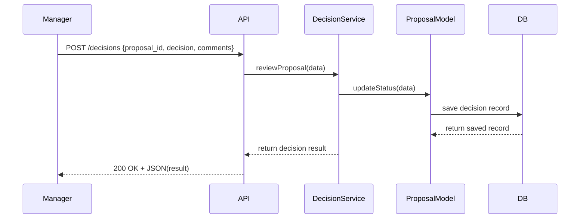

# Chapter 7: Human Decision Maker

In [Chapter 6: Process Proposal](06_process_proposal_.md), you saw how AI agents draft structured before-and-after memos for workflow or policy changes. Now it’s time for the **Human Decision Maker**—the person who reviews, tweaks, and approves (or rejects) those proposals. This step ensures real-world accountability, legal compliance, and that every change has an official sign-off.

## Why a Human Decision Maker Matters

Imagine the National Park Service (NPS) uses an AI agent to propose a faster permit-application workflow. Before rolling it out to all parks, a park manager needs to:

- Review the AI’s suggested steps  
- Add or remove checkpoints  
- Officially approve or send it back for revision  

This “human-in-the-loop” ensures that no automated change goes live without proper oversight.

## Key Concepts

1. **Actor Profile**  
   A User (e.g., park manager, program director) with authority to make decisions.

2. **Review Action**  
   The decision itself (`approved`, `rejected`, `needs_changes`) and optional comments.

3. **Override & Edit**  
   Managers can adjust fields or steps before finalizing.

4. **Audit Trail**  
   Every decision is logged for accountability, with timestamps and user info.

## Using the Human Decision Maker

Let’s walk through how a manager reviews a proposal in code.

```php
use App\Services\DecisionService;

// 1. Load the manager’s actor profile
$manager = DecisionService::getHumanDecisionMaker($userId);

// 2. Manager reviews the Process Proposal
$decision = $manager->reviewProposal([
  'proposal_id' => $proposal->id,
  'decision'    => 'approved',          // or 'rejected', 'needs_changes'
  'comments'    => 'Looks solid—move ahead.'
]);

// 3. Inspect the result
echo $decision->status;    // "approved"
echo $decision->comments;  // "Looks solid—move ahead."
```

Explanation:
- We fetch a `HumanDecisionMaker` tied to a real user.
- We call `reviewProposal()` with the proposal ID, a decision, and comments.
- The method returns a small object containing the final status.

## What Happens Under the Hood



1. The manager’s client sends a decision via the API.  
2. The API hands off to `DecisionService`.  
3. The service updates the `ProcessProposal` model’s status and logs comments.  
4. The database persists the record.  
5. The API returns the outcome to the manager.

## Under the Hood: Code Walkthrough

### 1. HumanDecisionMaker Model

File: `app/Models/Decision/HumanDecisionMaker.php`

```php
<?php
namespace App\Models\Decision;

class HumanDecisionMaker
{
    protected $userId;
    public function __construct(int $userId)
    {
        $this->userId = $userId;
    }

    // Core method: review a proposal
    public function reviewProposal(array $data)
    {
        // 1. Load the proposal
        // 2. Check permissions for $this->userId
        // 3. Update status & comments
        // 4. Return updated record
    }
}
```

### 2. DecisionService

File: `app/Services/DecisionService.php`

```php
<?php
namespace App\Services;

use App\Models\Decision\HumanDecisionMaker;

class DecisionService
{
    public static function getHumanDecisionMaker(int $userId)
    {
        // Pseudo: verify user exists & has decision rights
        return new HumanDecisionMaker($userId);
    }
}
```

These simple classes isolate:
- **Who** is making the decision (`HumanDecisionMaker`).  
- **How** the decision is applied (`reviewProposal()`).  
- **Where** permissions and logging happen (in service or model).

## Real-World Analogy

Think of the Human Decision Maker as a judge reviewing a proposed law:

- The AI writes the draft bill (Process Proposal).  
- The judge reads it, annotates changes, and stamps “approved” or “rejected.”  
- All notes are logged so the legislature can audit who changed what.

## Summary

You’ve learned how HMS-API ensures a real person reviews every AI-generated change:

- **Actor**: the Human Decision Maker tied to a user ID.  
- **Actions**: approve, reject, or request changes with comments.  
- **Audit**: all decisions are logged for compliance.  

Next up, we’ll see how approved proposals become live rules in [Chapter 8: Policy Deployment](08_policy_deployment_.md).

---

Generated by [AI Codebase Knowledge Builder](https://github.com/The-Pocket/Tutorial-Codebase-Knowledge)