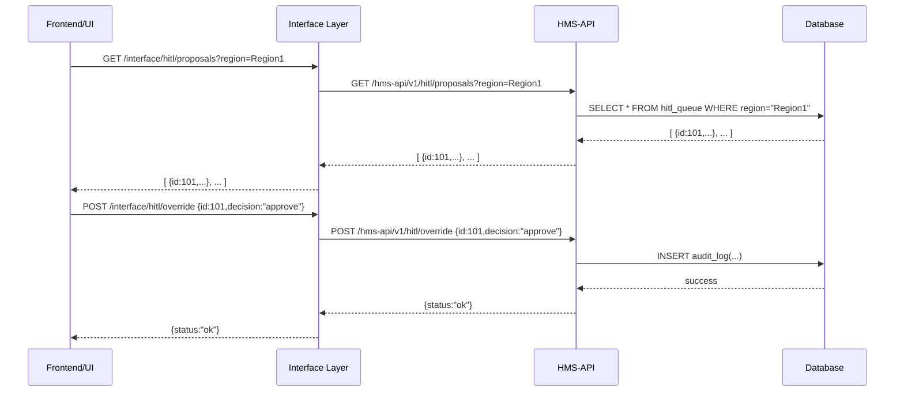

# Chapter 7: Human-in-the-Loop (HITL) Override

In [Chapter 6: Policy Deployment Workflow](06_policy_deployment_workflow_.md), we saw how approved policies get committed, tested, and deployed automatically. Now we’ll add a final safety net: the **Human-in-the-Loop (HITL) Override**. This checkpoint lets a qualified official review—or even veto—any AI-generated proposals before they go live.

---

## 1. Motivation & Central Use Case

Imagine the Environmental Protection Agency (EPA) has an AI-generated inspection schedule for chemical sites in “Region 1.” Before this goes into effect, a senior manager needs to:

- Review the AI’s proposal  
- Adjust inspection frequencies or areas  
- Approve or reject it formally  

This preserves accountability and transparency—just like a senior manager stamping **APPROVED** or **REJECTED** on policy drafts.

---

## 2. Key Concepts

We break HITL Override into four beginner-friendly pieces:

1. **Review Queue**  
   A list of all AI-drafted proposals pending human sign-off.

2. **Override Actions**  
   The decisions a reviewer can take:  
   - **approve** (green light)  
   - **veto** (stop deployment)  
   - **adjust** (modify parameters)

3. **Audit Trail**  
   Every decision and comment gets logged with who reviewed and when.

4. **Notifications**  
   Alert stakeholders when a proposal is ready for review or a final decision is made.

---

## 3. Using HITL Override in Code

Here’s a minimal example showing how a script (or UI) might fetch pending items and submit a decision:

```python
# app.py
from hms_mkt.services.hitl_service import HITLService

service = HITLService(api_token="YOUR_TOKEN")

# 1. Fetch all proposals for Region 1
pending = service.fetch_pending(region="Region1")
print("Pending proposals:", pending)

# 2. Approve the first proposal with a comment
first_id = pending[0]["id"]
service.submit_override(
    proposal_id=first_id,
    decision="approve",
    comments="Looks good – proceed."
)
```

Explanation:  
1. `fetch_pending()` returns a list of draft items.  
2. `submit_override()` sends your decision and comment to the backend.

---

## 4. Step-by-Step Flow



---

## 5. Under the Hood

### 5.1 API Handlers

File: `hms_mkt/handlers/hitl.py`

```python
from flask import request, jsonify
from hms_sys.auth import verify_token
from hms_mkt.services.hitl_service import HITLService

service = HITLService()

@app.route('/hms-api/v1/hitl/proposals', methods=['GET'])
def list_proposals():
    user = verify_token(request.headers)  # check role
    region = request.args.get('region')
    items = service.fetch_pending(region)
    return jsonify(items), 200

@app.route('/hms-api/v1/hitl/override', methods=['POST'])
def override_proposal():
    user = verify_token(request.headers)
    data = request.json
    service.submit_override(
      proposal_id=data["id"],
      decision=data["decision"],
      comments=data.get("comments","")
    )
    return jsonify({"status":"ok"}), 200
```

_Explanation:_  
- We verify the reviewer’s token via [HMS-SYS Auth](01_core_system_platform__hms_sys__.md).  
- Two endpoints: one to fetch drafts, one to submit a decision.

### 5.2 Service Implementation

File: `hms_mkt/services/hitl_service.py`

```python
import datetime
from hms_sys.logging import LoggingService
from hms_sys.messaging import MessagingService
from database import DBClient  # placeholder

class HITLService:
    def __init__(self):
        self.db = DBClient()
        self.logger = LoggingService(audit_store=self.db)
        self.messenger = MessagingService(msg_queue=self.db)

    def fetch_pending(self, region):
        return self.db.query(
          "SELECT * FROM hitl_queue WHERE region=%s AND status='pending'",
          (region,)
        )

    def submit_override(self, proposal_id, decision, comments=""):
        timestamp = datetime.datetime.utcnow()
        # 1. Record decision
        self.db.execute(
          "UPDATE hitl_queue SET status=%s WHERE id=%s",
          (decision, proposal_id)
        )
        # 2. Log audit entry
        self.logger.info(
          user_id="reviewer123",
          message=f"Proposal {proposal_id} {decision}: {comments}"
        )
        # 3. Publish event so downstream systems know
        self.messenger.send(
          topic="HITLDecision",
          payload={"id":proposal_id,"decision":decision}
        )
```

_Explanation:_  
1. We mark the draft as approved/rejected.  
2. We log an audit record via [HMS-SYS Logging](01_core_system_platform__hms_sys__.md).  
3. We publish an event so other services can act (e.g., deploy or discard).

---

## 6. Summary & Next Steps

You’ve learned how the **HITL Override** lets real people review and stamp AI drafts, ensuring accountability:

- A **Review Queue** holds all AI proposals  
- **Override Actions** let a manager approve, veto, or adjust  
- An **Audit Trail** logs every decision  
- **Notifications** inform other systems via messaging  

Next, we’ll expand our oversight with the **Governance Layer**, adding policies for roles, approvals, and compliance checks:

[Chapter 8: Governance Layer](08_governance_layer_.md)

---

Generated by [AI Codebase Knowledge Builder](https://github.com/The-Pocket/Tutorial-Codebase-Knowledge)