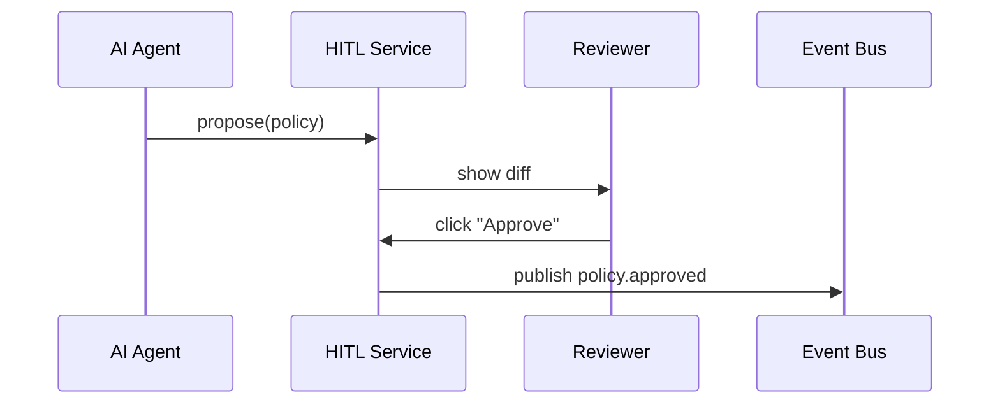

# Chapter 7: Human-in-the-Loop (HITL) Oversight  
*(The “Air-Traffic Controller” for Every AI Action)*  

[← Back to Chapter&nbsp;6: AI Governance Values Framework](06_ai_governance_values_framework_.md)

---

## 1. Why Do We Need Humans at the Switch?

Meet **Lena**, a water-operations engineer at the **Bureau of Reclamation**.  
An AI agent just drafted a **new dam-release policy** that would:

* Increase downstream flow by 15 %  
* Cut power generation by 3 %  

Great… maybe.  
If the change goes live instantly, farmers might cheer while grid operators scramble.  
Lena wants a **quick side-by-side view**, the ability to **tweak numbers**, and a big **“Approve”** button—just like an air-traffic controller can overrule autopilot.

That cockpit is exactly what **Human-in-the-Loop (HITL) Oversight** provides.

---

## 2. Key Concepts (Plain English)

| Term | What It Really Means | Tiny Analogy |
|------|----------------------|--------------|
| HITL Checkpoint | A pause inserted before an AI policy turns “live.” | Yellow light at an intersection. |
| Proposed vs. Current Diff | Dashboard panel comparing new vs. old metrics. | Two columns on a grocery receipt. |
| Soft Pause | Temporarily hold a policy for more data. | Hitting “snooze” on an alarm. |
| Override | Human edit that replaces part of the AI output. | Pilot grabbing the yoke. |
| Feedback Loop | The edited decision is fed back to the AI model for learning. | Teacher correcting homework. |

---

## 3. Quickstart: Your First HITL Checkpoint (18 Lines)

```ts
// hitl/registerCheckpoint.ts
import { enqueue } from "./queue";
import { can } from "../access/can";            // from RBAC chapter

export function registerCheckpoint(user, proposal) {
  if (!can(user.role, "review:policy")) throw "403";

  // 1. Diff current ↔ proposed
  const diff = {
    flowChange: proposal.flow - proposal.currentFlow,
    powerChange: proposal.power - proposal.currentPower,
  };

  // 2. Create review task
  enqueue({
    id: proposal.id,
    diff,
    status: "awaiting_review",
    proposal,
  });
}
```

**What just happened?**  
A helper function calculates the **impact diff** and places a task in the “Review Queue.”  
Only users with `review:policy` permission (see [Role-Based Access Control](03_role_based_access_control__rbac__.md)) may call it.

---

## 4. How Lena Sees It (Front-End, 16 Lines)

```tsx
// components/ReviewCard.tsx
export function ReviewCard({ task, onDecision }) {
  return (
    <Card title="Dam Release Proposal">
      <Table rows={[
        ["Current Flow", task.proposal.currentFlow + " cfs"],
        ["Proposed Flow", task.proposal.flow + " cfs"],
        ["Δ Flow", task.diff.flowChange + "%"],
        ["Δ Power", task.diff.powerChange + "%"]
      ]}/>
      <Textarea label="Comment" onChange={e=>task.note=e.target.value}/>
      <Button label="Approve" onClick={()=>onDecision("approve", task)}/>
      <Button label="Modify"  onClick={()=>onDecision("modify",  task)}/>
      <Button variant="danger" label="Reject" onClick={()=>onDecision("reject", task)}/>
    </Card>
  );
}
```

Users get a one-page cockpit: **diff table + three buttons**.

---

## 5. Life Cycle of a Proposal (Words Only)

1. AI Agent emits `policy.dam_release.proposed`.  
2. **HITL Checkpoint** moves the proposal to **Review Queue**.  
3. Reviewer sees diff, clicks **Approve / Modify / Reject**.  
4. Decision is written to the **Audit Log** (Chapter 8).  
5. An event (`policy.*.approved` or `*.rejected`) is broadcast; downstream services act (or not).

### Mini Sequence Diagram



---

## 6. Under the Hood

### 6.1 Review Queue (8 Lines)

```ts
// hitl/queue.ts
const tasks = new Map();       // id ➜ task

export function enqueue(task){ tasks.set(task.id, task); }
export function fetch(id){     return tasks.get(id);      }
export function all(){         return [...tasks.values()];}
export function remove(id){    tasks.delete(id);          }
```

Simple in-memory map for demos—swap for Redis in production.

### 6.2 Decision Handler (18 Lines)

```ts
// hitl/handleDecision.ts
import bus from "../infra/eventBus";
import { log } from "../audit/logger";          // next chapter

export function handleDecision(task, verdict){
  task.status = verdict;
  remove(task.id);

  // 1. Log for auditors
  log({
    policyId: task.id,
    verdict,
    note: task.note,
    reviewer: task.reviewerId,
  });

  // 2. Notify platform
  bus.publish(`policy.${task.id}.${verdict}`, task.proposal);
}
```

One tiny file:

* **Logs** the review (Chapter 8 will scoop this up).  
* **Publishes** a verdict event so services know what to do.

---

## 7. File Peek

```
hms-hitl/
  src/
    queue.ts            // in-memory or Redis
    registerCheckpoint.ts
    handleDecision.ts
    ui/
      ReviewCard.tsx
```

Newcomers can inspect every piece in under five minutes.

---

## 8. Hands-On Exercise (5 Min)

1. `npm start hitl-demo`  
2. POST a proposal:

```bash
curl -X POST /propose -d '{ "id":"dam42", "flow":5500, "currentFlow":4800, "power":97, "currentPower":100 }'
```  

3. Open `http://localhost:3000/review`—you’ll see the diff.  
4. Click **Modify**, change flow to 5300 cfs, then **Approve**.  
5. Check console: `policy.dam42.approve` event appears. 🎉

---

## 9. Common Pitfalls & Quick Fixes

| Problem | Symptom | Quick Fix |
|---------|---------|-----------|
| Queue overload | Review list grows unmanageable | Auto-escalate tasks older than X hours |
| Reviewer bias | Inconsistent approvals | Enable double-review mode via settings |
| Forgotten feedback loop | AI never learns from overrides | Publish `policy.*.modified` back to training dataset |

---

## 10. How This Relates to Other Layers

* **Values Guard** (Chapter 6) blocks unethical proposals **before** they reach HITL.  
* **RBAC** (Chapter 3) ensures only authorized reviewers can act.  
* **Audit Trail Module** (next chapter) stores every click for FOIA and IG reviews.

---

## 11. Summary & What’s Next

You now have a mental picture—and some starter code—for inserting **human common sense** between an AI suggestion and real-world impact.

Next we’ll make sure every proposal, edit, and verdict is **tamper-proof and searchable** in the [Compliance & Audit Trail Module](08_compliance___audit_trail_module_.md).

*Humans + AI = Safer Policy Flights!*

---

Generated by [AI Codebase Knowledge Builder](https://github.com/The-Pocket/Tutorial-Codebase-Knowledge)