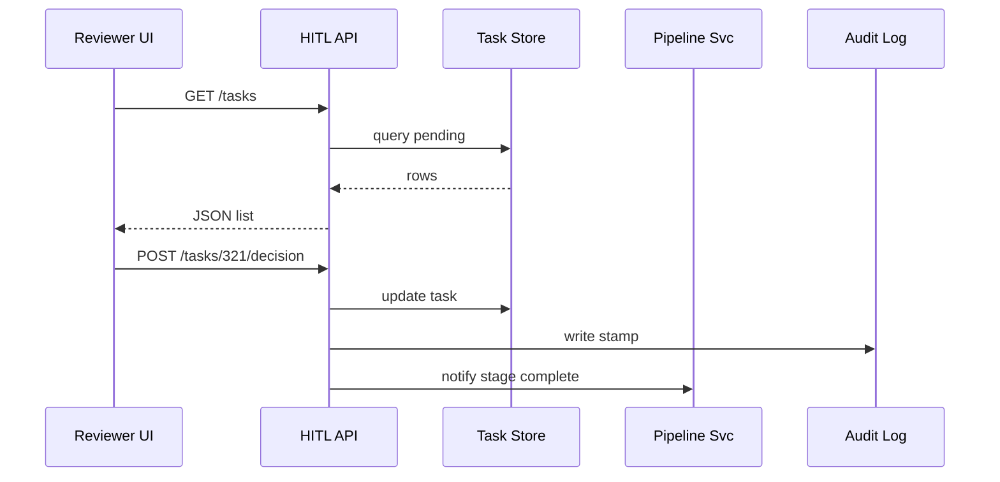

# Chapter 7: Human-in-the-Loop Oversight Workflow  

*(jumped here from the conveyor belt we built in  
[Process Proposal Pipeline](06_process_proposal_pipeline_.md))*  

---

## 1 · Why keep a human in the loop?  

Picture the **U.S. Postal Service (USPS)**.  
An AI agent just suggested changing the “90-day forwarding” rule to **120 days** after reading thousands of citizen complaints.  
Great idea—unless:

* Extending the window breaks an international treaty, or  
* The new text accidentally omits military addresses.

A **Director of Postal Policy** must skim, red-pen, and approve the AI draft **before** it goes live.  
That safety net—the place where a human can *override, tweak, or rubber-stamp*—is the **Human-in-the-Loop (HITL) Oversight Workflow**.

Goal: keep AI speed without losing human accountability.

---

## 2 · Key concepts (plain English)

| Term | Beginner Analogy |
|------|------------------|
| **HITL Task** | A paper folder landing on a supervisor’s desk |
| **Reviewer** | The supervisor (director, program manager, legal counsel) |
| **Red-Pen Layer** | Sticky notes & strike-throughs on the draft |
| **Decision** | Stamp: APPROVE ✅ · TWEAK ✏️ · REJECT ❌ |
| **Audit Stamp** | Time-stamped “Signed by Jane Doe, 3:14 PM” |

---

## 3 · 30-second tour of the UI

```text
╔═══════════ HITL Inbox (3) ════════════╗
║ ▸ Draft #321 – Forwarding Window       │ new
║ ▸ Draft #319 – Small-Parcel Surcharge  │
║ ▸ Draft #317 – PO Box Refunds          │
╚════════════════════════════════════════╝

┌── Review: Draft #321 ─────────────┐
│ AI change: "90 → 120 days"        │
│ Reason: 2 147 citizen complaints  │
│                                   │
│ [Add Comment]  [Approve] [Reject] │
└───────────────────────────────────┘
```

Everything the reviewer needs lives in one screen—no hunting through emails.

---

## 4 · Grabbing a task (front-end sample ≤ 17 lines)

```js
// src/composables/useHITL.js
export async function getMyTasks(){
  const r = await fetch('/hitl/tasks?status=pending')
  return r.json()                     // ⇒ [{id:321, title:'Forwarding…'}]
}

export async function decide(taskId, action, comments){
  await fetch(`/hitl/tasks/${taskId}/decision`, {
    method:'POST',
    headers:{'Content-Type':'application/json'},
    body: JSON.stringify({ action, comments })   // action = 'approve'|'tweak'|'reject'
  })
}
```

Explanation:  
1. `getMyTasks()` pulls all pending folders for the logged-in reviewer.  
2. `decide()` posts the reviewer’s stamp plus any red-pen comments.

*(Role checks come from [Role-Based Access & Authorization Model](01_role_based_access___authorization_model_.md).)*

---

## 5 · End-to-end example

Step-by-step for our USPS rule:

1. Complaint enters the [Process Proposal Pipeline](06_process_proposal_pipeline_.md).  
2. The **AI Representative Agent** (see [Chapter 5](05_ai_representative_agent__a2a_service_.md)) drafts text.  
3. Pipeline pauses at **HITL** and creates *Task #321*.  
4. Director opens the Inbox, tweaks wording (“FPO/APO addresses excluded”), presses **Approve**.  
5. Pipeline resumes → draft is published by the Deployer.  
6. Audit log stores: “Approved by Director (UID 45) – 2024-06-05 15:14 UTC”.

---

## 6 · What happens under the hood?



Small, predictable, and auditable.

---

## 7 · Server snippets (all ≤ 16 lines)

### 7.1 Creating a task (called by Pipeline)

```js
// services/hitl/createTask.js
module.exports = async ({ draftId, reviewerRole }) => {
  const id = await db('hitl_tasks').insert({
    draft_id: draftId,
    status: 'pending',
    reviewer_role: reviewerRole
  })
  return id
}
```

### 7.2 Listing tasks

```js
// routes/hitl.js
router.get('/tasks', async (req, res)=>{
  const rows = await db('hitl_tasks')
      .where({ reviewer_id: req.user.id, status: 'pending' })
  res.json(rows)
})
```

### 7.3 Recording a decision

```js
router.post('/tasks/:id/decision', async (req, res)=>{
  const { action, comments } = req.body        // 'approve' | 'tweak' | 'reject'
  await db('hitl_tasks').where({ id:req.params.id })
        .update({ status: action, comments })
  await audit.log(req.user.id, req.params.id, action, comments)
  pipe.resume(req.params.id)                   // hand control back to pipeline
  res.json({ ok:true })
})
```

All three snippets reuse the same tiny `db` helper; no magic.

---

## 8 · Power feature: “Red-Pen” overlay

A reviewer can mark up the AI draft inline:

```js
// PATCH /drafts/321/annotations
{
  "changes": [
    { "op":"replace", "path":"/body/para[2]", "value":"...FPO/APO..." },
    { "op":"comment", "path":"/body/para[3]", "value":"Check treaty XYZ" }
  ]
}
```

Behind the scenes the Policy Editor shows these as colored strike-throughs.  
If **Approve** is clicked, the annotations are auto-merged into the draft.

---

## 9 · Mini exercise 🏋️‍♀️

1. Log in as **Program Manager** (`demo/pm`).  
2. In the Dashboard choose **HITL Inbox** – approve the “Small-Parcel Surcharge” task.  
3. Verify the Pipeline for that draft now says **Stage: DEPLOY**.  
4. Switch to **External Auditor** (`demo/audit`) – confirm the Auditor can *see* the final text but never the HITL comments.

*(Hints in `exercises/07`.)*

---

## 10 · Frequently asked questions

**Q: Can one task have multiple reviewers?**  
A: Yes. Add extra rows in `hitl_tasks` with `parent_id` pointing to the same draft. Pipeline waits until *all* are ✅ or one ❌.

**Q: What if a reviewer is on vacation?**  
A: A 24-hour cron job auto-reassigns idle tasks—logic lives in `cron/reassignHitl.js` (8 lines).

**Q: Does AI ever override a human decision?**  
A: Never. AI stops at “suggest”. Only roles listed in RBAC can press **Approve**.

---

## 11 · What you learned

You now know how HMS-GOV:

* Drops every AI draft into a tidy reviewer inbox,  
* Lets humans red-pen, stamp, or reject in seconds, and  
* Records an iron-clad audit trail for Congress or FOIA requests.

Next we’ll climb one layer up and see how ethics checks, transparency logs, and safety rails surround *everything* we just built:  
[Governance Layer (Ethics, Transparency, Safety)](08_governance_layer__ethics__transparency__safety__.md)

---

Generated by [AI Codebase Knowledge Builder](https://github.com/The-Pocket/Tutorial-Codebase-Knowledge)