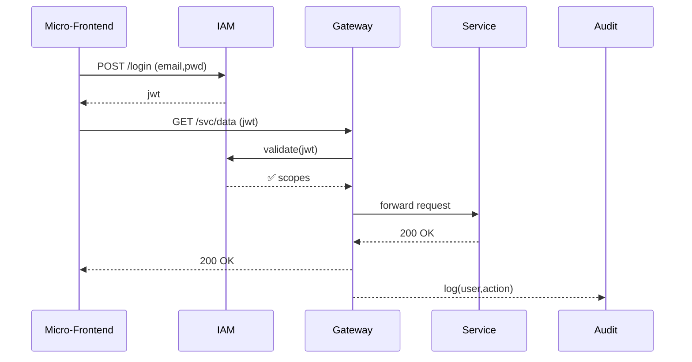

# Chapter 7: Identity & Access Management (IAM)
[← Back to Chapter 6: Backend API Gateway (HMS-API / HMS-MKT)](06_backend_api_gateway__hms_api___hms_mkt__.md)

---

> Think of IAM as the **passport office** of HMS.  
> Citizens, contractors, bots, and even the AI Representative Agent must line up here, prove who they are, and receive a stamped passport (token) that lists every door they may open.

---

## 1. Why do we need IAM? — A 60-second story

1. A **Food-Delivery vendor** logs in to update today’s cafeteria menu.  
2. At the same moment, an **USPTO patent clerk** fetches confidential drawings.  
3. Meanwhile, the **AI Representative Agent** bulk-submits 5 000 flood-relief claims.

Without a single, trusted passport office, any mix-up of roles would let the chef read secret patents or the AI drain treasury accounts.  
**IAM stops the mix-up** by issuing time-limited tokens that encode exactly **who** you are and **what** you’re allowed to do.

---

## 2. Key Concepts (passport analogies)

| IAM Term | Passport Analogy | What it means here |
|----------|------------------|--------------------|
| Identity Provider (IdP) | Passport office | Micro-service that issues & verifies credentials. |
| Role | Visa type | A bundle of permissions (“patent.clerk”, “vendor.menu”). |
| Scope | Entry stamp | A single permission inside a role (“menu:write”). |
| Token (JWT) | Stamped passport | Self-contained JSON packet proving identity + scopes. |
| Single-Sign-On (SSO) | Global passport | One login works across every HMS kiosk. |
| Service Account | Diplomatic passport | Non-human identity for micro-services & bots. |
| Rotation | Expiry date | Automatic renewal so passports never go stale. |

---

## 3. From Login to Token in 15 Lines

Below is the **entire** login flow for a Food-Delivery vendor MFE.  
Everything past line 10 is auto-handled by [HMS-API](06_backend_api_gateway__hms_api___hms_mkt__.md).

```vue
<!-- FoodDeliveryLogin.vue -->
<template>
  <form @submit.prevent="login">
    <input v-model="email" placeholder="Work email" />
    <input v-model="pwd"   placeholder="Password" type="password" />
    <button>Sign in</button>
  </form>
</template>

<script setup>
import axios from 'axios'
const email = ref('chef@foodco.gov')
const pwd   = ref('')

async function login () {
  const { data } = await axios.post('/iam/login', { email: email.value, pwd: pwd.value })
  localStorage.token = data.jwt                  // ① store passport
  axios.defaults.headers.authorization = `Bearer ${data.jwt}` // ② auto-attach
  location.href = '/vendor/menu'                 // enter the kiosk
}
</script>
```

Explanation  
① On success, we store the **JWT**.  
② Every future `axios` call now carries the passport automatically.

---

## 4. Using the Token – One Secure API Call

```js
// inside FoodDeliveryApp.vue
const menu = await axios.get('/api/v1/cafe/menu')
```

No extra code!  
The Gateway will:

1. read the `Authorization: Bearer …` header,  
2. ask IAM to validate the token,  
3. forward the call only if the token contains scope `menu:write`.

---

## 5. How bots log in – Client-Credential Flow (10 lines)

```bash
# request a bot passport (service account "a2a")
curl -X POST https://iam.hms.gov/oauth/token \
     -d 'client_id=a2a' -d 'client_secret=TOPSECRET' \
     -d 'scope=claims.bulk'
# → { "access_token":"eyJhbGciOi…", "expires_in":3600 }
```

The AI Representative Agent stores this token in memory and renews it every hour.

---

## 6. What happens under the hood?



Five actors, one round-trip to IAM, full audit trail.

---

## 7. Tiny Peek Inside IAM

Below is a **super-simplified** Node/Express implementation.  
(Real deployments use Keycloak, Auth0, or AWS Cognito, but the logic is identical.)

### 7.1 Token issuing — `routes/login.js` (18 lines)

```js
import jwt from 'jsonwebtoken'
import users from '../db/users.js'      // {email, pwdHash, roles}

export async function login(req, res) {
  const { email, pwd } = req.body
  const user = users.find(u => u.email === email)
  if (!user || !verify(pwd, user.pwdHash)) return res.status(401).end()

  const scopes = user.roles.flatMap(r => roleScopes[r])  // ["menu:write"]
  const jwtToken = jwt.sign(
    { sub: user.id, roles: user.roles, scopes },
    process.env.JWT_SECRET,
    { expiresIn: '15m' }
  )
  res.json({ jwt: jwtToken })
}
```

Walk-through  
1. Verify password (details skipped).  
2. Collect scopes from the user’s roles.  
3. Sign a JWT that expires in 15 minutes.

### 7.2 Token verification — `middleware/verify.js` (14 lines)

```js
import jwt from 'jsonwebtoken'

export function verify(req, res, next){
  const raw = req.headers.authorization?.split(' ')[1]
  if (!raw) return res.status(401).end()

  try {
    req.claims = jwt.verify(raw, process.env.JWT_SECRET)
    next()
  } catch { res.status(401).end() }
}
```

This middleware runs inside both **IAM** (for refresh) and the **Gateway** (for every request).

---

## 8. Role & Scope Cookbook

Common roles inside HMS:

| Role | Typical scopes | Who gets it |
|------|----------------|-------------|
| `citizen.basic` | `profile:read`, `journey:start` | Everyone after email verification. |
| `vendor.menu` | `menu:read`, `menu:write` | Approved cafeteria vendors. |
| `patent.clerk` | `patent:read`, `patent:write` | USPTO staff. |
| `a2a.bot` | `claims:bulk`, `metrics:read` | AI Representative Agent. |
| `hitl.officer` | `policy:pause`, `policy:edit` | Staff with override rights. |

Roles are assigned by HR systems or the [Governance Portal](05_governance_layer__hms_gov_portal_.md) and stored in the IAM database.

---

## 9. Integrating with Other HMS Layers

* **Gateway** validates every token before routing traffic.  
* **Journey Engine** reads scopes to hide steps a user cannot perform.  
* **HITL Console** checks `policy:pause` before showing the big red button.  
* **Compliance & Audit Trail** stores token metadata for every request (no raw PII).  
* **Micro-services** trust the `x-hms-user` header injected by the Gateway—never raw JWTs.

---

## 10. Hands-On Exercise (5 min)

1. Start the sandbox:

```bash
docker compose up iam gateway menu-svc
```

2. Register a new cafeteria chef:

```bash
curl -X POST http://localhost:8000/iam/register \
     -d '{"email":"chef@foodco.gov","pwd":"pa55","roles":["vendor.menu"]}'
```

3. Log in:

```bash
TOKEN=$(curl -s http://localhost:8000/iam/login \
              -d '{"email":"chef@foodco.gov","pwd":"pa55"}' | jq -r .jwt)
```

4. Call the protected endpoint:

```bash
curl -H "Authorization: Bearer $TOKEN" \
     http://localhost:9000/api/v1/cafe/menu
# → 200 [{"dish":"Veggie Wrap","price":7.50}]
```

5. Change roles in the DB to **remove** `vendor.menu`, call again → **401 Unauthorized**.

---

## 11. Common Questions

**Q: How long should tokens live?**  
Short (15 min) for interactive users; longer (60 min) for bots with refresh tokens.

**Q: Can I use SAML or government PIV cards?**  
Yes. IAM can federate to external IdPs; only the issued JWT format must stay consistent.

**Q: How are passwords stored?**  
Hashed with bcrypt/argon2; never logged or sent over the wire.

---

## 12. Recap & Next Steps

You learned to:

✓ Log in, receive a JWT passport, and attach it to every request.  
✓ Understand roles vs. scopes vs. tokens.  
✓ Glimpse at the 18-line core of issuing & verifying tokens.  
✓ See how every other HMS layer trusts the passport office.

Next, we’ll visit the **citizen-service micro-services** that rely on those passports to serve data safely:  
[Chapter 8: Microservices (HMS-SVC Family)](08_microservices__hms_svc_family__.md)

---

---

Generated by [AI Codebase Knowledge Builder](https://github.com/The-Pocket/Tutorial-Codebase-Knowledge)