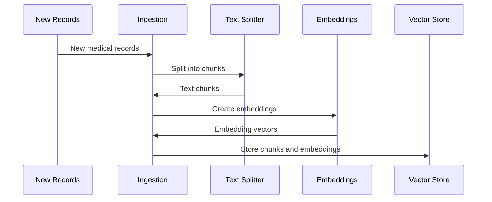

# Chapter 7: Ingestion

In the previous chapter, [Vector Store](06_vector_store.md), we learned where the embeddings of our medical records are stored. Now, let's explore how we get those records *into* the Vector Store in the first place. This process is called *Ingestion*.

Imagine you have a box of new medical records for your patients. Ingestion is like carefully organizing these records, creating labels for them, and placing them in the right drawers in your filing cabinet (the [Vector Store](06_vector_store.md)).

## What Problem Does Ingestion Solve?

Ingestion solves the problem of adding new information to our system so the [LLM (Large Language Model)](02_llm__large_language_model_.md) can access it.  Without ingestion, our [Vector Store](06_vector_store.md) would be empty, and the LLM wouldn't be able to answer our questions.

## How Ingestion Works

Think of ingestion as a four-step process:

1. **Gathering the Documents:**  First, we collect all the new medical records we want to add.

2. **Preparing the Documents:** We clean and format the records, removing any unnecessary information.  We also split long records into smaller chunks so they're easier to manage.

3. **Creating Embeddings:** We use an embeddings model (as discussed in [Embeddings](05_embeddings.md)) to create vector representations of each chunk.  These vectors capture the meaning of the text.

4. **Storing in the Vector Store:** Finally, we store the embeddings and the corresponding text chunks in the [Vector Store](06_vector_store.md), along with any relevant metadata (like the patient's name or the date of the record).

## Using Ingestion in HMS-MED

Let's say we have a new medical record for John Doe.  During ingestion:

1. HMS-MED takes the record and cleans it.
2. HMS-MED splits the record into smaller chunks.
3. HMS-MED creates embeddings for each chunk.
4. HMS-MED stores the embeddings and chunks in the [Vector Store](06_vector_store.md), along with metadata like "John Doe" and the record date.

## Internal Implementation

Here's a simplified view of how Ingestion works within HMS-MED:



The code for ingestion can be found in `HMS-EHR/backend/ingest.py`. Here's a simplified example:

```python
# ... other code ...

# This function handles the ingestion process.
def ingest_docs():
    # ... code to connect to the Vector Store ...

    # ... code to load and prepare the documents ...

    # Split the documents into smaller chunks.
    docs_transformed = text_splitter.split_documents(docs)

    # Create embeddings for each chunk.
    # The 'index' function handles embedding creation and storage.
    indexing_stats = index(docs_transformed, ..., vectorstore, ...)

    # ... more code ...
```

The `index` function takes the prepared documents, generates embeddings using the specified embeddings model, and stores them in the [Vector Store](06_vector_store.md). The `_scripts/clear_index.py` file shows how to clear the index, which is useful for testing and starting fresh.  The `MODIFY.md` file provides more details on configuring different [Vector Stores](06_vector_store.md).

## Conclusion

Ingestion is the process of adding new information to the [Vector Store](06_vector_store.md), making it available to the [LLM (Large Language Model)](02_llm__large_language_model_.md).  It involves cleaning, splitting, and embedding the text before storing it. Now, let's explore how we organize the data within the Vector Store for efficient searching: [Indexing](08_indexing.md).


---

Generated by [AI Codebase Knowledge Builder](https://github.com/The-Pocket/Tutorial-Codebase-Knowledge)