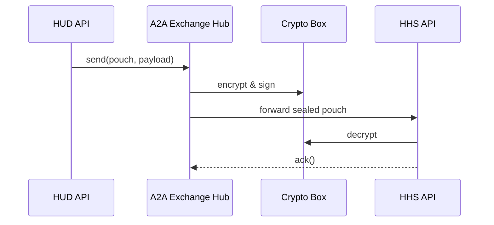

# Chapter 7: Inter-Agency Communication Layer (HMS-A2A)

*(Jumped in from [External System Sync Bus](06_external_system_sync_bus_.md))*  

---

## 1  Why Do We Need a “Diplomatic Pouch” for Data?

Disaster strikes the Gulf Coast.  
• **HUD** has lists of damaged addresses.  
• **HHS** tracks residents’ prescription needs.  
• **Radio Sawa** broadcasts evacuation info in Arabic.

All three agencies must **merge** their records—fast—but:

* Housing files contain **PII** (names, SSNs).  
* Health files contain **PHI** (diagnoses).  
* Broadcast scripts are **public** but can’t leak classified shelter locations.  

HMS-A2A is the **diplomatic pouch**: an encrypted, rule-driven channel that lets agencies pass only *what each recipient is cleared to see*.  
Master it, and you unlock cross-domain programs like national disaster relief or pandemic response.

---

## 2  Key Ideas in Plain English

| Word              | Think of it as…                                     |
|-------------------|-----------------------------------------------------|
| Pouch             | The sealed envelope that carries data between agencies. |
| Contract          | A packing list that says “this pouch contains: `address`, `needs`, …”. |
| Clearance Rule    | The customs form—what each agency may import/export. |
| Cloak             | Automatic redaction of PII/PHI before sealing the pouch. |
| Exchange Hub      | A post office that checks signatures and forwards pouches. |

Remember: **Pouch → Contract → Cloak → Rule → Hub**.  

---

## 3  60-Second Code Tour – Sending a Pouch

Below is **all** you need to ship a housing roster from HUD to HHS.

```python
# hud_send_pouch.py  (≤ 20 lines)
from hmsa2a import Pouch, Hub

data = {
    "address": "404 Elm St, Baytown",
    "resident_name": "Jane Doe",
    "ssn": "123-45-6789",
    "needs": ["wheelchair", "insulin"]
}

pouch = (
    Pouch(contract="disaster.roster.v1")  # 1⃣ packing list
    .cloak(fields=["ssn", "resident_name"])  # 2⃣ hide PII
    .seal(sender="HUD", recipient="HHS")      # 3⃣ encrypt & sign
)

Hub().send(pouch, payload=data)               # 4⃣ drop at post office
print("📦 Pouch #", pouch.id, "dispatched!")
```

What just happened?  
1. We picked a **contract** (`disaster.roster.v1`).  
2. `cloak()` scrubbed sensitive columns.  
3. `seal()` wrapped and encrypted the parcel for HHS only.  
4. `Hub().send()` handed it to the **Exchange Hub** for routing.

---

## 4  Receiving a Pouch on the Other Side

```python
# hhs_receive_pouch.py  (≤ 20 lines)
from hmsa2a import Hub

for pouch, data in Hub().inbox(agency="HHS"):
    print("🔑 Decrypted pouch", pouch.id)
    print("Data visible to HHS:", data)
    pouch.ack()                 # mark delivered
```

Output:

```
🔑 Decrypted pouch 987
Data visible to HHS: {'address': '404 Elm St, Baytown', 'needs': ['wheelchair', 'insulin']}
```

Note the **PII fields are gone**—`cloak()` did its job.

---

## 5  What Happens Under the Hood?



1. **HUD** submits the parcel.  
2. **Exchange Hub** verifies the contract & runs clearance rules.  
3. **Crypto Box** seals or unseals data with FIPS-compliant keys.  
4. **HHS** receives only the fields allowed by the rule set.

---

## 6  Diving Deeper – File Tour

```
hms-a2a/
 ├─ contracts/                # JSON Schema for each data type
 │   └─ disaster.roster.v1.json
 ├─ rules/                    # YAML clearance rules
 │   └─ disaster_relief.yaml
 ├─ crypto/                   # Key rotation & sealing logic
 ├─ hub/                      # Exchange Hub service (FastAPI)
 └─ examples/                 # Sample send / receive scripts
```

### 6.1  Snippet 1 – Contract (≤ 10 lines)

```json
{
  "$id": "disaster.roster.v1",
  "properties": {
    "address":  { "type": "string" },
    "needs":    { "type": "array", "items": { "type": "string" } }
  },
  "required": ["address","needs"]
}
```

### 6.2  Snippet 2 – Clearance Rule (≤ 10 lines)

```yaml
# rules/disaster_relief.yaml
- sender: HUD
  recipient: HHS
  contract: disaster.roster.v1
  allowed_fields: ["address", "needs"]
  max_tlp: amber           # traffic-light protocol
  encryption: aes256-gcm
```

If a field outside `allowed_fields` slips in, the Hub rejects the pouch with HTTP 422.

---

## 7  Adding a New Agency in 3 Steps

1. **Register Keys**  
   `hub crypto generate --agency=RadioSawa`

2. **Write a Rule**

```yaml
- sender: HHS
  recipient: RadioSawa
  contract: shelter.broadcast.v1
  allowed_fields: ["message", "language"]
```

3. **Send a Test Pouch**

```bash
hmsa2a send --from=HHS --to=RadioSawa --contract=shelter.broadcast.v1 \
            --data='{"message":"Clinic open","language":"ar"}'
```

Hub logs: `✅ routed pouch 1102 to RadioSawa`.

---

## 8  Government Analogy Cheat-Sheet

Software Thing | Real-World Counterpart
---------------|-----------------------
Pouch          | Sealed diplomatic bag
Contract       | Packing list inside the bag
Cloak          | Black marker hiding sensitive text
Clearance Rule | Customs officer’s checklist
Exchange Hub   | Diplomatic mail room

---

## 9  Common Beginner Pitfalls

1. **Skipping `cloak()`**  
   ➜ Hub blocks the pouch; no data leaves your agency.  
2. **Mismatched Contract Version**  
   ➜ Use `*.v2` only after all recipients upgrade.  
3. **Forgetting `pouch.ack()`** on the receiver  
   ➜ Hub retries delivery, causing duplicates.  
4. **Hard-coding Keys in Git**  
   ➜ Always load keys from environment or Vault.

---

## 10  Mini-Exercise

1. Clone `hms-a2a/examples`.  
2. Modify `hud_send_pouch.py` to include `"ssn": "111-22-3333"`.  
3. Comment out `.cloak(...)`.  
4. Run the script—observe Hub’s 422 error: `"PII field 'ssn' not allowed"`.  
5. Re-enable `.cloak()`, resend, and watch it succeed.

---

## 11  Recap & Next Step

You now know how **HMS-A2A**:

* Creates an encrypted **diplomatic pouch** for data.  
* Uses **contracts** and **clearance rules** to prevent leaks.  
* Lets agencies exchange only the slices of data they’re cleared to see.  

Next we’ll store all those contracts—and every other schema—in one searchable library inside [Data Lake & Schema Registry (HMS-DTA)](08_data_lake___schema_registry__hms_dta__.md).

---

Generated by [AI Codebase Knowledge Builder](https://github.com/The-Pocket/Tutorial-Codebase-Knowledge)