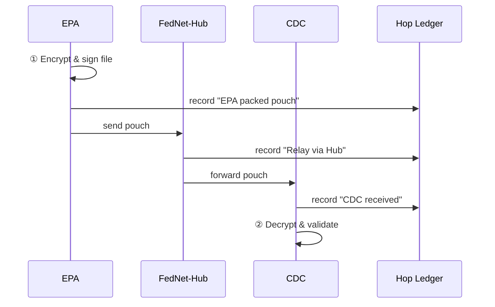

# Chapter 7: Inter-Agency Data Exchange (HMS-A2A)

*(continuing from [Chapter 6: Backend API Gateway](06_backend_api_gateway_.md))*  

---

## 1. Why Do We Need HMS-A2A?

Imagine the Environmental Protection Agency (EPA) detects an uptick in lead levels near a military base.  
Within **hours** the Department of Defense (DoD) health unit and the Centers for Disease Control (CDC) need that data to warn families and schedule blood-screenings.

Without guardrails:

* Each agency invents a different CSV layout.  
* Sensitive coordinates could leak to the public too soon.  
* Six months later, a FOIA officer can’t prove **who** changed **what** on the way.

**HMS-A2A** is the **diplomatic pouch** for data—not paper:

1. Negotiates a data-sharing agreement in plain English *and* JSON schema.  
2. Encrypts and ships the dataset through trusted hops.  
3. Logs every stop so auditors (FOIA, IG, GAO) can play the trip in reverse.

Result: Agencies share fast, safely, and with perfect chain-of-custody.

---

## 2. Key Concepts (No Jargon, Promise!)

| Term | Friendly Description |
|------|----------------------|
| Sharing Agreement | A mini-contract saying *what* data, *why*, and *for how long*. |
| Secure Pouch | AES-encrypted “folder” that travels between agencies. |
| Schema Map | A Rosetta Stone that converts “epa_site_id” → “dod_location_id”, etc. |
| Hop Ledger | Append-only diary: each relay writes its timestamp & hash. |
| FOIA Replay | Button that re-plays every hop to satisfy public record requests. |

---

## 3. Five-Minute Walking Tour

We will send an **Air Quality** CSV from **EPA** ➜ **CDC**.

### 3.1. Define a Sharing Agreement

```python
# file: demo_a2a.py
from hms_a2a import Agreement, A2A

agreement = Agreement(
    id="AQ-EPA-CDC-2024-05",
    purpose="Lead exposure monitoring",
    dataset="air_quality.csv",
    ttl_days=30              # auto-delete after 30 days
)
```

*Explanation*  
• A tiny object lists *why* the data moves and *how long* it may live.  
• TTL enforces “need-to-know” expiration.

### 3.2. Send the Secure Pouch

```python
pipe = A2A(sender="EPA", receiver="CDC")
receipt = pipe.send("air_quality.csv", agreement)
print(receipt.hops)          # ['EPA', 'FedNet-Hub', 'CDC']
```

*Explanation*  
1. `send()` automatically:  
   • Encrypts the file.  
   • Looks up the best route on the Micro-Services Spine.  
   • Starts a Hop Ledger entry.  
2. `receipt` is safe to attach in an email or FOIA response.

### 3.3. Receive & Unpack

```python
cdc_pipe = A2A(receiver="CDC")
file_path = cdc_pipe.receive(receipt)
print(open(file_path).readlines()[:2])
```

*Output (trimmed)*

```
site_id,pm25,lead_ppb,timestamp
1345,13,0.15,2024-05-20T14:00Z
```

Done—CDC analysts visualize the alert within minutes.

---

## 4. What Happens Under the Hood?



*Step ①* uses the **Schema Map** (auto-generated from the agreement).  
*Step ②* enforces TTL and legal purpose from [HMS-ESQ](03_compliance___legal_reasoning__hms_esq__.md).

---

## 5. Inside Components

| Module | What It Does (in 1 sentence) |
|--------|------------------------------|
| Negotiator | Turns an `Agreement` object into a signed JSON contract. |
| Transformer | Applies the Schema Map so columns & field names match the receiver’s spec. |
| Secure Courier | Streams the encrypted pouch across hops with retry/back-off. |
| Hop Ledger | Writes SHA-256 hash + timestamp; immutable like Git. |

---

## 6. Tiny Peeks at the Code

### 6.1. Negotiator (8 lines)

```python
# hms_a2a/negotiator.py
import json, time, hashlib

def sign(agreement):
    body = json.dumps(agreement.__dict__, sort_keys=True)
    digest = hashlib.sha256(body.encode()).hexdigest()
    return {"body": body, "sig": digest, "ts": time.time()}
```

*Explanation*  
• Serializes the agreement and stamps a SHA-256 signature.  
• Later hops verify the same digest before processing.

### 6.2. Secure Courier (10 lines)

```python
# hms_a2a/courier.py
import httpx, base64, os

KEY = os.getenv("A2A_KEY", "super-secret-key")

def ship(blob, target_url):
    encrypted = base64.b64encode(xor(blob, KEY.encode()))
    httpx.post(target_url + "/pouch", content=encrypted)
```

*Explanation*  
• Uses a silly `xor()` for demo; real code swaps to AES-GCM.  
• HTTP POST goes through the Gateway, which enforces policy.

### 6.3. Hop Ledger Write (6 lines)

```python
# hms_a2a/ledger.py
import json, time

def record(hop, digest):
    entry = {"hop": hop, "ts": time.time(), "hash": digest}
    open("hop_ledger.log", "a").write(json.dumps(entry) + "\n")
```

*Explanation*  
• Simple append-only file—easy to audit or import into Splunk later.

(All snippets trimmed for clarity; real module titles remain the same.)

---

## 7. FOIA Replay in 2 Lines

```python
from hms_a2a import ledger
print(ledger.playback("AQ-EPA-CDC-2024-05"))
```

Outputs a JSON array of hops with timestamps—ready to hand to an inspector.

---

## 8. Frequently Asked Questions

**Q1: How does A2A pick a route?**  
Looks up registered relay nodes in the [Micro-Services Spine](05_micro_services_spine_.md).  
Shortest healthy path wins.

**Q2: What if a hop is compromised?**  
Every hop re-hashes the pouch; any mismatch halts the chain and alerts [Operational Monitoring & Telemetry (HMS-OPS)](10_operational_monitoring___telemetry__hms_ops__.md).

**Q3: Can citizens request these logs?**  
Yes—FOIA officers export the Hop Ledger; sensitive parts (e.g., keys) are auto-redacted.

---

## 9. Mini Challenge (Optional)

1. Create a second agreement with `ttl_days=1`.  
2. Wait 24 hours and call `receive()`.  
3. Observe the `ExpiredPouchError`—the built-in safeguard against over-retention.

---

## 10. What We Learned

• HMS-A2A is a **secure, traceable courier** for inter-agency data.  
• Agreements, encryption, schema transforms, and hop logging work together so sharing is fast **and** audit-friendly.  
• FOIA replay is a first-class feature, not an afterthought.

Ready to sync with *non-federal* partners like state systems or public datasets?  
Jump to [Chapter 8: External System Sync](08_external_system_sync_.md).

---

Generated by [AI Codebase Knowledge Builder](https://github.com/The-Pocket/Tutorial-Codebase-Knowledge)