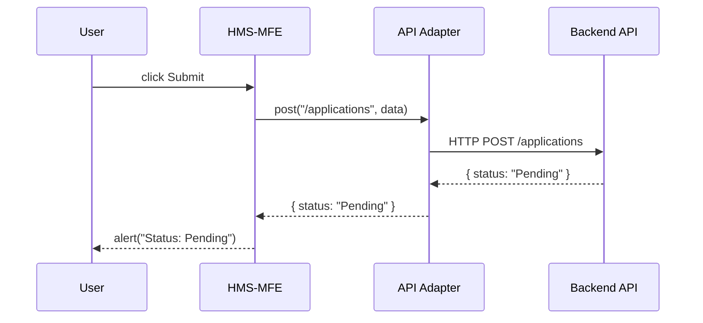

# Chapter 7: Interface Layer

Welcome back! In [Chapter 6: Microservices Infrastructure](06_microservices_infrastructure_.md) we split our backend into independent services. Now it’s time to build the **Interface Layer**—the user‐facing portals where citizens and administrators interact with HMS-UHC, much like public service counters or online kiosks.

---

## Why an Interface Layer?

Imagine you’re a small business owner applying for an export permit through a government web portal. You need:

1. A friendly form to enter your details.  
2. Real-time feedback (“Your application is pending review”).  
3. A secure admin dashboard for staff to approve or reject your request.

The **Interface Layer** provides:

- **HMS-MFE**: a micro-frontend for citizens.  
- **HMS-GOV**: an admin portal for government staff.  
- **Routing & Authentication**: controls who sees what.  
- **API Adapters**: connect UIs to our [Backend API](05_backend_api_.md).

---

## Key Concepts

1. **HMS-MFE**  
   - A lightweight, single‐page app for citizens.  
   - Built with modern JS frameworks (e.g., React).

2. **HMS-GOV**  
   - An admin interface for agency users.  
   - Provides lists, filters, and approval buttons.

3. **Router & Auth Guard**  
   - Determines which pages a user can visit based on their role.  
   - Redirects unauthenticated users to a login screen.

4. **API Adapter**  
   - A small module that wraps HTTP calls to the **Backend API**.  
   - Handles tokens, error messages, and data formatting.

5. **Shared UI Components**  
   - Buttons, forms, tables used by both citizen and admin portals.  
   - Reuse common styles and behavior.

---

## Solving Our Use Case

Use Case: A citizen submits a “Business License” application.

1. **Citizen** opens the HMS-MFE portal.  
2. They fill out a form and click “Submit.”  
3. The portal calls the **API Adapter** to send data to `/applications`.  
4. The **Backend API** processes the request and returns a status.  
5. The portal shows “Application Received” and the tracking ID.

Here’s a tiny React example for the submit button:

```javascript
// File: src/mfe/SubmitButton.js
import api from '../apiAdapter';

export function SubmitButton({ formData }) {
  const handleClick = async () => {
    const resp = await api.post('/applications', formData);
    alert(`Status: ${resp.status}`);
  };
  return <button onClick={handleClick}>Submit Application</button>;
}
```
This component:
- Calls `api.post(...)` when clicked.  
- Shows an alert with the returned status.

---

## What Happens Under the Hood

Here’s a simple sequence when you click “Submit Application”:



1. **MFE** captures the click event.  
2. **API Adapter** wraps and sends the HTTP request.  
3. **API** returns the JSON response.  
4. **MFE** shows the result to the user.

---

## Inside the Interface Layer Code

### 1. Router & Auth Guard (`src/interface/router.js`)

```javascript
import { BrowserRouter, Route, Redirect } from 'react-router-dom';
function PrivateRoute({ Component, role }) {
  const user = getUser(); // checks stored token
  return user?.role === role
    ? <Component />
    : <Redirect to="/login" />;
}

export default function AppRouter() {
  return (
    <BrowserRouter>
      <Route path="/login" component={Login} />
      <PrivateRoute path="/apply" role="citizen" Component={CitizenForm} />
      <PrivateRoute path="/dashboard" role="admin" Component={AdminDashboard} />
    </BrowserRouter>
  );
}
```
- `PrivateRoute` checks user role before showing a page.  
- Citizens see `/apply`; admins see `/dashboard`.

### 2. API Adapter (`src/interface/apiAdapter.js`)

```javascript
export default {
  async post(path, data) {
    const token = localStorage.getItem('token');
    const resp = await fetch(`/api${path}`, {
      method: 'POST',
      headers: { 'Content-Type': 'application/json', Authorization: token },
      body: JSON.stringify(data),
    });
    return resp.json();
  }
};
```
- Automatically prepends `/api`.  
- Attaches the auth token.  
- Returns parsed JSON.

### 3. Admin Dashboard Snippet (`src/gov/Dashboard.js`)

```javascript
import api from '../apiAdapter';
import { useEffect, useState } from 'react';

export function AdminDashboard() {
  const [apps, setApps] = useState([]);
  useEffect(() => {
    api.post('/applications/list', {}).then(setApps);
  }, []);
  return (
    <ul>
      {apps.map(a => <li key={a.id}>{a.id} – {a.status}</li>)}
    </ul>
  );
}
```
- Fetches a list of applications on load.  
- Displays each application ID and status.

---

## Visualizing the Interface Layer

```mermaid
flowchart LR
  subgraph Interface Layer
    MFE[HMS-MFE (Citizen Portal)]
    GOV[HMS-GOV (Admin Portal)]
    AD[API Adapter]
  end
  MFE --> AD
  GOV --> AD
  AD --> API[Backend API]
```
- Both portals share the **API Adapter**.  
- All traffic flows through the **Backend API**.

---

## Conclusion

In this chapter, you learned how the **Interface Layer** delivers user‐friendly portals:

- **HMS-MFE** for citizens to submit applications.  
- **HMS-GOV** for administrators to review and approve.  
- **Router & Auth Guard** to control access.  
- **API Adapter** to connect UIs with the backend.

Next up, we’ll build a shared set of UI building blocks in the [Frontend Component Library](08_frontend_component_library_.md).

---

Generated by [AI Codebase Knowledge Builder](https://github.com/The-Pocket/Tutorial-Codebase-Knowledge)