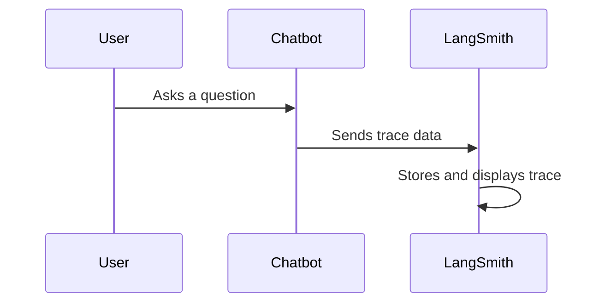
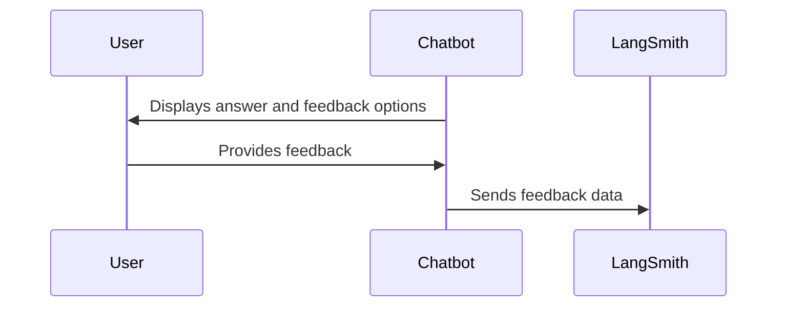

# Chapter 7: LangSmith

In the previous chapter, [Query Analysis/Rephrasing](06_query_analysis_rephrasing_.md), we learned how to help our chatbot understand our questions. But how do we know if our chatbot is actually performing well? How can we identify areas for improvement and ensure it's providing accurate and helpful answers? This is where LangSmith comes in.

Imagine you've trained a dog to fetch specific toys. You wouldn't just assume they've learned perfectly after the first few tries. You'd observe their performance, correct their mistakes, and give them positive reinforcement when they succeed. LangSmith is like a training tool for your LLM application, providing observability, evaluations, and feedback mechanisms to help you refine its performance over time.

## What is LangSmith?

LangSmith is a platform that helps you monitor, evaluate, and improve your LLM applications. Think of it as the quality control team for your LLM application. It monitors the performance, evaluates the answers, and collects feedback to help you improve the system over time.  It has three key features:

1. **Observability:**  Like watching your dog fetch, LangSmith lets you see what's happening "under the hood" of your chatbot. It records each step of the process, from the initial question to the final answer, allowing you to identify bottlenecks and areas for improvement.

2. **Evaluations:**  LangSmith provides tools to evaluate the quality of your chatbot's answers.  It's like testing your dog with different fetching scenarios to see how well they've learned.

3. **Feedback:**  LangSmith allows you to collect feedback from users, providing valuable insights into how people are interacting with your chatbot and what areas need improvement. This is like getting feedback from friends on how well your dog performed.

## Using LangSmith with HMS-AGT

Let's explore how to use LangSmith with your HMS-AGT project.

### Enabling Tracing

The simplest way to start using LangSmith is to enable tracing. This allows LangSmith to record every step of your chatbot's process.

```bash
export LANGCHAIN_TRACING_V2=true
export LANGCHAIN_API_KEY=<your-langsmith-api-key>
```

Setting these environment variables automatically enables tracing for your LangChain application.

### Adding Custom Run Names

You can add custom names to specific parts of your chain for better organization within LangSmith.

```python
# backend/chain.py (simplified)
# ... other code ...

if chat_history:
    _inputs = RunnableMap({
        "standalone_question": {
            # ...
        }.with_config(run_name="CondenseQuestion"), # Add a custom name
        # ...
    })
    # ...
```

This code snippet adds the name "CondenseQuestion" to the query rephrasing step, making it easier to identify in LangSmith.

### Viewing Traces

Once tracing is enabled, you can view the execution details of your chatbot's runs in the LangSmith dashboard.  Each run will show the inputs, outputs, and intermediate steps, allowing you to pinpoint areas for improvement.



### Running Evaluations

LangSmith provides tools to evaluate your chatbot's performance on a dataset of questions and answers.  You can define custom evaluation metrics or use pre-built ones.

```python
# _scripts/evaluate_chains.py (simplified)
# ... other code ...

eval_config = RunEvalConfig(evaluators=["qa"], prediction_key="output")
results = client.run_on_dataset(
    # ... other arguments ...
    evaluation=eval_config, # Specify evaluation configuration
    # ...
)
```

This code snippet shows how to run an evaluation using the `qa` evaluator (which assesses the quality of the answers) and specifies that the predictions are stored under the `output` key.

### Collecting Feedback

You can integrate feedback collection into your chatbot to gather user input on the quality of the answers.



LangSmith provides tools to visualize and analyze this feedback, helping you identify areas for improvement.

## Conclusion

LangSmith is a powerful tool for debugging, evaluating, and improving your LLM applications. By providing observability, evaluations, and feedback mechanisms, it helps you refine your chatbot's performance and ensure it's providing accurate and helpful answers.  In the next chapter, [Record Manager](08_record_manager_.md), we'll explore how to manage the data used by your chatbot.


---

Generated by [AI Codebase Knowledge Builder](https://github.com/The-Pocket/Tutorial-Codebase-Knowledge)