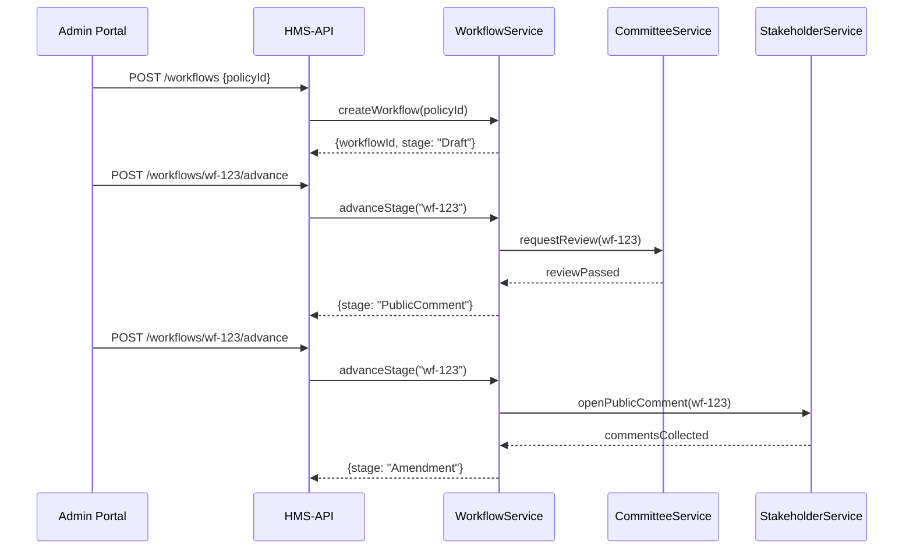

# Chapter 7: Legislative Workflow

Now that you’ve defined your Policy entity in [Chapter 6: Policy (Domain Entity)](06_policy__domain_entity__.md), it’s time to see how a policy travels from **draft** to **enacted**. In HMS-GOV, the **Legislative Workflow** manages each step—just like how a bill moves through committees, public hearings, amendments, and final votes on Capitol Hill.

---

## 1. Why a Legislative Workflow?

Imagine the state wants to limit fish catches:

1. A policy drafter writes “Max fish weight = 30 lbs.”  
2. The policy goes to a Fisheries Committee for review.  
3. Citizens and businesses comment.  
4. Committee suggests an amendment.  
5. After changes, the full assembly votes and **enacts** the rule.

Without a workflow, drafts might skip reviews or miss public input. Our abstraction ensures every policy follows the right sequence of stages and approval gates.

---

## 2. Central Use Case: Passing a Fishing Regulation

1. **Draft**: A clerk creates a Draft policy via the Admin Portal.  
2. **Committee Review**: WorkflowService assigns it to the Fisheries Committee.  
3. **Stakeholder Consultation**: The public comment period opens.  
4. **Amendment**: Committee applies feedback and updates the draft.  
5. **Final Approval**: The assembly approves the amended policy.  
6. **Activate**: Policy status changes to **Active**, and enforcement begins.

---

## 3. Key Concepts

- **Stages**: Named steps like `Draft`, `CommitteeReview`, `PublicComment`, `Amendment`, `Approval`.  
- **Gates**: Approval checks that must pass before moving on (e.g., committee vote).  
- **Actors**: Roles or services responsible at each stage (e.g., CommitteeService, StakeholderService).  
- **Transitions**: Methods to move from one stage to the next, enforcing gate logic.

---

## 4. How to Use Legislative Workflow

### 4.1 Start a Workflow

```javascript
// In HMS-API route
import { createWorkflow } from '../domain/services/workflow_service.js'

router.post('/workflows', (req, res) => {
  const { policyId } = req.body
  const workflow = createWorkflow(policyId)  
  res.json({ workflowId: workflow.id, stage: workflow.stage })
})
```
This call:
1. Creates a workflow tied to your `policyId`.  
2. Sets the initial stage to `Draft`.  

Output example:
```json
{ "workflowId": "wf-123", "stage": "Draft" }
```

### 4.2 Advance to Next Stage

```javascript
// Move from Draft → CommitteeReview
import { advanceStage } from '../domain/services/workflow_service.js'

router.post('/workflows/:id/advance', (req, res) => {
  const wf = advanceStage(req.params.id)  
  res.json({ stage: wf.stage })
})
```
If the **Draft** gate passes, the workflow advances to **CommitteeReview**.

---

## 5. Workflow in Action: Sequence Diagram



---

## 6. Under the Hood: Step-by-Step

1. **createWorkflow(policyId)**  
   - Generate a new workflow record with `stage = Draft`.  
2. **advanceStage(wfId)**  
   - Load workflow and its current stage.  
   - Check gate logic (e.g., committee vote).  
   - Update `stage` to next value.  
   - Trigger side effects (notify stakeholders).  
3. **getWorkflow(wfId)**  
   - Retrieve current stage and history for display.

---

## 7. Core Code Walkthrough

### 7.1 Workflow Entity

File: `domain/entities/workflow.js`
```javascript
export class Workflow {
  constructor(id, policyId) {
    this.id = id
    this.policyId = policyId
    this.stage = 'Draft'
    this.history = [{ stage: 'Draft', timestamp: Date.now() }]
  }
}
```
*Holds the workflow’s ID, tied policy, current stage, and change history.*

### 7.2 Workflow Repository

File: `domain/repositories/workflow_repo.js`
```javascript
const store = {}
export const save = (wf) => { store[wf.id] = wf }
export const get = (id) => store[id]
```
*Simple in-memory save/get by workflow ID.*

### 7.3 Workflow Service

File: `domain/services/workflow_service.js`
```javascript
import { Workflow } from '../entities/workflow.js'
import * as repo from '../repositories/workflow_repo.js'

// Define stage order
const STAGES = ['Draft','CommitteeReview','PublicComment','Amendment','Approval','Active']

export function createWorkflow(policyId) {
  const wf = new Workflow(`wf-${Date.now()}`, policyId)
  repo.save(wf)
  return wf
}

export function advanceStage(id) {
  const wf = repo.get(id)
  const idx = STAGES.indexOf(wf.stage)
  if (idx < STAGES.length - 1) {
    wf.stage = STAGES[idx + 1]
    wf.history.push({ stage: wf.stage, timestamp: Date.now() })
    repo.save(wf)
  }
  return wf
}
```
*`createWorkflow` starts at `Draft`. `advanceStage` moves to the next stage in order and records history.*

---

## 8. What’s Next?

Now that policies can flow through a clear, auditable process, your Admin Portal needs a UI to show and control these workflows. In the next chapter we’ll build that interface.

[Chapter 8: Admin/Gov Portal (HMS-GOV)](08_admin_gov_portal__hms_gov__.md)

---

Congratulations! You’ve learned how HMS-GOV models the **Legislative Workflow**—drafting, reviews, consultations, amendments, and final approval—just like passing a bill in government. With this in place, every policy follows a transparent, consistent path from idea to enforcement.

---

Generated by [AI Codebase Knowledge Builder](https://github.com/The-Pocket/Tutorial-Codebase-Knowledge)