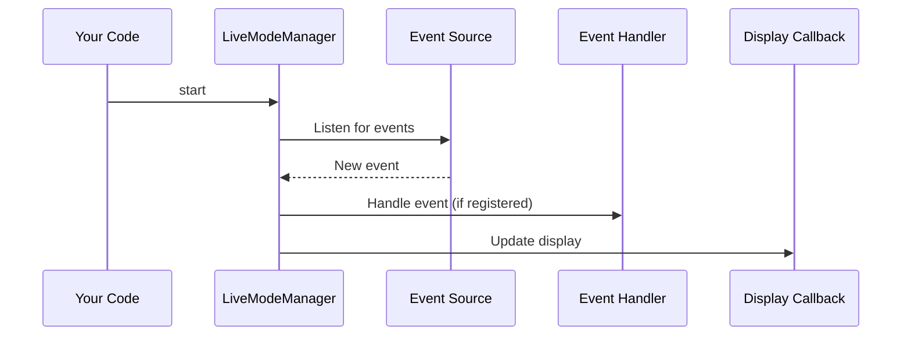

# Chapter 7: Live Mode Manager (Real-time Event Monitoring)

Coming from our understanding of how the [AutoResponder (Automated ESR Responses)](06_autoresponder__automated_esr_responses__.md) helps automate responses, let's explore how we can monitor the system in real-time. Imagine you're managing a busy support desk.  New ESRs are being created, background jobs are running, and errors are popping up.  How do you keep track of everything that's happening?  That's where the `LiveModeManager` comes in.  It's like a news ticker for your system, providing a live stream of events.

## What is LiveModeManager?

The `LiveModeManager` collects events from different sources, like [SidekiqMonitor (Background Job Monitoring)](08_sidekiqmonitor__background_job_monitoring__.md), [BugsnagClient](02_client_libraries__api_wrappers__.md), and even manual events you create, and displays them in real-time. This allows you to quickly see what's happening and react to important events.

## Key Concepts

1. **Events:**  These are notifications about things happening in the system.  Think of them as news headlines.  Each event has a type (e.g., "esr_created", "bugsnag_error"), a source (e.g., "jira", "bugsnag"), a title, and optional details.  These are represented by the [Types::LiveModeEvent](03_types__data_structures__.md) type.

2. **Event Handlers:** These are functions that react to specific types of events.  For example, you might have an event handler that sends an email notification when a critical error occurs.

3. **Event Sources:** These are the parts of the system that generate events.  Examples include Sidekiq, Bugsnag, and Kibana.

## Use Case: Monitoring New ESRs and Errors

Let's see how to use the `LiveModeManager` to monitor new ESRs and errors:

```ruby
require_relative 'live_mode_manager'

# Define a display callback to print events to the console
display_callback = lambda do |events|
  events.each do |event|
    puts event.to_s
  end
end

# Initialize and start Live Mode
LiveModeManager.initialize(display_callback)
LiveModeManager.start

# ... your application continues running ...

# Stop Live Mode when done
LiveModeManager.stop
```

**Explanation:**

1. We define a `display_callback` that will be called whenever there are new events. This callback simply prints the events to the console.
2. We initialize the `LiveModeManager` with the `display_callback`.
3. We start the `LiveModeManager`.  It will now run in the background, collecting and displaying events.
4. Our application continues running normally.
5. Finally, we stop the `LiveModeManager` when we're done.

## Internal Implementation

Here's a simplified sequence diagram showing how the `LiveModeManager` processes events:



The `LiveModeManager` listens for events from various sources. When a new event arrives, it checks if there's a registered handler for that event type. If so, it calls the handler.  Finally, it calls the `display_callback` to update the display.

## Code Example: `live_mode_manager.rb`

Let's look at a simplified snippet from `live_mode_manager.rb`:

```ruby
# File: live_mode_manager.rb (simplified)
module LiveModeManager
  def self.add_event(event_type, source, title, details = {})
    # ... (Create a new LiveModeEvent object) ...
    @@events.unshift(event) # Add the event to the list
    update_display # Update the display
  end

  def self.update_display
    if @@display_callback
      @@display_callback.call(filtered_events) # Call the display callback
    end
  end
end
```

The `add_event` method creates a new [Types::LiveModeEvent](03_types__data_structures__.md) object and adds it to the list of events.  The `update_display` method then calls the provided `display_callback` to update the display with the new events.

## Conclusion

In this chapter, we learned about the `LiveModeManager` and how it provides real-time event monitoring. We saw how to use it to monitor new ESRs and errors and explored its internal implementation. In the next chapter, we'll delve into the [SidekiqMonitor (Background Job Monitoring)](08_sidekiqmonitor__background_job_monitoring__.md), which is one of the event sources for the `LiveModeManager`.


---

Generated by [AI Codebase Knowledge Builder](https://github.com/The-Pocket/Tutorial-Codebase-Knowledge)