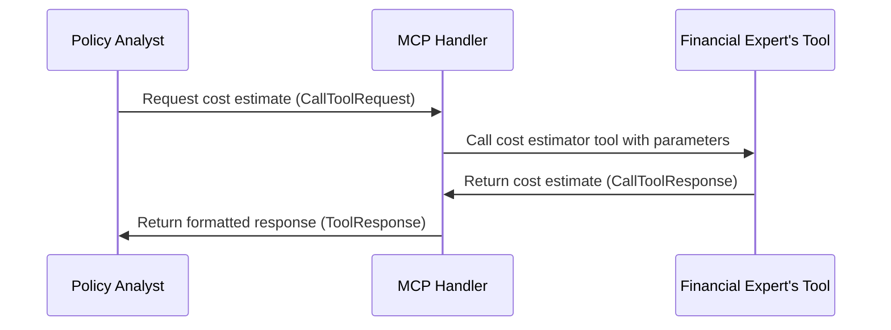

# Chapter 7: MCP (Model Context Protocol)

Following on from our understanding of [Routes](06_routes.md), we'll now delve into the core communication language of our factory, the *MCP (Model Context Protocol)*.

Imagine our factory needs to produce a report on the impact of a new healthcare law.  This involves several [Agents](04_agent.md) – a policy analyst, a financial expert, and a legal advisor.  They need to exchange information and use specialized tools, like a "policy impact predictor" or a "cost estimator."  How do we ensure they all understand each other and can use these tools effectively?  That's where MCP comes in.

## Understanding MCP

MCP is like a standardized language for our factory. It defines how different [Agents](04_agent.md) communicate and use tools.  It ensures that when the policy analyst requests a cost estimate, the financial expert understands the request and provides the information in a format the policy analyst can use.

Think of it like ordering a coffee.  You don't need to know how the barista makes the coffee, but you both understand the language of ordering – "I'd like a latte, please."  MCP provides that shared language for our [Agents](04_agent.md).

## Key Concepts of MCP

1. **Tools:** These are the specialized functions each [Agent](04_agent.md) can perform, like our "cost estimator."
2. **Requests:**  These are messages sent between [Agents](04_agent.md) to request information or use a tool.  They're like our coffee order.
3. **Responses:** These are the results returned by a tool, like the latte we receive.  They're formatted in a standardized way so everyone understands them.

## Using MCP: Example

Let's see how our policy analyst would use MCP to request a cost estimate:

```rust
// Simplified example - details omitted for clarity
use crate::protocols::mcp::healthcare_tools::PatientFinancialAssessmentRequest;

// ... other code ...

// Create the request
let request = PatientFinancialAssessmentRequest {
    patient_id: "ANON-1234".to_string(),
    // ... other parameters
};

// Call the tool (using MCP)
let response = healthcare_handler.patient_financial_assessment(request).await;

// Process the response
// ...
```

This simplified code shows how an [Agent](04_agent.md) would create a request and call a tool using MCP. The `response` would contain the cost estimate in a standardized format.

## Inside MCP: Implementation

Here's a sequence diagram illustrating a simplified MCP interaction:



1. The Policy Analyst sends a request (using `CallToolRequest`) to the MCP Handler.
2. The MCP Handler calls the appropriate tool (e.g., the Financial Expert's "cost estimator").
3. The tool returns the result (`CallToolResponse`).
4. The MCP Handler formats the result into a standardized `ToolResponse` and sends it back to the Policy Analyst.

The core MCP logic is implemented in `src/protocols/mcp.rs` and related files within the `src/protocols/mcp` directory.  Here's a simplified snippet from `src/protocols/mcp/healthcare_tools.rs`:

```rust
// src/protocols/mcp/healthcare_tools.rs
#[tool(tool_box)]
impl HealthcareMcpHandler {
    // ... other code ...

    async fn patient_financial_assessment(&self, #[tool(aggr)] params: PatientFinancialAssessmentRequest) -> ToolResponse<PatientFinancialAssessment> {
        // ... (Implementation details omitted)
        // This function handles the request and returns a ToolResponse
    }
}
```

This code defines the `patient_financial_assessment` tool, which receives a request and returns a `ToolResponse` containing the assessment results.

## Conclusion

MCP provides a standardized communication protocol for our [Agents](04_agent.md), enabling them to exchange information and use tools effectively.  This is crucial for complex collaborations, like generating our healthcare law impact report.  Next, we'll explore how [Agents](04_agent.md) communicate directly using the [A2A (Agent-to-Agent) Protocol](08_a2a__agent_to_agent__protocol.md).


---

Generated by [AI Codebase Knowledge Builder](https://github.com/The-Pocket/Tutorial-Codebase-Knowledge)