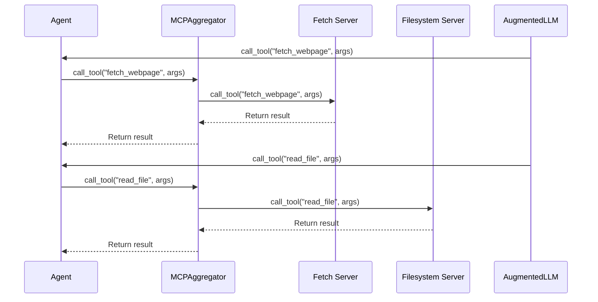

# Chapter 7: MCPAggregator

In the previous chapter, [MCPConnectionManager](06_mcpconnectionmanager.md), we learned how the `MCPApp` manages connections to individual [MCP Servers](04_mcp_server.md).  Now, let's explore how to access *multiple* servers simultaneously using the `MCPAggregator`.

## What problem does MCPAggregator solve?

Imagine our news summarization assistant has grown more sophisticated. It now needs to access a "fetch" server to download web pages *and* a "filesystem" server to read files from disk.  How can our [Agent](02_agent.md) access tools from both servers?  The `MCPAggregator` acts like a general contractor, coordinating different specialists (MCP servers) for a construction project.  It allows an agent to easily use tools from multiple toolboxes.

## Key Concepts

The `MCPAggregator` combines multiple MCP servers, allowing an [Agent](02_agent.md) to access tools from different toolboxes.

## Using MCPAggregator

You typically interact with the `MCPAggregator` through an [Agent](02_agent.md).  The agent uses the aggregator behind the scenes to access tools from multiple servers.  Let's see a simplified example:

```python
from mcp_agent.agents.agent import Agent
from mcp_agent.workflows.llm.augmented_llm_openai import OpenAIAugmentedLLM

async def my_task():
    agent = Agent(
        name="my_agent",
        instruction="Access tools from multiple servers.",
        server_names=["fetch", "filesystem"],
    )
    async with agent:
        llm = await agent.attach_llm(OpenAIAugmentedLLM)
        webpage = await llm.generate_str("Fetch https://www.example.com")
        file_content = await llm.generate_str("Read file: my_file.txt")
        print(webpage) # Output: (Content of the webpage)
        print(file_content) # Output: (Content of the file)

```

In this example, the `my_agent` has access to both the "fetch" and "filesystem" servers.  The [AugmentedLLM](05_augmentedllm.md) can then use tools from either server without the agent needing to explicitly manage the connections.

## Internal Implementation

When the `AugmentedLLM` calls a tool, the `MCPAggregator` searches for the tool across all connected servers.



Here's a simplified look at the `call_tool` function from `src/mcp_agent/mcp/mcp_aggregator.py`:

```python
async def call_tool(self, name: str, arguments: dict | None = None) -> CallToolResult:
    # ... find the server that provides the tool ...
    if self.connection_persistence:
        server_connection = await self._persistent_connection_manager.get_server(server_name)
        # ... call the tool on the server ...
    else:
        async with gen_client(server_name, server_registry=self.context.server_registry) as client:
            # ... call the tool on the server ...
```

The `MCPAggregator` also handles loading tools and prompts from all connected servers during initialization.  This is done in the `load_servers` function:

```python
async def load_servers(self):
    # ... load tools and prompts from each server ...
```

## Conclusion

The `MCPAggregator` simplifies access to multiple [MCP Servers](04_mcp_server.md), allowing [Agents](02_agent.md) to use tools from different servers seamlessly.  It acts as a central point of contact, managing the connections and routing tool calls to the appropriate server. In the next chapter, [Settings](08_settings.md), we'll explore how to configure the `MCPApp` and its various components.


---

Generated by [AI Codebase Knowledge Builder](https://github.com/The-Pocket/Tutorial-Codebase-Knowledge)