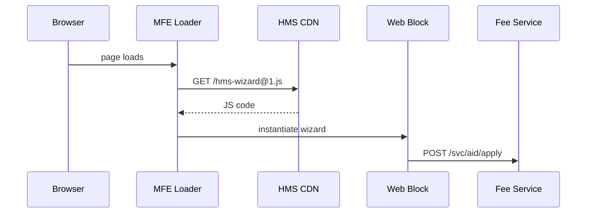

# Chapter 7: Micro-Frontend Interface Library (HMS-MFE)

*(If you just finished [Backend Service Core (HMS-SVC)](06_backend_service_core__hms_svc__.md) you saw how tiny services do the heavy lifting behind the curtain.  
Now let’s build the **curtain itself**—the screens citizens and clerks actually touch.)*

---

## 1. Why Do We Need HMS-MFE?

### Story – “Apply for Disaster Assistance”

1. A hurricane hits Florida.  
2. FEMA needs a public form **today** so families can request aid.  
3. At the same time, the Small Business Administration (SBA) needs a **dashboard** to approve loans, and HUD wants a **wizard** that guides people through housing options.

Historically each agency would spin up its own React app, copy-paste CSS, and forget accessibility rules.  
**HMS-MFE is Lego for screens.**  
Designers drag-and-drop **blocks**—`<hms-card>`, `<hms-table>`, `<hms-wizard>`—that already know:

* Color palette & fonts from [HMS-GOV](01_governance_layer__hms_gov__.md)  
* Where to fetch data (`/svc/...`) from [HMS-SVC](06_backend_service_core__hms_svc__.md)  
* How to trace every click with the MCP `trace_id`

Result: FEMA, SBA, and HUD ship a united experience in hours—not weeks.

---

## 2. Key Concepts (Plain English)

| Word          | What It Means                               | Analogy                           |
|---------------|---------------------------------------------|-----------------------------------|
| Block         | A self-contained Web Component (`<hms-card>`)| A single Lego brick               |
| Theme         | Shared CSS variables (colors, spacing)      | Paint job applied to every brick  |
| Manifest      | JSON file listing which blocks a page needs | Lego instruction booklet          |
| Loader        | A 2 KB script that fetches & injects blocks | The person dumping bricks on table|
| Slot          | Placeholder area inside a block             | Empty stud waiting for another brick|

Remember these five and you can speak MFE fluently.

---

## 3. Your First Page in 3 Steps

### 3.1 Create a Manifest (≤10 lines)

```json
// file: disaster_portal.mfe.json
{
  "title": "Disaster Aid Application",
  "blocks": [
    { "type": "card",   "src": "hms-card@^1" },
    { "type": "wizard", "src": "hms-wizard@^1" }
  ]
}
```

Explanation  
1. `type` is just human-readable.  
2. `src` tells the Loader which NPM package & semver to pull (from the public CDN).  
3. No CSS, no framework setup—only a list!

### 3.2 Drop the Loader in HTML (7 lines)

```html
<!doctype html>
<html>
<head>
  <script src="https://cdn.hms.gov/mfe/loader@1.js"></script>
</head>
<body data-mfe="disaster_portal.mfe.json"></body>
</html>
```

What happens?  
* The Loader reads `data-mfe`, downloads the manifest, fetches blocks, and mounts them—**all under 800 ms on broadband**.

### 3.3 Wire a Wizard Step (18 lines)

```html
<!-- auto-inserted by Loader -->
<hms-wizard id="aid-wizard">
  <step title="Your Info">
    <input name="fullName" label="Full name"/>
    <input name="ssn"      label="SSN" mask="###-##-####"/>
  </step>

  <step title="Damage Details">
    <textarea name="damage"></textarea>
  </step>

  <script>
    aidWizard.onSubmit = formData =>
      fetch("/svc/aid/apply", { method:"POST", body: JSON.stringify(formData)})
         .then(r => r.json())
         .then(() => alert("✅ Request received!"));
  </script>
</hms-wizard>
```

Explanation  
1. `<hms-wizard>` provides validation, “Next”/“Back” buttons, progress bar, and accessibility labels out of the box.  
2. We only supply fields and an `onSubmit` handler.

---

## 4. What Happens Under the Hood?



• The Loader is framework-agnostic (plain ES modules).  
• Blocks lazy-load only when visible (so dashboards stay fast).  
• CSP & Subresource Integrity are enforced automatically.

---

## 5. Peek Inside the Source Tree

```
hms-mfe/
├── packages/
│   ├── card/
│   │   └── index.ts
│   ├── table/
│   └── wizard/
├── loader/
│   └── index.js
└── docs/
```

### 5.1 `packages/card/index.ts` (12 lines)

```ts
import { LitElement, html, css } from 'lit';
export class HmsCard extends LitElement {
  static styles = css`
     :host { display:block; border:1px solid var(--hms-border); }
     header { font-weight:bold; }
  `;
  render() {
    return html`
      <header><slot name="title"></slot></header>
      <section><slot></slot></section>
    `;
  }
}
customElements.define('hms-card', HmsCard);
```

Beginners’ takeaway:  
*Every block is just a tiny **Web Component**—so it works in React, Vue, Angular, or plain HTML.*

### 5.2 `loader/index.js` (15 lines)

```js
(async () => {
  const manifestUrl = document.body.dataset.mfe;
  const { blocks } = await fetch(manifestUrl).then(r => r.json());
  for (const { src } of blocks) {
    const tag = src.split('@')[0];     // "hms-wizard"
    if (!customElements.get(tag)) {
      await import(`https://cdn.hms.gov/${src}.js`);
    }
    document.body.appendChild(document.createElement(tag));
  }
})();
```

1. Fetches the manifest.  
2. Dynamically imports each block once.  
3. Appends an element of that tag to the page.

No bundler, no CLI—**copy one file and you’re done**.

---

## 6. Theming & Accessibility

```css
:root {
  --hms-primary: #0B5FFF;
  --hms-border : #dcdcdc;
}
/* Agencies may override: */
.hud-theme { --hms-primary:#006400; }   /* HUD green */
```

Blocks inherit CSS variables, so changing a theme is just swapping a class on `<body>`.

All blocks pass WCAG-AA by default; screen-reader labels come for free.

---

## 7. Talking to Back-End Services

Blocks auto-embed an MCP `trace_id` in every fetch:

```js
fetch(url, {
  headers: { "X-HMS-Trace": currentTraceId }
});
```

That makes the UI instantly observable by [Activity & Operations Monitoring (HMS-OPS)](12_activity___operations_monitoring__hms_ops___hms_oms__.md) and auditable by [Compliance & Legal Reasoner (HMS-ESQ)](10_compliance___legal_reasoner__hms_esq__.md).

---

## 8. Try It Yourself (5-Minute Lab)

```bash
git clone https://github.com/hms-example/hms-mfe
cd hms-mfe/examples
# Start a tiny static server
npx serve .
# Open http://localhost:3000/disaster.html
```

Play with the wizard; check DevTools → Network.  
You’ll see each block loaded from the CDN and X-HMS-Trace headers on every request.

---

## 9. Recap & What’s Next

You learned:

✓ HMS-MFE lets you build full portals by **listing blocks in a JSON manifest**.  
✓ A 2 KB Loader downloads, themes, and mounts Web Components on demand.  
✓ Every block already speaks MCP, respects governance policies, and logs trace IDs.  
✓ Agencies share the same bricks—update once, benefit everywhere.

Next we’ll see **where all those form submissions and logs actually land**—our unified data lake: [Data Lake & Repository (HMS-DTA)](08_data_lake___repository__hms_dta__.md).

---

---

Generated by [AI Codebase Knowledge Builder](https://github.com/The-Pocket/Tutorial-Codebase-Knowledge)