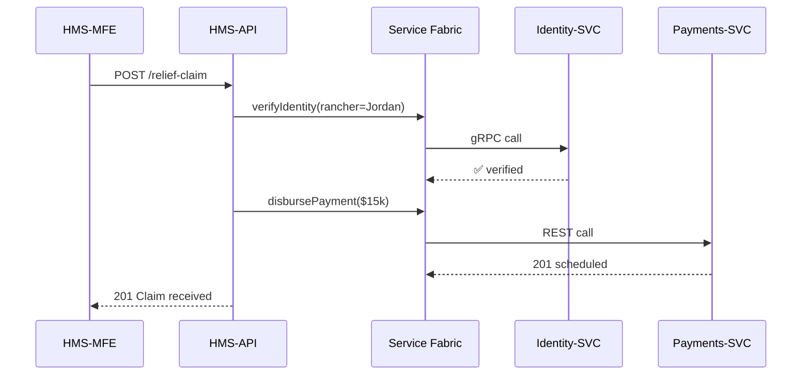

# Chapter 7: Microservices Fabric (HMS-SVC)

[⬅︎ Back to Chapter&nbsp;6: Protocol Blueprint](06_protocol_blueprint_.md)

---

## 1. Why do we need a “fabric” at all?

Picture **Jordan**, a rancher hit by drought in Arizona.  
He opens HMS-MFE and files for the **USDA Livestock Forage Disaster Program**.

Behind that single click, three totally different chores must happen:

1. **Identity-SVC** – confirm Jordan’s eAuth login really owns the ranch.  
2. **Payments-SVC** – schedule a relief deposit to Jordan’s bank.  
3. **Analytics-SVC** – add an anonymized record to the Drought Impact dashboard watched by Congress.

If any one of those chores stalls, we *still* want the other two to work, and we never want a stuck payment to *knock out* identity checks for thousands of other farmers.

That independence—and the “don’t touch my neighbor’s pipes” safety—is what **HMS-SVC (Microservices Fabric)** gives us.  
Think of it as the **city utility grid** for software: each agency office gets water, power, and data through separate, self-healing lines.

---

## 2. Key concepts in plain English

| Term | What it really means | City-grid analogy |
|------|----------------------|-------------------|
| Containerized Service | A tiny app with one job (identity, payments…) | A dedicated water main |
| Service Discovery | Auto-finding a service’s address at runtime | City map of all pipes |
| Circuit Breaker | Automatic off-switch when a service misbehaves | Pressure valve that closes a leaky line |
| Zero-Trust Mesh | Mutual TLS between every service, no implicit trust | Locked utility boxes with ID badges |
| Sidecar Proxy | Little helper process that handles the above for its service | A smart meter outside each building |

Keep these five in mind; the rest is wiring.

---

## 3. One concrete walk-through

Below is the happy-path when Jordan hits **“Submit”**:



Notice HMS-API never “hard-codes” where Identity-SVC lives; it simply asks the **Fabric**.

---

## 4. Trying it on your laptop (5-minute demo)

### 4.1 Spin up three microservices + the fabric

```bash
git clone hms-demo && cd hms-demo

# one-liner dev script
./dev.sh              # runs docker-compose up
```

What just launched?

* `identity-svc`  (localhost:7001)  
* `payments-svc`  (localhost:7002)  
* `analytics-svc` (localhost:7003)  
* `svc-mesh` – tiny service registry & proxy (localhost:6000)  
* `hms-api` (localhost:5000) – already wired to the mesh

### 4.2 Watch automatic discovery

```bash
curl localhost:6000/registry
```

Example output:

```json
{
  "identity-svc": "10.5.0.12:7001",
  "payments-svc": "10.5.0.13:7002",
  "analytics-svc": "10.5.0.14:7003"
}
```

No IP typing required—services registered themselves at startup.

### 4.3 Submit a fake claim

```bash
curl -X POST http://localhost:5000/api/relief-claim \
     -d '{"rancher":"Jordan","amount":15000}'
```

You should see:

```json
{ "status":"OK", "paymentId":"pay_993", "identity":"verified" }
```

Open `docker compose logs payments-svc` to confirm the payment endpoint fired.

---

## 5. What happens if a service goes down?

Let’s kill payments-svc:

```bash
docker compose stop payments-svc
```

Call the API again:

```bash
curl -X POST http://localhost:5000/api/relief-claim \
     -d '{"rancher":"Jordan","amount":15000}'
```

Response:

```json
{
  "status": "PARTIAL_SUCCESS",
  "identity": "verified",
  "payment": "queued_for_retry"
}
```

Why no crash?

1. The **circuit breaker** in the mesh noticed failures > 3 and *opened* the circuit.  
2. HMS-API got a fast “queued for retry” response instead of timing out.  
3. A background job (not shown) will re-attempt when payments-svc comes back.

---

## 6. Mini-tour of the code (Node +  docker-compose)

### 6.1 Service registration (runs inside every svc)

```ts
// src/bootstrap/register.ts
import axios from 'axios';

export async function register(name: string, port: number) {
  await axios.post('http://svc-mesh:6000/register', { name, port });
  setInterval(() => axios.post('http://svc-mesh:6000/heartbeat', { name }), 5000);
}
```

Explanation  
1. `register()` tells the mesh where we live.  
2. A 5-second heartbeat keeps the entry fresh.  
3. If the mesh misses 3 beats → entry is dropped.

### 6.2 Calling another service with discovery + breaker

```ts
// src/lib/callSvc.ts
import axios from 'axios';
import CircuitBreaker from 'opossum';

export async function callSvc(target: string, path: string, body = {}) {
  // 1. Ask mesh for address
  const { data: addr } = await axios.get(`http://svc-mesh:6000/resolve/${target}`);

  // 2. Wrap HTTP call in a breaker (5s timeout, open after 3 fails)
  const breaker = new CircuitBreaker(
    () => axios.post(`http://${addr}${path}`, body),
    { timeout: 5000, errorThresholdPercentage: 50 }
  );
  return breaker.fire();
}
```

Line-by-line:

1. Resolve `payments-svc` → `10.5.0.13:7002`.  
2. Make the call; if > 50 % fail, the breaker opens for 10 s.  
3. HMS-API treats an open breaker as “queued for retry”.

All < 20 lines!

### 6.3 docker-compose snippet (shortened)

```yaml
services:
  svc-mesh:
    image: hms/mesh
    ports: ["6000:6000"]

  identity-svc:
    build: services/identity
    environment: { MESH_HOST: svc-mesh }

  payments-svc:
    build: services/payments
    environment: { MESH_HOST: svc-mesh }

  hms-api:
    build: hms-api
    environment: { MESH_HOST: svc-mesh }
```

Each service points to `svc-mesh`; no one hard-codes neighbor IPs.

---

## 7. Security: Zero-Trust inside the fabric

1. Every call travels through the mesh’s **sidecar proxy**, which:  
   • Upgrades plain HTTP to **mTLS**.  
   • Checks the caller’s JWT that IAM (see [Chapter 4](04_access___identity_control__zero_trust_iam__.md)) injected.  
2. If a rogue container tries a direct hit (`curl identity-svc:7001`) the mesh firewall blocks it—no badge, no entry.

*Good news for auditors:* service-to-service logs include **caller ID**, **method**, and **latency**—fed into the Metrics Loop in Chapter 12.

---

## 8. Common pitfalls & quick fixes

| Pitfall | How to avoid |
|---------|--------------|
| “Works on my machine” but not in prod | Always call `callSvc()`—never hard-code URLs |
| Breaker never resets | Configure a `resetTimeout` (e.g., 10 000 ms) |
| Registry memory leak | Purge entries that miss 3 heartbeats |
| Silent TLS failures | Turn on `mesh --strict` to block *any* plain HTTP |

---

## 9. Recap & what’s next

Today you:

✓ Saw why each capability lives in its **own** container  
✓ Learned five key pieces: Discovery, Breaker, Mesh, Sidecar, Zero-Trust  
✓ Watched a service self-register and another consume it in <20 lines  
✓ Simulated a failure and observed graceful degradation

Next we’ll look outward—how HMS syncs with *legacy* mainframes, partner clouds, and federal open-data portals.  
Ready to plug into the outside world? Jump to  
[Chapter 8: External System Sync Adapter](08_external_system_sync_adapter_.md)

---

---

Generated by [AI Codebase Knowledge Builder](https://github.com/The-Pocket/Tutorial-Codebase-Knowledge)