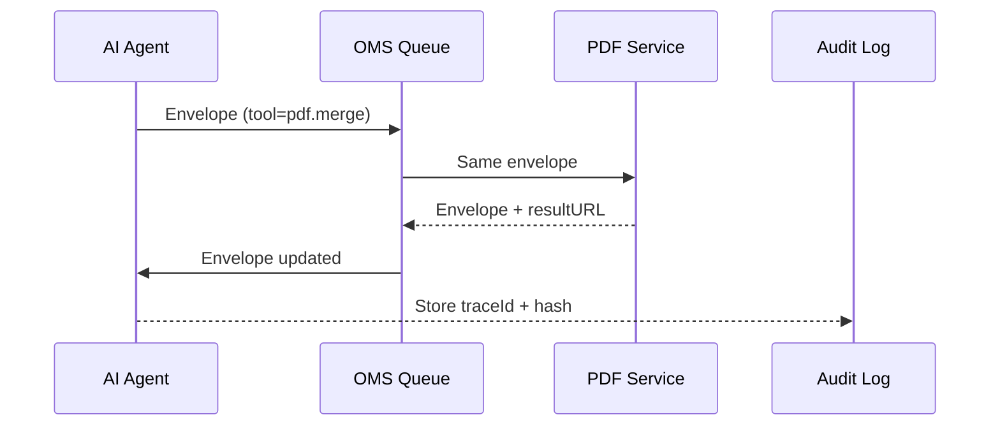

# Chapter 7: Model Context Protocol (HMS-MCP)

*(just landed here from [AI Representative Agent (HMS-AGT / HMS-AGX)](06_ai_representative_agent__hms_agt___hms_agx__.md))*  

---

> “If every AI module were a diplomat from a different country, **MCP** is the UN interpreter booth.”  
> One grammar, no lost meaning, full audit trail.

---

## 1. Why does HMS-GOV need a universal grammar?

Use-case:  
The **National Health Information Center (NHIC)** wants an AI assistant that can:

1. Read a citizen’s email: “Please send me all child-vaccination brochures in Spanish.”  
2. Query the document catalog.  
3. Ask the PDF service to merge selected files.  
4. E-mail the bundle back.

Today each step speaks its own dialect:

* Agent returns plain text.  
* Catalog API expects GraphQL.  
* PDF service wants `/merge?ids=…`.  
* Audit office needs a CSV log.

Result: brittle adapters everywhere.

**Model Context Protocol (MCP)** fixes this by wrapping every request and response in the **same envelope**, whether human, AI model, or tool is speaking.

---

## 2. Five key concepts (in plain English)

| Term | Think of it as… | 1-line explanation |
|------|-----------------|--------------------|
| Envelope | A manila folder | Holds the whole conversation & metadata. |
| Message | A sticky note | One utterance: user, assistant, tool, etc. |
| Role | Who’s talking | `system`, `user`, `assistant`, `tool`. |
| Invocation | A stamped form inside | Tells a tool which function to run with which args. |
| Trace ID | Tracking number | Lets auditors replay the story later. |

---

## 3. A complete MCP envelope (hello-world)

```json
{
  "traceId": "abc-123",
  "messages": [
    { "role": "system",    "content": "You are NHIC assistant." },
    { "role": "user",      "content": "Spanish vaccination brochures please." },
    { "role": "assistant", "content": "Searching catalog…" },
    {
      "role": "tool",
      "name": "docCatalog.search",
      "arguments": { "lang": "es", "subject": "vaccination" }
    }
  ],
  "meta": {
    "tenant": "NHIC",
    "timestamp": "2025-04-01T10:42:00Z"
  }
}
```

What just happened?

1. `traceId` keeps every hop tied together.  
2. `messages` is an **ordered list**—no branching confusion.  
3. A *tool message* says: “Call `docCatalog.search()` with `{lang:'es'}`.”  
4. `meta` stores extra breadcrumbs (tenant, time, user-id, etc.).

---

## 4. Building an envelope in 12 lines of code

```js
// lib/mcp.js
export function makeEnvelope(userText) {
  return {
    traceId : crypto.randomUUID(),
    messages: [
      { role:'system', content:'You are NHIC assistant.' },
      { role:'user',   content:userText }
    ],
    meta: { tenant:'NHIC', ts:Date.now() }
  }
}
```

Explanation  
• One helper returns a ready-to-use envelope.  
• More messages (assistant replies, tool calls) will be **pushed** into `messages` as the dialog unfolds.

---

## 5. Invoking a tool with MCP

Assume the AI decides to merge PDFs with the service `pdf.merge`.

```js
// After thinking, the agent adds:
envelope.messages.push({
  role:'tool',
  name:'pdf.merge',
  arguments:{ ids:['doc-7', 'doc-8'] }
})

// Send to OMS queue
queue.add('mcp', envelope)
```

Every watcher (queue worker, logger, or human reviewer) now **sees exactly** what was requested and with which parameters.

---

## 6. The dance: agent → tool service → agent



Only four participants; everyone speaks MCP.

---

## 7. Under the hood – minimal validator (18 lines)

```js
// mcp/validate.js
import Ajv from 'ajv'
import schema from './mcp.schema.json'   // generated from spec

const ajv = new Ajv()
const check = ajv.compile(schema)

export function validate(env) {
  if (!check(env))
    throw new Error('Invalid MCP: '+ajv.errorsText(check.errors))
  return true
}
```

Explanation  
• Any service receives an envelope, runs `validate(envelope)`, and can safely assume the shape is correct.  
• Violations are blocked **before** hitting business logic.

---

## 8. Storing the audit trail (10 lines)

```js
// audit/store.js
import fs from 'fs'
export function record(env) {
  const line = `${env.traceId},${Date.now()},${env.meta.tenant}\n`
  fs.appendFile('audit.csv', line, ()=>{})   // fire-and-forget
}
```

Now the compliance team can reconstruct *who did what, when*, by replaying the envelopes associated with a `traceId`.

---

## 9. How agents discover available tools

Each service registers a **Tool Card**:

```json
{
  "name": "pdf.merge",
  "description": "Combine multiple PDFs into one",
  "parameters": {
    "type": "object",
    "properties": {
      "ids": { "type":"array", "items":{"type":"string"} }
    },
    "required": ["ids"]
  }
}
```

The agent loads all cards at startup (or on demand) and can use them inside MCP messages.  
Tool cards themselves are plain JSON, so they can live in the [AI Capability Marketplace](08_ai_capability_marketplace__hms_mkt__.md) you will meet next.

---

## 10. Quick FAQ

| Question | Answer |
|----------|--------|
| **Is MCP only for LLMs?** | No, a human UI can wrap its clicks in MCP so downstream tools understand them. |
| **Binary payloads?** | Store them elsewhere (S3, DB) and reference the URI inside `arguments`. |
| **Does every message need `meta`?** | Only the envelope needs it once; inner messages inherit. |
| **Encryption?** | Optional field `meta.enc=true` signals body is AES-GCM encrypted in transit. |

---

## 11. Recap

You learned:

✓ Why multiple modules need a common “interpreter booth.”  
✓ The five MCP building blocks: Envelope, Message, Role, Invocation, Trace ID.  
✓ How to create, validate, and audit an envelope in <20 lines each.  
✓ How agents discover and call tools using **Tool Cards**.  
✓ How MCP glues together AI agents, services, queues, and auditors.

Ready to publish and share those tool cards across agencies?  
Hop to [AI Capability Marketplace (HMS-MKT)](08_ai_capability_marketplace__hms_mkt__.md).

---

Generated by [AI Codebase Knowledge Builder](https://github.com/The-Pocket/Tutorial-Codebase-Knowledge)