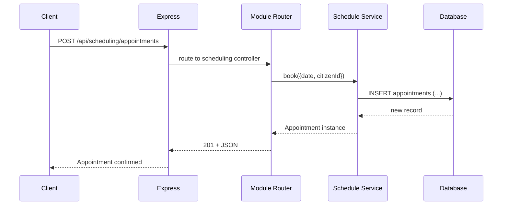

# Chapter 7: Module System

Welcome back! In [Chapter 6: CodifySubproject](06_codifysubproject_.md), you learned how to break big programs or policies into focused initiatives. Now it’s time to see **where** those features live and **how** they plug into HMS-API without touching core code. Say hello to the **Module System**.

---

## 7.1 Why a Module System?

Imagine HMS-API as a large government building. Each department—Licensing, Inspections, Appeals—works independently but shares the same hallways, elevators, and security. When you need a new service (say, scheduling inspections), you don’t rebuild the entire building. You simply add a new department suite.  

**Use Case:**  
A state Health Department wants to add a **Scheduling Module** for vaccine appointments. By dropping a “scheduling” folder into `modules/`, HMS-API instantly knows how to route requests, apply business rules, and store data—without touching its core.

---

## 7.2 Key Concepts

1. **Module**  
   A self-contained feature folder (e.g., `modules/scheduling`).  
2. **Controller**  
   Defines HTTP endpoints (routes) and maps them to services.  
3. **Service**  
   Contains business logic—like “book an appointment” or “cancel slot.”  
4. **Model**  
   Shapes and validates data (e.g., `Appointment` with `date`, `citizenId`).  
5. **Plug-and-Play**  
   Add, remove, or swap modules by updating a single entry in your app’s module registry.

> Analogy: Each Module is like a government office suite ready to serve specific needs, while the building infrastructure (core HMS-API) handles security, logging, and shared services.

---

## 7.3 How to Use the Module System

### 7.3.1 Create a New Module

1. Under `modules/`, create a folder for your feature:
   ```
   modules/
     scheduling/
       controllers/
       services/
       models/
       index.js
   ```
2. Define a simple model:

```js
// modules/scheduling/models/appointmentModel.js
class Appointment {
  constructor({ id, date, citizenId }) {
    this.id = id;
    this.date = date;
    this.citizenId = citizenId;
  }
}
module.exports = Appointment;
```
*This model represents an appointment record.*

3. Add a service:

```js
// modules/scheduling/services/scheduleService.js
const Appointment = require('../models/appointmentModel');
const db = require('../../core/db');

async function book({ date, citizenId }) {
  // Simplified insert
  const result = await db.insert('appointments', { date, citizenId });
  return new Appointment(result);
}
module.exports = { book };
```
*The service handles booking logic and talks to the DB.*

4. Create a controller:

```js
// modules/scheduling/controllers/scheduleController.js
const express = require('express');
const router = express.Router();
const { book } = require('../services/scheduleService');

router.post('/appointments', async (req, res) => {
  const appt = await book(req.body);
  res.status(201).json(appt);
});

module.exports = router;
```
*This controller exposes a POST `/appointments` endpoint.*

5. Register your module:

```js
// modules/scheduling/index.js
const controller = require('./controllers/scheduleController');
module.exports = { route: '/api/scheduling', controller };
```
*Export your route prefix and controller.*

### 7.3.2 Hook Modules into HMS-API

In your main app setup:

```js
// app.js (core)
const express = require('express');
const modules = require('./modules'); // auto-loads every index.js
const app = express();
app.use(express.json());

// Mount each module
modules.forEach(m => {
  app.use(m.route, m.controller);
});

app.listen(3000);
```
*This loop mounts each module under its `/api/…` path.*

---

## 7.4 What Happens Under the Hood?



1. **Client** calls `/api/scheduling/appointments`.  
2. **Express** (core) routes to the Scheduling module.  
3. **Controller** calls the **Service** logic.  
4. **Service** writes to the **DB** and returns a Model.  
5. **Controller** responds with JSON.

---

## 7.5 Internal Module Loading

Under the hood, your `modules/` folder might auto-discover modules:

```js
// modules/index.js
const fs = require('fs');
const path = require('path');

module.exports = fs
  .readdirSync(__dirname)
  .filter(name => name !== 'index.js')
  .map(name => require(path.join(__dirname, name)));
```
*This simple script reads each module folder and imports its `index.js`.*

---

## Conclusion

You’ve learned how the **Module System** turns HMS-API into a plug-and-play engine: just drop in a feature folder with `controllers`, `services`, and `models`, and it wires itself up. This design empowers rapid iteration and customization—no core changes needed.

Next up: see a real example by building the [Assessment Module](08_assessment_module_.md).

---

Generated by [AI Codebase Knowledge Builder](https://github.com/The-Pocket/Tutorial-Codebase-Knowledge)