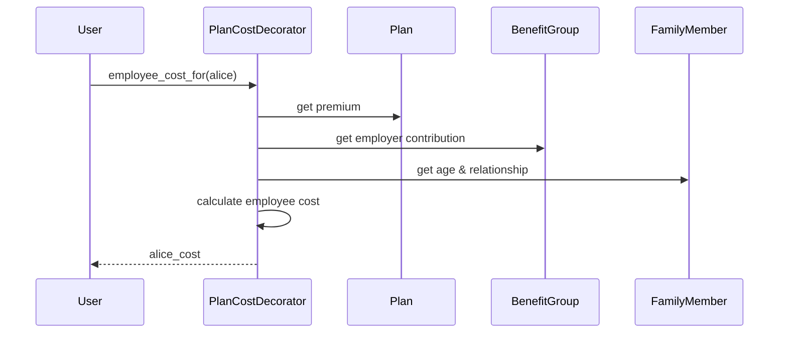

# Chapter 7: PlanCostDecorator

In the previous chapter, [HbxEnrollment](06_hbxenrollment.md), we learned how to represent a family's enrollment in a health plan.  This chapter introduces the `PlanCostDecorator`, which helps us calculate the cost of a health plan for a given member or family. Think of it as a price tag generator for health plans.

## What problem does `PlanCostDecorator` solve?

Imagine Alice's family has enrolled in the "Acme Corp Silver Plan".  How do we calculate how much Alice, Bob, and Charlie will each pay for this plan, taking into account their ages, relationship to Alice (the subscriber), and Acme Corp's contributions? The `PlanCostDecorator` solves this.  It takes a [Plan](XX_plan.md), a [FamilyMember](XX_familymember.md) (or [CensusEmployee](XX_census_employee.md)), and a [BenefitGroup](05_benefitgroup.md) as input and calculates the cost for that member.

## Key Concepts:

1. **Decoration:** The `PlanCostDecorator` "decorates" a [Plan](XX_plan.md) object. This means it adds extra functionality to the plan, specifically cost calculation methods, without modifying the original [Plan](XX_plan.md) class.  Think of it like adding toppings to a plain ice cream – you get a more flavorful ice cream (decorated plan) without changing the original ice cream (plain plan).

2. **Inputs:** The `PlanCostDecorator` needs three main ingredients:
    - The [Plan](XX_plan.md) itself (the ice cream).
    - The [FamilyMember](XX_familymember.md) or [CensusEmployee](XX_census_employee.md) (who's eating the ice cream).
    - The [BenefitGroup](05_benefitgroup.md) (the menu that lists the ice cream and its price).

3. **Outputs:** The `PlanCostDecorator` provides methods to calculate:
    - `premium_for(member)`: The total cost of the plan for the member.
    - `employer_contribution_for(member)`: How much the employer contributes towards the cost.
    - `employee_cost_for(member)`: How much the employee has to pay.

## Using the `PlanCostDecorator`

Let's calculate how much Alice pays for the "Acme Corp Silver Plan":

```ruby
# ... other code ...

plan = Plan.find(plan_id) # Assuming plan_id is known
alice = FamilyMember.find(alice_id) # Assuming alice_id is known
benefit_group = BenefitGroup.find(benefit_group_id) # Assuming benefit_group_id is known

plan_cost_decorator = PlanCostDecorator.new(plan, alice, benefit_group, benefit_group.reference_plan)
alice_cost = plan_cost_decorator.employee_cost_for(alice)

puts "Alice's cost: #{alice_cost}"

# ... other code ...
```

This code creates a `PlanCostDecorator` object, passing in the plan, Alice's `FamilyMember` object, and the `BenefitGroup`.  It then calls `employee_cost_for(alice)` to get Alice's cost.

## Under the Hood

When you call `employee_cost_for(alice)`, the following happens:

1. **Premium Retrieval:** The `PlanCostDecorator` retrieves the plan's premium from the [Plan](XX_plan.md) object.
2. **Contribution Calculation:** It calculates the employer's contribution based on the [BenefitGroup](05_benefitgroup.md) rules.
3. **Employee Cost Calculation:** It subtracts the employer's contribution from the total premium to get Alice's cost.



The code for `employee_cost_for` is in `plan_cost_decorator.rb`:

```ruby
# plan_cost_decorator.rb
class PlanCostDecorator
  # ... other code ...

  def employee_cost_for(member)
    premium_for(member) - employer_contribution_for(member)
    # ... other logic for rounding and large family factors ...
  end

  # ... other code ...
end
```

This simplified code snippet shows how `employee_cost_for` calculates the difference between the premium and the employer contribution.  The actual implementation includes additional logic for rounding, large family discounts, and other factors.

## Conclusion

This chapter introduced the `PlanCostDecorator`, which helps calculate the cost of a health plan for a given member.  We learned about its key concepts and how it's used. In the next chapter, we'll explore [QualifyingLifeEventKind](08_qualifyinglifeeventkind.md).


---

Generated by [AI Codebase Knowledge Builder](https://github.com/The-Pocket/Tutorial-Codebase-Knowledge)