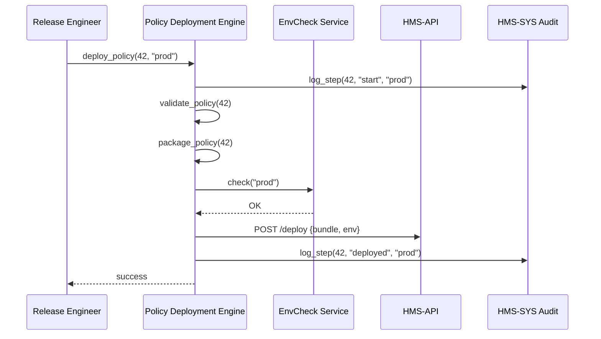

# Chapter 7: Policy Deployment Engine

Welcome back! In [Chapter 6: Human-in-the-Loop Workflow](06_human_in_the_loop_workflow_.md), we added a human review step before any AI-driven change goes live. Now it’s time to **safely push those approved policy updates** into your production environments with the **Policy Deployment Engine**.

---

## 1. Why Do We Need a Deployment Engine?

Imagine you’re at the Employee Benefits Security Administration (EBSA). Your team just approved a new benefit eligibility rule. You need to update:

- The **Backend API** so it enforces the new rule  
- The **Frontend Portal** so citizens see the updated form  
- The **Microservices** that schedule payments  

Without a Deployment Engine, you’d manually copy files, bump versions, and hope you hit every environment. That’s error-prone and slow. The **Policy Deployment Engine** is like a postal sorting center: it **validates**, **packages**, and **routes** your “letters” (policy changes) to the right “mailing lists” (system modules), all while keeping an audit trail.

---

## 2. Key Concepts

1. **Validation**  
   Check the policy package for schema compliance and conflicting versions.

2. **Packaging**  
   Bundle policy rules, configurations, and metadata into a deployable artifact.

3. **Routing**  
   Decide which modules (HMS-API, scheduling service, frontend) get the update.

4. **Environment Checks**  
   Verify that the target environment (dev/staging/production) is healthy.

5. **Version Control**  
   Tag the release in Git or your versioning system for traceability.

6. **Logging**  
   Record each step via the audit service in [HMS-SYS](01_core_system_platform__hms_sys__.md).

---

## 3. Using the Deployment Engine

Here’s a minimal Python script that a release engineer might run after a policy is approved:

```python
# deploy_policy.py (simplified)
from policy_deploy.engine import deploy_policy

# Deploy policy ID 42 to production
deploy_policy(policy_id=42, target_env="production")
print("✅ Policy 42 deployed to production.")
```

Running this will:
1. Validate the policy  
2. Package it into a zip or JSON bundle  
3. Check that production is ready  
4. Push the bundle to each service’s API  
5. Tag the version in Git  
6. Log every step to HMS-SYS for audit

---

## 4. Under the Hood: Sequence Diagram



1. The engine logs the **start** event.  
2. It **validates** and **packages** the policy.  
3. It calls an **environment check** service.  
4. If OK, it **pushes** to `HMS-API` (and other modules).  
5. It logs the **deployed** event.

---

## 5. Inside the Engine: Code Walkthrough

### a) Main Deployment Logic  
File: `policy_deploy/engine.py`

```python
# policy_deploy/engine.py
from policy_deploy.validator import validate_policy
from policy_deploy.packager import package_policy
from policy_deploy.router import route_bundle
from policy_deploy.envcheck import check_env
from hms_sys.audit import log_event

def deploy_policy(policy_id, target_env):
    log_event(policy_id, "deploy_start", {"env": target_env})
    # 1. Validate and package
    policy = validate_policy(policy_id)
    bundle = package_policy(policy)
    # 2. Ensure target environment is ready
    if not check_env(target_env):
        log_event(policy_id, "env_check_failed", {"env": target_env})
        raise RuntimeError("Environment check failed")
    # 3. Send to all target services
    route_bundle(bundle, target_env)
    # 4. Tag version (omitted)
    log_event(policy_id, "deployed", {"env": target_env})
```

Explanation:
- We start and end with `log_event` calls so auditors see every action.
- `validate_policy`, `package_policy`, `check_env`, and `route_bundle` are small helpers.

### b) Validator Example  
File: `policy_deploy/validator.py`

```python
# policy_deploy/validator.py
def validate_policy(policy_id):
    # In reality, check JSON schema, version conflicts, etc.
    print(f"Validating policy {policy_id}…")
    return {"id": policy_id, "rules": {...}}
```

### c) Packaging Helper  
File: `policy_deploy/packager.py`

```python
# policy_deploy/packager.py
import json

def package_policy(policy):
    # Bundle rules and metadata into a JSON string
    bundle = json.dumps(policy)
    print("Policy packaged.")
    return bundle
```

### d) Router Helper  
File: `policy_deploy/router.py`

```python
# policy_deploy/router.py
import requests

SERVICES = {
    "HMS-API": "https://api.gov/deploy",
    "HMS-MFE": "https://mfe.gov/deploy"
}

def route_bundle(bundle, env):
    for name, url in SERVICES.items():
        # POST the bundle to each service
        requests.post(url, json={"bundle": bundle, "env": env})
        print(f"Sent to {name}.")
```

---

## 6. Summary

In this chapter you learned how the **Policy Deployment Engine**:

- Acts like a postal center: **validates**, **packages**, **routes**  
- Coordinates with **HMS-SYS** for logging  
- Checks environment health before pushing updates  
- Bundles, version-tags, and notifies each target service  

With this in place, approved policies smoothly flow into your production pipeline—no manual copy-and-paste needed.  

Up next, we’ll see how to wrap these deployments into broader guardrails with our [Chapter 8: AI Governance Framework](08_ai_governance_framework_.md).

---

Generated by [AI Codebase Knowledge Builder](https://github.com/The-Pocket/Tutorial-Codebase-Knowledge)