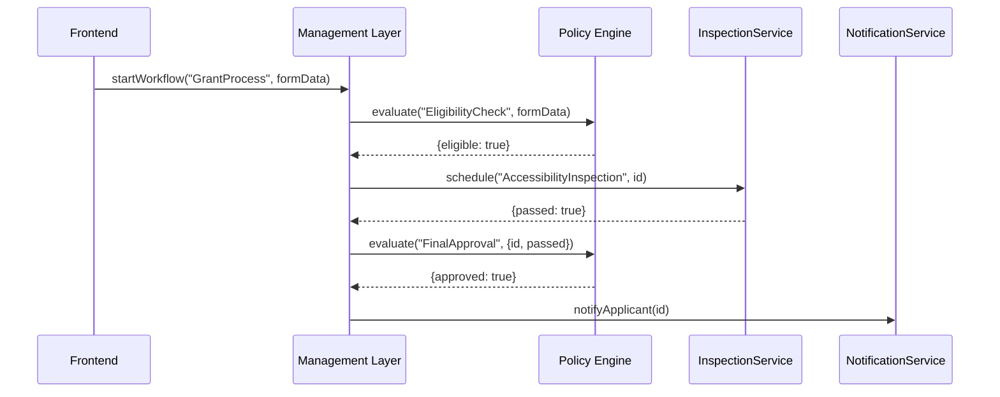
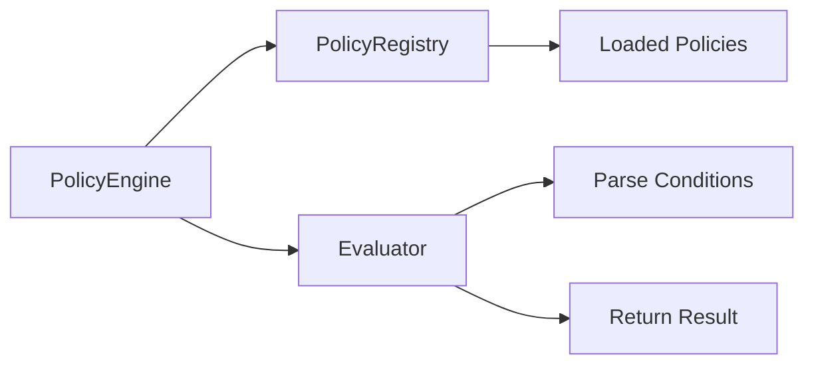

# Chapter 7: Policy Engine & Workflow Orchestration

Welcome back! In [Chapter 6: Management Layer](06_management_layer_.md) we learned how to orchestrate multi-step processes across services. Now we’ll dive into the **Policy Engine & Workflow Orchestration**—the “rulebook” that knows legislative text, encodes decision trees, validates policies, and drives workflows step by step.

---

## Why a Policy Engine?

Imagine the Office of Disability Employment Policy (ODEP) needs to process applications for an Accessible Workplace Grant. The rules might say:

- Applicants must be a small business  
- Annual revenue under \$1M  
- At least one employee with a disability  
- Pass an on-site accessibility inspection  

Hard-coding these checks in each service is error-prone and hard to update when legislation changes. A **Policy Engine** centralizes those rules:

- You write or import policies (in JSON/YAML)  
- The engine **validates** inputs against those rules  
- It **executes** decision trees (e.g., eligibility checkpoints)  
- It ties into the **Workflow Orchestrator** to move from “Check Eligibility” → “Schedule Inspection” → “Notify Applicant”

---

## Central Use Case: Accessible Workplace Grant

1. **Applicant** submits grant data (business size, revenue, employee info).  
2. Our **API** calls **Policy Engine** to check eligibility.  
3. If eligible, the **Workflow** triggers an inspection step.  
4. After inspection, **Policy Engine** applies final approval rules.  
5. **Notification Service** emails the result (approved/rejected).



---

## Key Concepts

1. **Policy Model**  
   A structured representation of rules (JSON/YAML) defining inputs, conditions, and outcomes.

2. **Policy Validation**  
   Ensuring that the policy file itself is well-formed before use (catch typos or missing fields).

3. **Rule Execution**  
   The engine interprets the policy, evaluates conditions, and returns results (e.g., `{ eligible: false, reason: "Revenue too high" }`).

4. **Workflow Orchestration**  
   Uses the Management Layer to sequence rule checks and service calls based on policy outcomes.

5. **Decision Trees**  
   Encode multi-step logic (if A and B then next step C; else end).

---

## Using the Policy Engine

### 1. Define a Policy (grant-policy.json)

```json
{
  "name": "EligibilityCheck",
  "inputs": ["businessSize", "annualRevenue", "hasDisabledEmployee"],
  "rules": [
    { "if": { "businessSize": "<=50" }, "then": { "pass": true } },
    { "if": { "annualRevenue": "<=1000000 }, "then": { "pass": true } },
    { "if": { "hasDisabledEmployee": true }, "then": { "pass": true } }
  ],
  "default": { "pass": false, "reason": "Does not meet criteria" }
}
```

### 2. Load & Evaluate in Code

```js
// src/policyClient.js
import { PolicyEngine } from '@hms-policy';

const engine = new PolicyEngine();
await engine.loadPolicy('EligibilityCheck', 'grant-policy.json');

const result = engine.evaluate('EligibilityCheck', {
  businessSize: 20,
  annualRevenue: 800000,
  hasDisabledEmployee: true
});

console.log(result); 
// { pass: true }
```

Explanation:
- We import a `PolicyEngine` SDK.  
- `loadPolicy` reads and validates our JSON rule file.  
- `evaluate` runs the logic and returns `{ pass: true }` or `{ pass: false, reason }`.

---

## Orchestrating with Policies

```js
// src/workflow/grantWorkflow.js
import mgmt from '@hms-mgmt';
import engine from '../policyClient.js';

export async function startGrantProcess(data) {
  const elig = engine.evaluate('EligibilityCheck', data);
  if (!elig.pass) {
    return { status: 'Rejected', reason: elig.reason };
  }
  const pid = await mgmt.workflow.start('GrantProcess', data);
  return { status: 'In Progress', processId: pid };
}
```

Explanation:
- We first call the policy engine for “EligibilityCheck.”  
- If it fails, we return a rejection immediately.  
- Otherwise, we kick off a managed workflow to handle inspections and final approval.

---

## Internal Walkthrough

Here’s what happens under the hood when you call `engine.evaluate()`:



1. **PolicyRegistry** holds all loaded policies.  
2. **Evaluator** finds the right policy by name.  
3. It parses each rule, checks your input, and returns the first matching outcome or the `default`.

---

## Policy Engine Internals

```js
// hms-policy/PolicyEngine.js
import { PolicyRegistry } from './policyRegistry.js';

export class PolicyEngine {
  constructor() { this.registry = new PolicyRegistry(); }
  async loadPolicy(name, path) {
    const raw = await fs.promises.readFile(path, 'utf8');
    const policy = JSON.parse(raw);
    // validate shape (inputs, rules, default)…
    this.registry.register(name, policy);
  }
  evaluate(name, data) {
    const policy = this.registry.get(name);
    for (const rule of policy.rules) {
      if (matches(rule.if, data)) return rule.then;
    }
    return policy.default;
  }
}
```

```js
// hms-policy/policyRegistry.js
export class PolicyRegistry {
  constructor() { this.policies = {}; }
  register(name, policy) { this.policies[name] = policy; }
  get(name) { return this.policies[name]; }
}
```

Explanation:
- **PolicyEngine** handles loading and evaluating policies.  
- **PolicyRegistry** stores them in memory.

---

## Putting It All Together

1. **Define** policies in JSON or YAML.  
2. **Load** them at service startup (`engine.loadPolicy`).  
3. **Evaluate** rules before or during a workflow step.  
4. **Orchestrate** calls to services based on policy outcomes.

By separating **rules** from **code**, policy updates (new legislation) become as easy as editing a JSON file and reloading—no deep code changes.

---

## Conclusion

In this chapter, you learned how to:

- Model and validate policies with a **Policy Engine**  
- Execute decision trees to drive business rules  
- Integrate policy checks into your workflows using the **Management Layer**  
- Keep your legislative logic centralized and easy to update  

Next up, we’ll explore how **AI Agents (HMS-A2A)** can enhance decision-support and automate common FAQs.  
[Chapter 8: AI Agents (HMS-A2A)](08_ai_agents__hms_a2a__.md)

---

Generated by [AI Codebase Knowledge Builder](https://github.com/The-Pocket/Tutorial-Codebase-Knowledge)