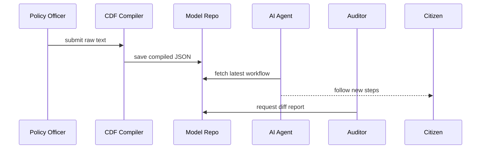

# Chapter 7: Policy & Process Model (HMS-CDF)


*Continuation of [Governance Layer (HMS-SYS → HMS-GOV)](06_governance_layer__hms_sys___hms_gov__.md)*  

---

## 1. Why Bother Turning Laws Into Code?

### 60-Second Story — “The Sidewalk-Ramp Amendment”

Congress slips a **one-sentence rider** into the year-end omnibus bill:

> “All new public-works permits **must** include an ADA sidewalk-ramp inspection step.”

Overnight every Department of Transportation form, internal checklist, and AI bot must add an extra approval hop.  
Without automation that means:

* 17 PDF forms edited by hand.  
* 4 backend services patched.  
* Dozens of inspectors retrained.

With **HMS-CDF** (Code Definition Framework) a policy officer simply pastes the *exact* sentence into the compiler, presses **Build**, and every workflow from citizen portal to AI agent is auto-patched.  
No missed ramps, no legal risk, happy auditors.

---

## 2. What Is HMS-CDF in One Sentence?

*A rulebook compiler that converts raw statute text into machine-readable workflows.*  
Think **“LaTeX for laws”**—feed written clauses in, receive executable JSON out.

---

## 3. Key Concepts (Plain English)

| Term | Friendly Explanation |
|------|----------------------|
| **Source** | The raw text: statute, executive order, agency memo. |
| **Clause** | A sentence or paragraph tagged with meaning (“must add ADA ramp”). |
| **Trigger** | A condition that wakes the workflow (“when issuing a public-works permit”). |
| **Action** | The step to perform (collect photo, request sign-off, etc.). |
| **Workflow** | A chain of triggers & actions—basically a flowchart encoded in JSON. |
| **Compilation** | The act of turning clauses ➜ workflow. |
| **Diff** | A side-by-side comparison showing how one version of the model changed. |

Analogy:  
Recipes (source) ➜ Grocery list & cooking steps (workflow).  
CDF is the chef that translates grandma’s prose into a tidy checklist.

---

## 4. Hands-On: Compiling Your First Clause

Below we feed the new ADA rider to the compiler and peek at the workflow.

```javascript
// compileRamp.js   (18 lines)
import { compile, pretty } from '@hms-cdf/core';

const law = `
  §12(b) ADA Rider:
  All new public-works permits must include an ADA sidewalk-ramp inspection step.
`;

async function run() {
  const model = await compile(law);         // 1️⃣ turn text → JSON
  console.log('🤖 Workflow:\n', pretty(model));
}

run();
```

What happens?

1. `compile` tokenizes the sentence, identifies **Trigger = "public-works permit"** and **Action = "ADA sidewalk-ramp inspection"**.  
2. `model` is plain JSON—easy for portals, agents, or humans to read.

Sample console output (truncated for brevity):

```json
{
  "id": "ada-ramp-2024",
  "trigger": "permit:public-works:new",
  "steps": [
    { "action": "inspection:ada-ramp", "role": "inspector" }
  ]
}
```

---

## 5. Simulating a Workflow

Let’s see the model in action with a pretend permit application.

```javascript
// simulate.js  (16 lines)
import { runModel } from '@hms-cdf/sim';

const model = require('./ada-ramp-2024.json');

const input = { type: 'permit:public-works:new', project: 'Main St Bridge' };

runModel(model, input, step => console.log('➡️', step));
```

Expected output:

```
➡️ inspection:ada-ramp  (assigned to inspector)
```

You’ve just proven the clause works **before** it goes live—no broken forms later.

---

## 6. Version Control & Diffs

Suppose Congress later tweaks the law:

> “…**and cross-slope must not exceed 2%.**”

```javascript
// diff.js  (17 lines)
import { compile, diff } from '@hms-cdf/core';

const v1 = await compile(lawOriginal);
const v2 = await compile(lawAmended);

console.log(diff(v1, v2));
```

Console output:

```
+ step[1]: inspection:cross-slope-measurement  (NEW)
```

Auditors can now pinpoint *exactly* which clause added the new inspection.

---

## 7. Under the Hood — 5-Step Journey



Only five players—easy to reason about.

---

## 8. Peeking Inside the Compiler

### 8.1 Micro-Parser (14 lines)

```javascript
// parser/tokenize.js
export function tokenize(text) {
  return text
    .replace(/[^\w\s]/g, '') // strip punctuation
    .split(/\s+/)            // words → array
    .map(w => w.toLowerCase());
}
```

Just strips punctuation & splits—simple!

### 8.2 Clause Detector (18 lines)

```javascript
// parser/clauses.js
export function detect(tokens) {
  const hasPermit   = tokens.includes('permit');
  const hasRamp     = tokens.includes('ramp');
  if (hasPermit && hasRamp) {
    return {
      trigger: 'permit:public-works:new',
      action:  'inspection:ada-ramp'
    };
  }
  // ...more patterns here
}
```

Pattern matches words → structured rule.  
Real system has 100+ patterns, but the idea is identical.

---

## 9. Integrating With Other HMS Layers

• Portals (Chapter 1) automatically show extra **“ADA Ramp Inspection”** step by reading the workflow.  
• AI agents (Chapter 3) pull the *same* model to stay **inside guardrails**.  
• Governance toggles (Chapter 6) can temporarily disable a compiled step (`inspection:ada-ramp → OFF`) without deleting the law.  
• Security engine (Chapter 11) hashes every model version for tamper proofing.

---

## 10. Directory Peek

```
hms-cdf/
 ├─ core/          // compile, diff, pretty
 ├─ parser/        // tokenize & detect clauses
 ├─ sim/           // runModel()
 ├─ models/        // JSON outputs (git-tracked)
 └─ README.md
```

Everything is plain text—Git diff & PR reviews work out-of-the-box.

---

## 11. Recap

You learned:

1. **Why** compiling laws avoids duct-tape edits when legislation changes.  
2. Key CDF concepts: clause, trigger, action, workflow, diff.  
3. How to compile, simulate, and diff models in under 20 lines each.  
4. The internal flow from raw sentence to executable JSON.  
5. How other HMS layers consume these models for portals, agents, and guardrails.

Ready to see how these compiled workflows get **executed, scheduled, and observed** day-to-day?  
Head over to [Management Layer (HMS-ACT, HMS-OMS, HMS-OPS)](08_management_layer__hms_act__hms_oms__hms_ops__.md).

---

Generated by [AI Codebase Knowledge Builder](https://github.com/The-Pocket/Tutorial-Codebase-Knowledge)