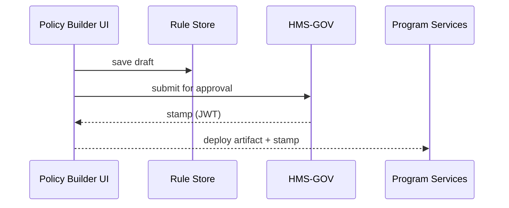

# Chapter 7: Process & Policy Builder  
*(Filename: 07_process___policy_builder_.md)*  

[← Back to Chapter 6: Governance Layer (HMS-GOV)](06_governance_layer__hms_gov__.md)

---

## 1. Why Do We Need a “Bill-Drafting Room” for Software?

Imagine FEMA must roll out **“Hurricane Housing Assistance 2024.”**  
The policy is only four pages long but, in practice, triggers dozens of rules:

* Who may apply (county in declared disaster zone)  
* Income ceilings (≤ 80 % Area Median Income)  
* Approval gates (state sign-off, FEMA regional director sign-off)  
* Automatic payments through Treasury once approved  

If each micro-service developer hard-codes these rules, chaos follows when Congress tweaks a clause.  
Instead we give non-coders (policy analysts, program officers) a **drag-and-drop canvas**—the **Process & Policy Builder**—to assemble clauses like LEGO® bricks.  
Once they click “Publish,” the system emits a **machine-readable contract** enforced across HMS-MKT.

> Analogy: Capitol Hill staffers mark up a bill, send it to the House Clerk, and the text instantly becomes the official version. The Builder plays both staffer **and** clerk for digital policy.

---

## 2. Meet the Heroes (Key Concepts)

| Term                     | Beginner-Friendly Meaning (Legislative Analogy) |
|--------------------------|--------------------------------------------------|
| Clause                   | One sentence of the policy (“Applicants must live in a declared disaster county”). |
| Condition                | IF-THEN test attached to a clause (“IF income ≤ 80 %, THEN proceed”). |
| Approval Gate            | A required signature (“Regional Director”).      |
| Policy Artifact          | The compiled, machine-readable “final bill.”     |
| Version History / Diff   | The Congressional Record—who changed what line. |
| Rollback                 | “Motion to reconsider” – revert to a prior version. |

---

## 3. A 5-Minute Walk-Through: Drafting “Hurricane Housing Assistance 2024”

### 3.1 Drag-and-Drop in the UI

Open the page in dev mode:

```
npm run dev
→ http://localhost:5173/#/protocol-builder       (auto opens)
```

You will see the minimal stub provided in  
`pages/protocol-builder/index.vue`.  
Let’s extend it by adding two draggable blocks.

```vue
<!-- File: pages/protocol-builder/index.vue (snippet) -->
<template>
  <div class="protocol-builder">
    <h1>{{ title }}</h1>

    <!-- Drop Zone -->
    <Clause v-for="c in clauses" :key="c.id" :data="c" />

    <!-- Palette -->
    <Palette @add="clauses.push($event)" />
  </div>
</template>

<script setup>
import { ref } from 'vue'
import Clause from './Clause.vue'   // tiny component
import Palette from './Palette.vue' // list of building blocks

const title   = 'Hurricane Housing Assistance 2024'
const clauses = ref([])             // will hold dragged clauses
</script>
```

What happens?  
1. `Palette` lists pre-made blocks (Eligibility, Income Check, Approval Gate).  
2. Dragging a block emits an `add` event.  
3. The new clause appears in the **Drop Zone**.

*(14 lines – under 20 as promised)*

### 3.2 What a “Clause” Looks Like Internally

```js
// File: builder/blocks/eligibility.js
export default {
  id: 'eligibility',
  text: 'Applicant county ∈ FEMA Disaster Declaration',
  test: 'user.county in disasterCounties'
}
```

Explanation:  
• `text` is human-readable.  
• `test` is a tiny expression the rules engine will later evaluate.

---

## 4. Compiling the Draft ➜ Policy Artifact

Click “Publish” in the UI (button omitted for brevity).  
Under the hood the Builder stitches JSON together:

```json
{
  "id": "HHA-2024",
  "version": 1,
  "clauses": [
    { "id": "eligibility", "test": "user.county in disasterCounties" },
    { "id": "incomeCheck", "test": "user.ami <= 80" },
    { "id": "directorSign", "gate": "FEMA Director" }
  ]
}
```

This blob is saved to `policies/HHA-2024/1.json` and automatically sent to [HMS-GOV](06_governance_layer__hms_gov__.md) for stamping.

---

## 5. How the Magic Works (Step-By-Step)



Plain English:  
1. The Builder saves the draft locally (Rule Store).  
2. Sends the artifact to Governance for sign-off.  
3. Returns a signed stamp.  
4. Deploys both to services that now enforce the rules.

---

## 6. Under the Hood – Tiny Rule Engine (≤ 20 lines)

```js
// File: runtime/evaluator.js
export function evaluate(artifact, ctx) {
  for (const c of artifact.clauses) {
    if (c.test && !eval(c.test)) return false     // failed test
    if (c.gate && !ctx.approvals.includes(c.gate)) return false
  }
  return true   // ✅ all good
}
```

Beginners’ view:  
• `artifact` = compiled policy JSON.  
• `ctx` = run-time data (user, approvals obtained).  
• If any test or gate fails, evaluation halts.

---

### Example Invocation

```js
import { evaluate } from '@/runtime/evaluator'
import artifact from '@/policies/HHA-2024/1.json'

const ctx = {
  user:{ county:'10001', ami:57 },
  disasterCounties:['10001','10003'],
  approvals:['FEMA Director']
}

console.log(evaluate(artifact, ctx))   // → true  ✅ assistance may proceed
```

---

## 7. Version History & Diff View

Every save writes a new file: `…/2.json`, `…/3.json`, etc.  
To show *what changed*, we run a tiny diff:

```bash
npx json-diff 1.json 2.json
```

Output (human friendly):

```
- "user.ami <= 80"
+ "user.ami <= 100"   // Congress raised ceiling
```

Clicking **Rollback** in the UI simply redeploys an earlier JSON + stamp.

---

## 8. Field Guide for Policy Authors

1. Drag clauses from the **Palette**.  
2. Click a clause to edit the plain-English sentence *and* its test expression.  
3. Insert **Approval Gates** where human signatures are needed.  
4. Hit **Validate** – the Builder simulates the policy against sample data and shows pass/fail.  
5. Press **Publish** – sends to Governance for stamping.  

No coding knowledge required—if you can edit a Word doc, you can draft policy.

---

## 9. Ties to Other HMS-MKT Layers

* Governance stamping & revocation: [Chapter 6](06_governance_layer__hms_gov__.md)  
* Runtime enforcement inside micro-services: [Management / Service Layer](04_management___service_layer__hms_api__hms_svc__.md)  
* Role checks for approvers: [RBAC](05_authorization___role_based_access_control__rbac__.md)  
* AI help for plain-language drafting: heads-up in [AI Representative Agent](08_ai_representative_agent__hms_a2a__.md) – it can auto-suggest clause text!

---

## 10. Frequently Asked Questions

**Q: Can I import an existing PDF policy?**  
A: Yes. Drag the PDF onto the canvas—the Builder uses HMS-A2A OCR to suggest clauses you can refine.

**Q: How do I localize policies?**  
A: Each clause stores `text_en`, `text_es`, etc. Only the human text changes; the machine test stays the same.

**Q: What if two policies conflict?**  
A: HMS-GOV rejects the stamp and shows the conflicting clause IDs. Authors can merge or set explicit precedence.

---

## 11. Recap & Where We Go Next

You just learned how non-developers can:

• Assemble policy clauses with drag-and-drop.  
• Compile them into a machine-readable artifact.  
• Track every edit like the Congressional Record.  
• Publish with one click—guaranteeing consistent enforcement across all services.

Next we’ll invite an AI co-author to the drafting room—meet the  
[AI Representative Agent (HMS-A2A)](08_ai_representative_agent__hms_a2a__.md) →  

---

---

Generated by [AI Codebase Knowledge Builder](https://github.com/The-Pocket/Tutorial-Codebase-Knowledge)