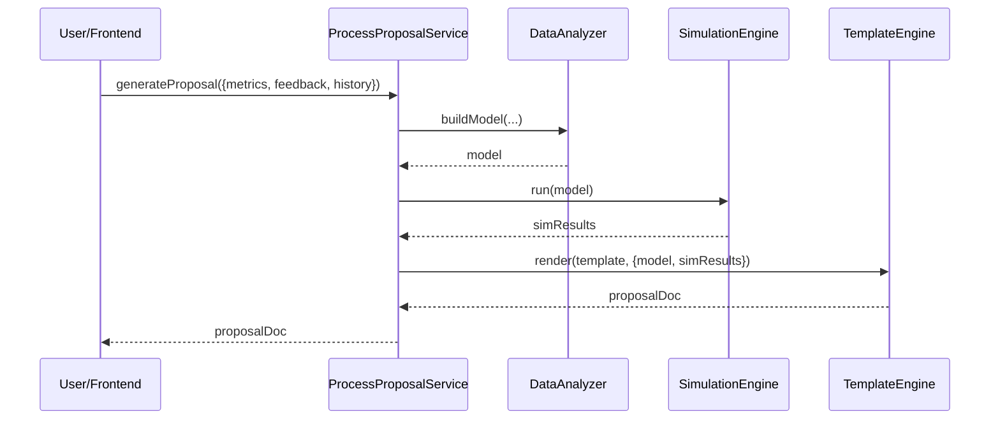

# Chapter 7: Process Proposal Generation

Welcome back! In [Chapter 6: Human-in-the-Loop Override](06_human_in_the_loop_override_.md) we added a safety net so humans can review AI drafts. Now we’ll dive into how HMS-GOV’s **Process Proposal Generation** automation actually drafts those workflows and policies for review.

---

## 7.1 Why Process Proposal Generation?

Imagine the U.S. Marshals Service wants to streamline its witness-protection application process. They’ve gathered:

- Usage metrics (how long each step takes)  
- Stakeholder feedback (agents complaining bottlenecks)  
- Historical data (past approval times, error rates)  

Turning this into an optimized, step-by-step proposal by hand can take weeks. The **Process Proposal Generation** module acts like a policy think-tank: it ingests all that data, runs simple simulations to spot bottlenecks, scores alternative options, and outputs a clear document with actionable steps.

---

## 7.2 Key Concepts

1. **Data Models**  
   Define how we represent metrics, feedback, and historical records in code (e.g. `UsageMetric`, `FeedbackEntry`, `HistoryRecord`).

2. **Scoring Algorithms**  
   Simple functions that assign numeric scores to workflow variants (e.g. “parallelize step A and B reduces time by 30%”).

3. **Simulation Engine**  
   Runs what-if scenarios on the data to identify bottlenecks and test alternative flows.

4. **Templating Engine**  
   Fills proposal templates with the analysis results, producing human-readable Markdown or PDF.

---

## 7.3 Using the Proposal Generator

Here’s a minimal example. Suppose you have your metrics, feedback, and history already loaded. You call:

```js
// File: src/services/ProcessProposalService.js
import DataAnalyzer from './DataAnalyzer'
import SimulationEngine from './SimulationEngine'
import TemplateEngine from './TemplateEngine'

export default {
  async generateProposal({ metrics, feedback, history }) {
    const model = DataAnalyzer.buildModel(metrics, feedback, history)
    const simResults = SimulationEngine.run(model)
    return TemplateEngine.render('workflow-proposal', { model, simResults })
  }
}
```

In your Vue component:

```js
async createProposal() {
  const proposalDoc = await ProcessProposalService.generateProposal({
    metrics: this.metrics,
    feedback: this.feedback,
    history: this.history
  })
  console.log(proposalDoc) 
  // → "# Optimized Permit Workflow\n\n1. Collect docs…"
}
```

Explanation:
- We import three helpers: **DataAnalyzer**, **SimulationEngine**, and **TemplateEngine**.
- `generateProposal()` builds a data model, simulates, then renders a document.
- The result is a Markdown string you can show or export.

---

## 7.4 High-Level Flow

Below is what happens when you call `generateProposal()`:



1. **ProcessProposalService** orchestrates the steps.  
2. **DataAnalyzer** combines raw inputs into a coherent model.  
3. **SimulationEngine** finds bottlenecks and tests fixes.  
4. **TemplateEngine** fills out a human-readable proposal.

---

## 7.5 Inside the Modules

### 7.5.1 DataAnalyzer

```js
// File: src/services/DataAnalyzer.js
export default {
  buildModel(metrics, feedback, history) {
    return {
      // simple merge: attach feedback counts to each step
      steps: metrics.steps.map(s => ({
        ...s,
        complaints: feedback.filter(f => f.stepId===s.id).length,
        avgTime: history.avgTimeByStep[s.id]
      }))
    }
  }
}
```
Explanation:  
- We loop through each workflow step, attach complaint counts and average times.

### 7.5.2 SimulationEngine

```js
// File: src/services/SimulationEngine.js
export default {
  run(model) {
    // find the slowest step
    const bottleneck = model.steps.reduce((slow, s) =>
      s.avgTime>slow.avgTime ? s : slow, model.steps[0]
    )
    return { bottleneck, suggestedChange:
      `Parallelize step ${bottleneck.name}` }
  }
}
```
Explanation:  
- We pick the step with highest average time and suggest parallelizing it.

### 7.5.3 TemplateEngine

```js
// File: src/services/TemplateEngine.js
export default {
  render(templateName, data) {
    // imagine a Handlebars or simple string replace
    return `
# Optimized Workflow Proposal

**Bottleneck:** ${data.simResults.bottleneck.name}

**Suggestion:** ${data.simResults.suggestedChange}

## Steps
${data.model.steps.map(s =>
  `1. ${s.name} (avg ${s.avgTime}m, ${s.complaints} complaints)`
).join('\n')}
`
  }
}
```
Explanation:  
- We build a Markdown document listing the bottleneck and detailed steps.

---

## 7.6 Summary

In this chapter you learned how HMS-GOV:
- Defines **data models** for metrics, feedback, and history  
- Uses a **Simulation Engine** to spot bottlenecks  
- Packages results into a **templated proposal** for human review  

With these building blocks, your AI agent can generate optimized process proposals in seconds, ready for that final sign-off via our [Human-in-the-Loop Override](06_human_in_the_loop_override_.md). Next up, we’ll see how to hook this generator into our AI pipelines in [Chapter 8: AI Agent Integration](08_ai_agent_integration_.md).

---

Generated by [AI Codebase Knowledge Builder](https://github.com/The-Pocket/Tutorial-Codebase-Knowledge)