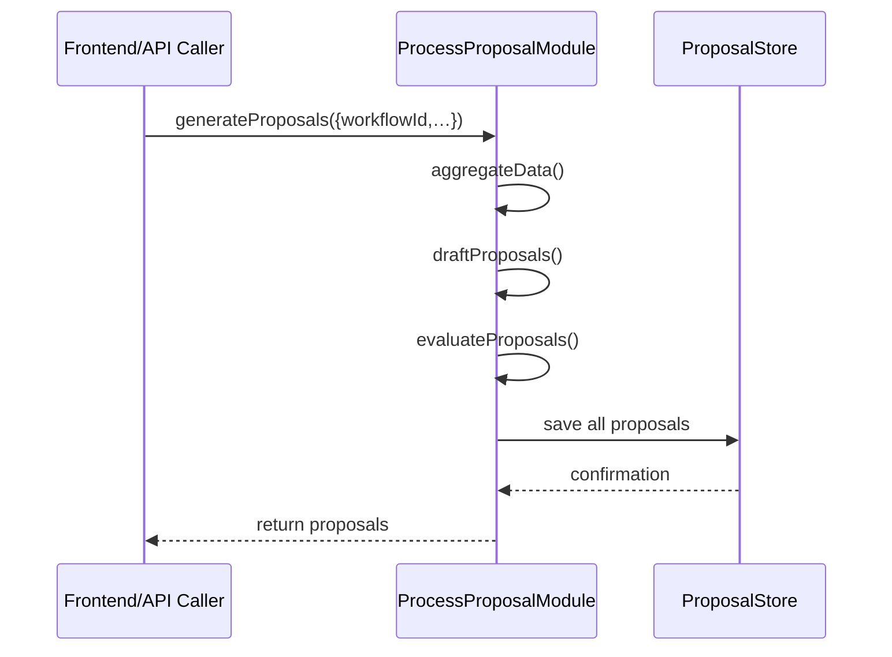

# Chapter 7: Process Proposal Module

Welcome back! In [Chapter 6: AI Representative Agent](06_ai_representative_agent_.md), we learned how an automated agent analyzes workflows and spots optimizations. Now it’s time to turn those observations into concrete policy or process updates with our **Process Proposal Module**.

## Why the Process Proposal Module Matters

Imagine the Performance Office at the Environmental Protection Agency:

- Citizens submit feedback on recycling programs.
- Workflow metrics show where collections are delayed.
- External data (weather, traffic) impacts routes.

The **Process Proposal Module** ingests all this, drafts recommended guideline updates (e.g., “add alternate pickup routes on rainy days”), and ranks them by impact. It’s like a policy‐drafting office that uses data instead of just meetings.

## Key Concepts

1. **Input Aggregator**  
   Gathers user feedback, workflow metrics, and external feeds into one view.

2. **Proposal Generator**  
   Applies rules or simple ML to draft new process or policy proposals.

3. **Proposal Evaluator**  
   Scores each draft by cost, benefit, or risk, then ranks them.

4. **Proposal Store**  
   Persists proposals so staff can review, comment, or push to deployment.

## Using the Process Proposal Module

Here’s a minimal example. We ask the module to create proposals for the “recycling_collection” workflow:

```ts
// File: src/modules/processProposal/usage.ts
import { ProcessProposalModule } from './index'

async function run() {
  const module = new ProcessProposalModule()
  const proposals = await module.generateProposals({
    workflowId: 'recycling_collection',
    feedback: ['slow pickups in Zone A', 'bins often full'],
    metricsWindowDays: 7,
    externalSources: { weatherApi: 'rainData' }
  })
  console.log(proposals)
}

run()
// ➜ [
//   { id: 'p1', title: 'Add extra pickup on rainy days', score: 0.87 },
//   { id: 'p2', title: 'Deploy overflow bins in Zone A', score: 0.75 }
// ]
```

Explanation:
- We supply feedback, metrics window, and external data sources.
- The module returns a ranked list of proposals with IDs, titles, and scores.

## What Happens Behind the Scenes



1. **Frontend** calls `generateProposals`.  
2. **Module** aggregates inputs, drafts and evaluates proposals.  
3. **Module** saves them to the Proposal Store and returns the list.

## Under the Hood: Implementation

### 1. Module Entry Point

File: `src/modules/processProposal/index.ts`

```ts
import { aggregateData, draftProposals, evaluateProposals } from './engine'
import { ProposalStore } from './store'

export class ProcessProposalModule {
  private store = new ProposalStore()

  async generateProposals(params) {
    const data = await aggregateData(params)
    const drafts = draftProposals(data)
    const scored = evaluateProposals(drafts)
    await this.store.saveAll(scored)
    return scored
  }
}
```

Explanation:
- We call three engine functions in order.
- Then save results and return them to the caller.

### 2. Data Aggregation

File: `src/modules/processProposal/engine.ts`

```ts
export async function aggregateData({ workflowId, feedback, metricsWindowDays, externalSources }) {
  // Stub: fetch metrics from a service
  const metrics = await fetchMetrics(workflowId, metricsWindowDays)
  // Stub: fetch external data (e.g., weather)
  const external = await fetchExternal(externalSources)
  return { workflowId, feedback, metrics, external }
}
```

Explanation:
- `fetchMetrics` might call your Metrics Service.
- `fetchExternal` pulls from APIs like weather or traffic.

### 3. Drafting Proposals

```ts
export function draftProposals(data) {
  const proposals = []
  if (data.external.rainData.avgRain > 0.5 && data.feedback.includes('slow pickups')) {
    proposals.push({ title: 'Add extra pickup on rainy days', impact: 0.9, cost: 0.3 })
  }
  if (data.feedback.includes('bins often full')) {
    proposals.push({ title: 'Deploy overflow bins in Zone A', impact: 0.7, cost: 0.4 })
  }
  return proposals
}
```

Explanation:
- Simple rule checks weather and feedback to draft ideas.
- Each draft has `impact` and `cost` estimates.

### 4. Evaluating Proposals

```ts
export function evaluateProposals(drafts) {
  return drafts.map((p, i) => ({
    id: `p${i+1}`,
    title: p.title,
    score: parseFloat((p.impact - p.cost * 0.5).toFixed(2))
  }))
}
```

Explanation:
- We compute a `score = impact – cost*0.5` and assign a unique ID.

### 5. Storing Proposals

File: `src/modules/processProposal/store.ts`

```ts
export class ProposalStore {
  private db: any[] = []

  async saveAll(proposals) {
    // In real life: write to a database or ledger
    this.db.push(...proposals)
  }
}
```

Explanation:
- For now we keep proposals in memory; swap in a real DB later.

## Summary

In this chapter you learned how the **Process Proposal Module**:

- Aggregates feedback, metrics, and external data.  
- Drafts candidate process or policy updates.  
- Scores and ranks proposals.  
- Persists them for staff review.

Next up, we’ll see how a human can review and override these proposals in [Chapter 8: Human-in-the-Loop Override](08_human_in_the_loop_override_.md).

---

Generated by [AI Codebase Knowledge Builder](https://github.com/The-Pocket/Tutorial-Codebase-Knowledge)