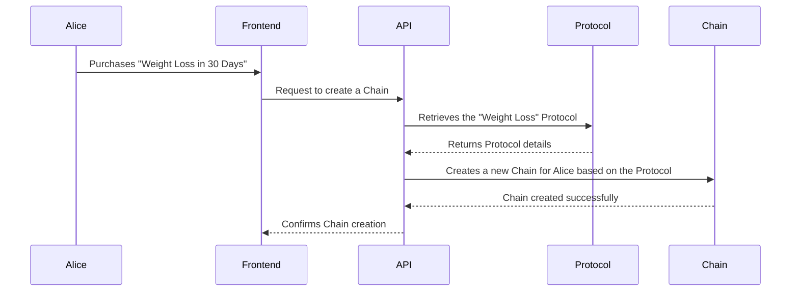

# Chapter 7: Protocols and Chains

In the previous chapter, [Middleware](06_middleware_.md), we learned how to control access to specific routes. Now, let's explore how to structure and deliver your health programs using *Protocols and Chains*.

## The Use Case: Delivering a Weight Loss Program

Imagine you've created a "Weight Loss in 30 Days" program. This program has a specific structure: weekly meal plans, daily exercise routines, and weekly check-in calls. You want to deliver this program to multiple users, tracking their progress individually. This is where Protocols and Chains come in.

## Key Concepts

1. **Protocol:** A predefined workflow or plan. Think of it as a master template or blueprint for your program.  It defines the structure and content of your "Weight Loss in 30 Days" program, including all the steps involved.

2. **Chain:** An instance of a protocol for a specific user.  It's like a personalized copy of the program.  Alice's chain will track *her* progress through the "Weight Loss in 30 Days" program, while Bob's chain will track *his* progress separately.

## Delivering the Program: Step-by-Step

Here's how Protocols and Chains work together:

1. You create a Protocol for your "Weight Loss in 30 Days" program, outlining all the steps.
2. When Alice buys the program, a new Chain is created for her, based on the Protocol.
3. Alice follows her personalized Chain, completing tasks and tracking her progress.
4. Bob buys the same program, and a separate Chain is created for him.
5. Alice and Bob progress through the same program (Protocol) but follow their individual Chains.

## Under the Hood: Code Implementation

Here's a simplified look at how a new Chain is created:



The `routes/tenant.php` file defines the route for creating a Chain (simplified):

```php
// File: routes/tenant.php (simplified)

// ... other code ...

Route::post('/personal-chain/create', [TenantProtocolPersonalChainController::class, 'create']);

// ... other code ...
```

The `create` method in `TenantProtocolPersonalChainController` handles the request:

```php
// File: app/Http/Controllers/Tenant/TenantProtocolPersonalChainController.php (simplified)

// ... other code ...

public function create(Request $request)
{
    // 1. Get the Protocol ID.
    $protocolId = $request->input('protocol_id');

    // 2. Retrieve the Protocol.
    $protocol = Protocol::find($protocolId);

    // 3. Create a new Chain.
    $chain = new ProtocolPersonalChain();
    $chain->protocol_id = $protocol->id;
    $chain->user_id = auth()->user()->id; // [Authentication (Auth)](04_authentication__auth__.md)
    // ... other chain details ...
    $chain->save();

    // 4. Return success message.
    return response()->json(['message' => 'Chain created successfully!']);
}

// ... other code ...
```

**Explanation:**

1. The `create` method receives a request containing the `protocol_id`.
2. It retrieves the corresponding `Protocol` from the database.
3. It creates a new `ProtocolPersonalChain` record, linking it to the `Protocol` and the authenticated user.
4. It returns a success message.

## Conclusion

In this chapter, we explored Protocols and Chains, learning how they help structure and deliver health programs to individual users. We saw how a Protocol acts as a template and a Chain as a personalized instance of that template. Next, we'll delve into [Broadcasting](08_broadcasting_.md) to understand how to send real-time updates and notifications to your users.


---

Generated by [AI Codebase Knowledge Builder](https://github.com/The-Pocket/Tutorial-Codebase-Knowledge)