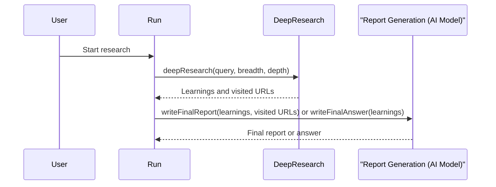

# Chapter 7: Report Generation

In the previous chapter, [Follow-up Question Generation](06_follow_up_question_generation_.md), we learned how the Deep Research Agent generates follow-up questions to delve deeper into a research topic.  Now, let's explore how the agent compiles all its learnings into a comprehensive report using *Report Generation*.

Imagine you've finished researching the history of the Roman Empire. You have notes on various aspects, like its founding, its emperors, its military campaigns, and its eventual decline.  You wouldn't just hand in a pile of scattered notes. You'd organize them into a structured research paper with a clear introduction, body paragraphs, and a conclusion.  Report Generation does something similar: it takes all the learnings gathered by the agent and organizes them into a well-structured report.

## What is Report Generation?

Report Generation is the final step in the research process. It takes all the learnings extracted from various sources and compiles them into a comprehensive report, much like writing a research paper summarizing all the findings and sources.  HMS-AGX offers two report generation modes:

- **Detailed Report:** Provides a comprehensive overview of the research, including all the learnings and sources.  Think of this as a full research paper.
- **Concise Answer:** Provides a direct answer to the initial query, using the learnings to formulate a concise response.  Think of this as answering a specific question.

## Using Report Generation

Let's continue with our Roman Empire example.  After the agent has gathered learnings about different aspects of the empire, Report Generation would organize these learnings into a structured report.

**Example Input (Learnings):**

- Rome was founded in 753 BC by Romulus and Remus (according to legend).
- The Roman Empire reached its greatest extent under Emperor Trajan.
- The Roman Empire fell in 476 AD.
- Julius Caesar was a prominent Roman general and statesman.


**Example Output (Detailed Report - simplified):**

```
# The Roman Empire: A Historical Overview

This report summarizes the history of the Roman Empire, from its founding to its decline.

## Founding and Early History

According to legend, Rome was founded in 753 BC by Romulus and Remus. ...

## Expansion and Peak

The Roman Empire reached its greatest extent under Emperor Trajan. ...

## Decline and Fall

The Roman Empire eventually fell in 476 AD. ...

## Key Figures

Julius Caesar was a prominent Roman general and statesman. ...

## Sources

- [URL 1]
- [URL 2]
- [URL 3]
```

**Example Output (Concise Answer):**

```
The Roman Empire, traditionally founded in 753 BC, reached its peak under Emperor Trajan and fell in 476 AD.
```


## Inside the Deep Research Agent with Report Generation

Here's a simplified sequence diagram showing how Report Generation fits into the research process:



1. The `deepResearch` function gathers learnings and visited URLs.
2. The `run` function calls either `writeFinalReport` or `writeFinalAnswer` depending on the user's choice.
3. These functions use the [AI Model Provider](08_ai_model_provider_.md) to generate the final report or answer.

## Diving Deeper into the Code

The `writeFinalReport` and `writeFinalAnswer` functions are the core of Report Generation.  They are located in `src/deep-research.ts`.  Here's a simplified version of `writeFinalReport`:

```typescript
// src/deep-research.ts
export async function writeFinalReport({ prompt, learnings, visitedUrls }) {
  // ... (Uses AI to generate the report markdown from learnings)
  const urlsSection = `\n\n## Sources\n\n${visitedUrls.map(url => `- ${url}`).join('\n')}`;
  return res.object.reportMarkdown + urlsSection;
}
```

This function takes the initial prompt, the gathered learnings, and the visited URLs as input. It uses the `generateObject` function from the [AI Model Provider](08_ai_model_provider_.md) to generate the markdown content for the report.  It then appends a "Sources" section with the visited URLs.

The `writeFinalAnswer` function is similar, but it focuses on generating a concise answer instead of a detailed report.

## Conclusion

This chapter explained how Report Generation compiles the research findings into a structured report or a concise answer. This final step presents the information in a user-friendly format, making it easy to understand the results of the research process.  The next chapter, [AI Model Provider](08_ai_model_provider_.md), will explore how the AI models are used throughout the HMS-AGX project.


---

Generated by [AI Codebase Knowledge Builder](https://github.com/The-Pocket/Tutorial-Codebase-Knowledge)