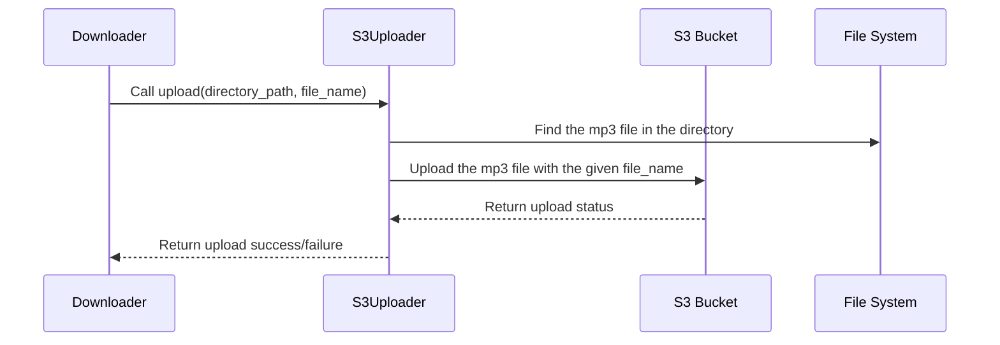

# Chapter 7: S3Uploader

In the previous chapter, [instaloader Library](06_instaloader_library.md), we learned how to download Instagram posts.  But what if you want to make those downloaded videos and audio files accessible online? That's where the `S3Uploader` comes in.

## What Problem Does the `S3Uploader` Solve?

Imagine you've downloaded a cool TikTok video using the `HMS-UTL` project.  You want to share this video with your friends, but emailing a large video file can be slow and cumbersome. The `S3Uploader` solves this problem by uploading the file to an Amazon S3 storage bucket.  Think of Amazon S3 as a giant online storage drive.  Once your video is uploaded, it has a unique web address that you can share with anyone.

## Understanding the `S3Uploader`

The `S3Uploader` is a Python class that handles uploading files to Amazon S3.  It's like a delivery service. Once a video is downloaded, the `S3Uploader` takes it and "delivers" it to your S3 bucket, making it accessible online.

### Key Concepts

1. **Amazon S3:**  Amazon S3 (Simple Storage Service) is a cloud storage service. It's like a massive hard drive in the cloud where you can store files.

2. **Bucket:** A bucket is like a folder on your S3 drive. You can create different buckets to organize your files.

3. **Upload:**  Uploading means sending a file from your computer to your S3 bucket.

## Using the `S3Uploader`

Here's a simplified example of how to use the `S3Uploader`:

```python
from lib.uploader import S3Uploader

uploader = S3Uploader() # Create an S3Uploader object
directory_path = "tmp/12345" # The directory containing the file to upload
file_name = "my_cool_video" # The name you want for the file on S3 (without extension)
uploader.upload(directory_path, file_name) # Upload the file
# The file will be uploaded to your S3 bucket with the name "my_cool_video.mp3"
```

This code creates an `S3Uploader` object and then calls the `upload()` function, providing the directory containing the file and the desired filename. The `upload()` function handles the upload process.

## Internal Implementation

Here's a simplified sequence diagram showing how the `S3Uploader` works:



The `Downloader` (from the [Downloader](02_downloader.md) chapter) calls the `upload()` function of the `S3Uploader`. The `S3Uploader` first locates the MP3 file within the specified directory. Then, it uploads the file to the designated S3 bucket using the provided filename. Finally, it returns the upload status (success or failure) to the `Downloader`.

### Code Example: `lib/uploader.py`

```python
import boto3 # Library for interacting with Amazon S3
import os # For file system operations

class S3Uploader:
    def __init__(self):
        # ... (Initialize S3 client with credentials and bucket name)

    def upload(self, directory, file_name):
        mp3_file = self.find_mp3(directory) # Find the MP3 file in the directory
        if mp3_file:
            # ... (Upload the file to S3)
            return True # Return True if upload was successful
        else:
            return False # Return False if MP3 file was not found
```

This simplified code snippet shows the core of the `upload()` function. It first uses a helper function `find_mp3()` to locate the MP3 file in the given directory. If an MP3 file is found, it uploads the file to S3 and returns `True`. Otherwise, it returns `False`.

## Conclusion

In this chapter, we explored the `S3Uploader`, which makes downloaded files accessible online by uploading them to Amazon S3. We learned about Amazon S3, buckets, and the `upload()` function. Next, we'll look at [Chrome Profile and Headless Mode](08_chrome_profile_and_headless_mode.md), which are used for managing browser sessions and running them in the background.


---

Generated by [AI Codebase Knowledge Builder](https://github.com/The-Pocket/Tutorial-Codebase-Knowledge)