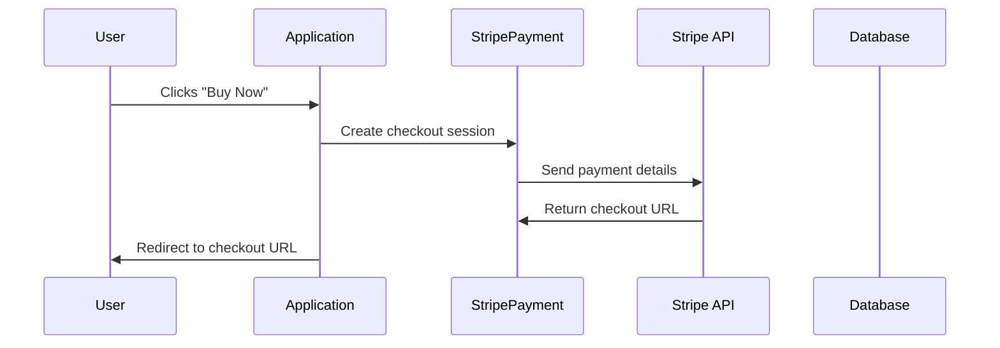

# Chapter 7: Stripe Payment

In the previous chapter, [Frontend CMS](06_frontend_cms.md), we learned how tenants can customize the look and feel of their websites. This chapter introduces Stripe Payment, which allows tenants to charge for their [Programs](02_program.md) and manage subscriptions, effectively setting up an online store for their services.

## Why Use Stripe Payment?

Imagine a tenant offers a premium "Photography Masterclass" [Program](02_program.md).  They want to charge users a fee to enroll. Stripe Payment makes this possible! It handles securely processing payments, managing subscriptions, and even handling donations.

## Key Concepts

* **Payment Processing:** Stripe securely handles the complex process of accepting payments from users, including credit cards and other payment methods.
* **Subscriptions:**  Stripe allows tenants to set up recurring subscriptions, so users can pay a regular fee for ongoing access to a [Program](02_program.md).
* **Donations:**  Tenants can also accept one-time donations through Stripe.

## Using Stripe Payment

Let's say a user wants to purchase the "Photography Masterclass" [Program](02_program.md).  The tenant would first need to define the price for the program in Stripe.  Then, on their website, they would include a "Buy Now" button that uses Stripe's checkout process.

```php
// Simplified example of initiating a purchase
$stripe = new StripePayment();
$purchaseData = [
    'program_id' => 1, // ID of the Photography Masterclass program
    'user_id' => auth()->user()->id, // ID of the logged-in user
    'price_id' => 'price_12345', // ID of the price defined in Stripe
];
$checkoutSession = $stripe->buy($purchaseData);
// Redirect the user to the Stripe checkout URL
return redirect($checkoutSession['url']);
```

This code creates a new `StripePayment` object, prepares the purchase data (including the [Program](02_program.md) ID, user ID, and the price ID from Stripe), and then calls the `buy` method.  This method interacts with the Stripe API to create a checkout session.  The user is then redirected to Stripe's checkout page to complete the payment.

## Under the Hood

When a user clicks the "Buy Now" button, the application interacts with the `StripePayment` model to create a checkout session.



### Internal Implementation

The `StripePayment` model (located in `app/Models/Tenant/Sales/StripePayment.php` and `app/Models/Core/Sales/StripePayment.php`) handles all interactions with the Stripe API.

```php
// Inside the StripePayment model (simplified buy method)
public function buy(array $purchaseData)
{
    // ... other code ...

    $session = $this->stripe->checkout->sessions->create([
        // ... Stripe session parameters ...
    ]);

    return ['url' => $session->url];
}
```

This simplified code snippet shows how the `buy` method uses the Stripe client to create a checkout session.  The `StripePayment` model also handles other interactions with Stripe, such as creating products and prices, managing subscriptions, and processing donations.  The `Unit/Models/Tenant/Sales/StripePaymentTest.php` and `Unit/Models/Core/Sales/StripePaymentTest.php` files contain unit tests for these methods. The `Feature/Http/Controllers/Core/StripeConnectControllerTest.php` file contains integration tests for the controller that handles Stripe Connect functionality.

## Conclusion

In this chapter, we explored Stripe Payment, a crucial component for monetizing [Programs](02_program.md) and accepting donations. We learned how it simplifies payment processing and subscriptions. In the next chapter, we'll learn about integrating with [Google Calendar Integration](08_google_calendar_integration.md).


---

Generated by [AI Codebase Knowledge Builder](https://github.com/The-Pocket/Tutorial-Codebase-Knowledge)