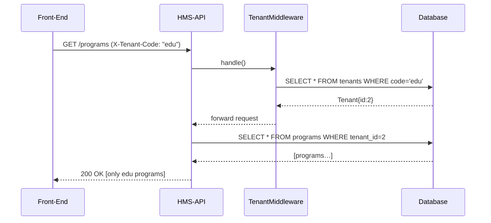

# Chapter 7: Tenant Management

In the last chapter, we saw how to define and secure our API in [Chapter 6: Backend API Endpoints](06_backend_api_endpoints_.md). Now we’ll learn how HMS-API keeps each agency’s data separate using **Tenant Management**—so multiple departments can share the same system without seeing each other’s records.

---

## 1. Why Do We Need Tenant Management?

Imagine the Department of Health and the Department of Education both use HMS-API to run programs. We want:

- **Isolation:** Health data never leaks into Education reports.
- **Shared Codebase:** One HMS-API instance serves both departments.
- **Custom Settings:** Each agency can upload its own logos, forms, or policies.
- **Secure Data:** A clerk in Health can only view Health applications.

Without tenants, every query would mix data from all agencies—chaos!

---

## 2. Key Concepts

1. **Tenant:** Represents an agency, region, or sub-organization (e.g. “Health Dept”).  
2. **Tenant ID / Code:** A unique key (`id` or short `code`) used in every record.  
3. **Context:** The “current tenant” your code is working for, based on header, subdomain, or token.  
4. **Global Scope:** Eloquent feature that automatically filters queries by `tenant_id`.  
5. **Middleware:** Sets up the tenant context at the start of each request.

---

## 3. Using Tenants in HMS-API

### 3.1 Create a Tenant

```php
use App\Models\Tenant;

// Add two agencies
Tenant::create(['name'=>'Health Dept','code'=>'health']);
Tenant::create(['name'=>'Education Dept','code'=>'edu']);
```
When you run that, you’ll get two tenant rows with IDs and codes:

- id: 1, code: “health”  
- id: 2, code: “edu”

### 3.2 Associate Records with a Tenant

Add a `tenant_id` column to your tables (e.g., `programs`):

```php
// In a migration:
$table->unsignedBigInteger('tenant_id')->index();
// In Program model:
protected $fillable = ['name','description','tenant_id'];
```
Now every program belongs to one tenant.

### 3.3 Middleware: Determine Current Tenant

Create `app/Http/Middleware/TenantMiddleware.php`:

```php
public function handle($request, Closure $next)
{
  // 1. Read tenant code from header
  $code = $request->header('X-Tenant-Code');
  // 2. Look up the tenant or fail
  $tenant = \App\Models\Tenant::where('code',$code)->firstOrFail();
  // 3. Share it in the container
  app()->instance(\App\Models\Tenant::class, $tenant);
  return $next($request);
}
```
Register it in `app/Http/Kernel.php` under `api` middleware:

```php
protected $middlewareGroups = [
  'api' => [
    // ...
    \App\Http\Middleware\TenantMiddleware::class,
  ],
];
```

Now every request carries a tenant context.

### 3.4 Global Scope: Auto-Filter by Tenant

In `app/Models/Core/Program/Program.php` add:

```php
protected static function booted()
{
  static::addGlobalScope('tenant', function($builder){
    $builder->where(
      'tenant_id', app(\App\Models\Tenant::class)->id
    );
  });
}
```
With this in place, any `Program::all()` or `Program::where(…)` only returns records for the current tenant.

---

## 4. Under the Hood: Request Flow



1. Front-end sends a special header.  
2. Middleware resolves and stores the tenant.  
3. Eloquent global scope filters queries by `tenant_id`.  
4. Client sees only its own data.

---

## 5. Internal Implementation Details

### 5.1 Tenant Model

File: `app/Models/Tenant.php`

```php
<?php
namespace App\Models;

use Illuminate\Database\Eloquent\Model;

class Tenant extends Model
{
  protected $fillable = ['name','code'];
}
```

### 5.2 Tenant Middleware

File: `app/Http/Middleware/TenantMiddleware.php`  
We saw this above—fetches by `code` and binds the instance.

### 5.3 Program Model Update

File: `app/Models/Core/Program/Program.php`

```php
protected $fillable = ['name','description','tenant_id'];

protected static function booted()
{
  static::addGlobalScope('tenant', function($builder){
    $builder->where('tenant_id', app(\App\Models\Tenant::class)->id);
  });
}
```

With these pieces in place, your controllers never need to write `->where('tenant_id',…)`—it’s automatic.

---

## Conclusion

You’ve learned how HMS-API uses **Tenant Management** to isolate data per agency:

- Created tenants in the database  
- Attached `tenant_id` to models  
- Used middleware to set the current tenant context  
- Applied a global scope to auto-filter queries  

Next up, we’ll see how to bundle these pieces into reusable sub-projects in [Chapter 8: CodifySubprojects](08_codifysubprojects_.md).

---

Generated by [AI Codebase Knowledge Builder](https://github.com/The-Pocket/Tutorial-Codebase-Knowledge)