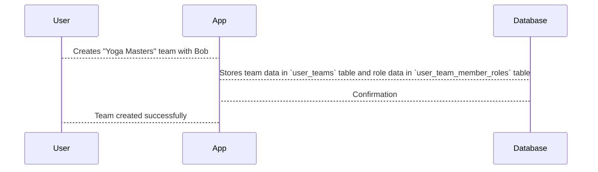

# Chapter 7: User Teams

In the previous chapter, [Protocol Modules](06_protocol_modules.md), we learned about the individual building blocks of a workout routine. Now, let's explore how multiple [Users](01_users.md) can work together on [Programs](02_programs.md) and [Protocols](03_protocols.md).  This is where *User Teams* come in.

Imagine Alice wants to create a new yoga program with her friend Bob, a yoga instructor.  They want to collaborate on building the [Protocol](03_protocols.md) and manage the [Program](02_programs.md) together.  How can they do this?  User Teams allow them to work together as a team.

## What is a User Team?

A User Team is a group of [Users](01_users.md) who can collaborate on [Programs](02_programs.md) and [Protocols](03_protocols.md). Think of it like a group of chefs working together in a kitchen. Each chef might have a different role, like head chef, sous chef, or pastry chef.  Similarly, each member of a User Team can have different roles and permissions.

## Key Concepts in a User Team

* **Team Owner:** The [User](01_users.md) who creates the team.  Think of this person as the head chef.
* **Team Members:** The [Users](01_users.md) who are part of the team.  These are the other chefs in the kitchen.
* **Roles:**  Different team members can have different roles and permissions.  For example, the team owner might have full control, while other members might only be able to view or edit certain parts of the [Program](02_programs.md) or [Protocol](03_protocols.md).
* **Status:** Indicates whether a user is actively part of the team or has been invited but hasn't joined yet.

## Creating a User Team

Let's say Alice wants to create a User Team called "Yoga Masters" with Bob as a member.

```php
// File: factories/Core/User/UserTeamFactory.php

use App\Models\Core\User\UserTeam;

$team = UserTeam::factory()->create([
    'team_owner' => 1, // Alice's User ID
    'team_member' => 2, // Bob's User ID
    'status' => 1, // Active member
]);
```

This code creates a new entry in the `user_teams` table, linking Alice and Bob as team members.

## Assigning Roles

Now, let's assign Bob the role of "Instructor."  We'll skip the details of creating the "Instructor" role for now.

```php
// File: migrations/2023_02_16_054106_create_user_team_member_roles_table.php
// ... Code to insert into user_team_member_roles table ...
// Example (simplified):
// DB::table('user_team_member_roles')->insert([
//     'team_id' => $team->id,
//     'role_id' => 2, // "Instructor" role ID
// ]);
```

This code links the "Yoga Masters" team with the "Instructor" role for Bob.

## Under the Hood

When a User Team is created, the code interacts with the database to store the team information.



The `user_teams` table stores the basic team information, while the `user_team_member_roles` table stores the roles of each team member.  The `potential_user_team_invites` table manages invitations to join teams. The `node_team_members` table links teams to specific steps ([Protocol Chains](05_protocol_chains.md)) within a [Protocol](03_protocols.md).

## Conclusion

In this chapter, we learned about User Teams, which allow multiple [Users](01_users.md) to collaborate on [Programs](02_programs.md) and [Protocols](03_protocols.md).  We saw how User Teams are created and how roles are assigned. In the next chapter, we'll explore [Tenants](08_tenants.md).


---

Generated by [AI Codebase Knowledge Builder](https://github.com/The-Pocket/Tutorial-Codebase-Knowledge)