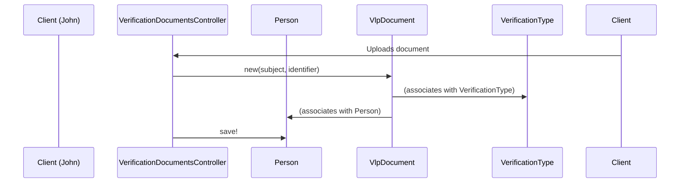

# Chapter 7: VerificationType/VlpDocument/RidpDocument

In the previous chapter, [QualifyingLifeEventKind (QLE) / SpecialEnrollmentPeriod (SEP)](06_qualifyinglifeeventkind__qle____specialenrollmentperiod__sep__.md), we learned how individuals and families can enroll in health insurance outside of the typical Open Enrollment Period. This chapter introduces the concepts of `VerificationType`, `VlpDocument`, and `RidpDocument`, which are crucial for verifying eligibility for health insurance.

## Why do we need document verification?

Imagine John Doe is applying for financial assistance to help pay for his health insurance.  The government needs to verify certain information about John, like his citizenship or income, to determine if he's eligible for assistance.  This verification process often involves submitting documents as proof.

## Key Concepts

* **VerificationType:** This represents a *category* of information that needs to be verified.  Think of it as a checklist item. Examples include:
    * Citizenship
    * Immigration status
    * Income
    * Residency

* **VlpDocument (Verification Lawful Presence Document):** This stores a document submitted for verifying Lawful Presence, a specific type of `VerificationType`.  It contains information like:
    * The type of document (e.g., passport, green card)
    * The document's location (e.g., a link to a stored file)

* **RidpDocument (Remote Identity Proofing Document):** This stores a document submitted for Remote Identity Proofing, another type of `VerificationType`. It's used to verify someone's identity remotely.  It contains similar information to `VlpDocument`.

## Solving the Use Case: Verifying John's Citizenship

1. **Determine the VerificationType:** John needs to verify his citizenship, so we find the "Citizenship" `VerificationType`.

2. **Create a VlpDocument:** John submits a copy of his passport. We create a `VlpDocument` to represent this.

3. **Link the Document:** We link the `VlpDocument` to John's [Person](01_person_family_familymember_.md) object and the "Citizenship" `VerificationType`.

```ruby
# Simplified example (actual implementation is more complex)

citizenship_verification_type = VerificationType.find_by(type_name: "Citizenship")

john_passport = VlpDocument.new(
  subject: "Passport", # Type of document
  identifier: "path/to/passport.pdf" # Location of the document
)

john.consumer_role.vlp_documents << john_passport
citizenship_verification_type.vlp_documents << john_passport

john.save!
```

This code creates a `VlpDocument` for John's passport and links it to his profile and the "Citizenship" `VerificationType`.

## Internal Implementation

When a document is uploaded, the system saves it and updates the verification status.



1. The `insured/verification_documents_controller.rb` receives the uploaded document.

2. A new `VlpDocument` (or `RidpDocument`) is created.

3. The document is associated with the correct `VerificationType` and the `Person` object.

4. The `Person` object is saved, along with the new document.

The relevant code can be found in `insured/verification_documents_controller.rb`, `insured/ridp_documents_controller.rb`, the `Person` model, and the `VlpDocument`/`RidpDocument` models.

```ruby
# insured/verification_documents_controller.rb (simplified)
def upload
  # ...
  doc_uri = Aws::S3Storage.save(file_path(file), 'id-verification')
  if doc_uri.present? && update_vlp_documents(file_name(file), doc_uri)
    # ...
  end
  # ...
end
```

## Conclusion

This chapter introduced `VerificationType`, `VlpDocument`, and `RidpDocument`, explaining how they represent the document verification process. We used the example of verifying John's citizenship to illustrate how these concepts work. We also looked at the internal implementation to understand how documents are uploaded and linked.

Next, we'll explore user accounts and authentication with [User/Authentication](08_user_authentication_.md).


---

Generated by [AI Codebase Knowledge Builder](https://github.com/The-Pocket/Tutorial-Codebase-Knowledge)