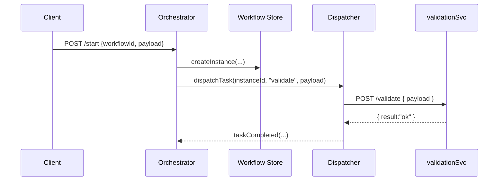

# Chapter 7: Workflow Orchestration

Welcome back! In [Chapter 6: Policy Engine](06_policy_engine_.md) we learned how HMS evaluates rules on each request. Now we’ll see how to tie these decisions and tasks together into end-to-end processes with **Workflow Orchestration**—our “assembly line manager” for citizen services.

---

## 1. Why Workflow Orchestration? (Motivation)

Imagine a citizen submits a **building permit** application to the City Planning Office:

1. The system must **review** the application data.  
2. If complete, it routes for **technical approval**.  
3. After approval, it sends a **notification** to the applicant.  
4. If the reviewer is away for 2 days, it **escalates** to a backup reviewer.  
5. The citizen can **track** each step’s status from “Submitted” to “Completed.”

Without orchestration, each developer writes custom code to link these steps—hard to maintain and extend. The **Workflow Orchestration** layer sequences steps, hands off tasks, enforces escalation paths, and shows a clear status tracker—just like a DMV manager lining up cars on an assembly line.

---

## 2. Key Concepts

1. **Workflow Definition**  
   - A JSON or YAML file that lists each **step** (review, approval, notify).  

2. **Tasks & Services**  
   - Each step is a **task** assigned to the right service or person.  

3. **Sequence & Conditions**  
   - Steps run in order or branch based on data (e.g., missing docs → reject).  

4. **Escalations**  
   - If a task hangs too long, the system reroutes to a backup.  

5. **Status Tracking**  
   - Exposes each workflow instance’s current step, history, and logs.

---

## 3. Defining & Using a Workflow

### 3.1 Example: A Simple Permit Workflow Definition

File: `workflows/permitWorkflow.json`
```json
{
  "id": "building-permit",
  "steps": [
    { "id": "validate", "service": "validationSvc" },
    { "id": "approve",  "service": "approvalSvc", "timeout": "48h", "onTimeout": "escalate" },
    { "id": "notify",   "service": "notificationSvc" }
  ]
}
```
– `id`: unique workflow name  
– `steps`: ordered tasks with optional `timeout` and `onTimeout` for escalation

### 3.2 Starting a Workflow

```js
// File: startPermit.js
import fetch from 'node-fetch';

async function startPermit(data) {
  const res = await fetch('https://hms-svc/api/workflows/start', {
    method: 'POST',
    headers: { 'Content-Type': 'application/json' },
    body: JSON.stringify({ workflowId: 'building-permit', payload: data })
  });
  const info = await res.json();
  console.log('Instance ID:', info.instanceId);
}

startPermit({ applicant: 'Jane Doe', plans: {...} });
```
> This call returns an `instanceId` you can use to track progress.

### 3.3 Checking Workflow Status

```js
// File: checkStatus.js
import fetch from 'node-fetch';

async function checkStatus(id) {
  const res = await fetch(`https://hms-svc/api/workflows/${id}/status`);
  const status = await res.json();
  console.log('Current Step:', status.currentStep);
  console.log('History:', status.history);
}

checkStatus('instance-12345');
// Output:
// Current Step: approve
// History: [ { step: "validate", result: "ok", time: "..." } ]
```

---

## 4. Under the Hood: How It Works

When you start a workflow, here’s the sequence:



1. **Client** requests to start.  
2. **Orchestrator** saves an instance record.  
3. It calls **Dispatcher** to run the first task.  
4. **Dispatcher** invokes the actual service (e.g., validationSvc).  
5. When the service returns, Dispatcher notifies Orchestrator, which moves to the next step.

---

## 5. Internal Implementation

### 5.1 API Routes

```js
// File: hms-svc/routes/workflow.js
import express from 'express';
import { startWorkflow, getStatus } from '../services/workflowService.js';
const router = express.Router();

router.post('/start', async (req, res) => {
  const instanceId = await startWorkflow(req.body);
  res.json({ instanceId });
});

router.get('/:id/status', async (req, res) => {
  const status = await getStatus(req.params.id);
  res.json(status);
});

export default router;
```
> Two endpoints: one to **start** and one to **check** status.

### 5.2 Core Service Logic

```js
// File: hms-svc/services/workflowService.js
import { saveInstance, loadInstance, saveTaskResult } from '../store/workflowStore.js';
import { dispatchTask } from './taskDispatcher.js';

export async function startWorkflow({ workflowId, payload }) {
  const instance = await saveInstance(workflowId, payload);
  await dispatchTask(instance.id, instance.nextStep, payload);
  return instance.id;
}

export async function getStatus(id) {
  const inst = await loadInstance(id);
  return { currentStep: inst.nextStep, history: inst.history };
}
```
> We save the instance, dispatch the first task, and let the Dispatcher handle the rest.

---

## 6. Analogy Recap

Think of Workflow Orchestration as a **DMV assembly-line manager**:

- **Workflow Definition** = The step-by-step instructions at each station.  
- **Dispatcher** = The clerk who calls you to the next window.  
- **Escalation** = If one clerk is on break, you get routed to another.  
- **Tracker** = The digital board showing “Now Serving: Window 3.”

---

## Conclusion

In this chapter you learned:

- What **Workflow Orchestration** is and why it matters.  
- How to define a simple JSON workflow with steps, timeouts, and escalations.  
- How to start a workflow, dispatch tasks, and track progress.  

Next up, we’ll look at how to build smart assistants that can plug into these workflows with **[AI Agent Framework (HMS-A2A)](08_ai_agent_framework__hms_a2a__.md)**. See you there!

---

Generated by [AI Codebase Knowledge Builder](https://github.com/The-Pocket/Tutorial-Codebase-Knowledge)