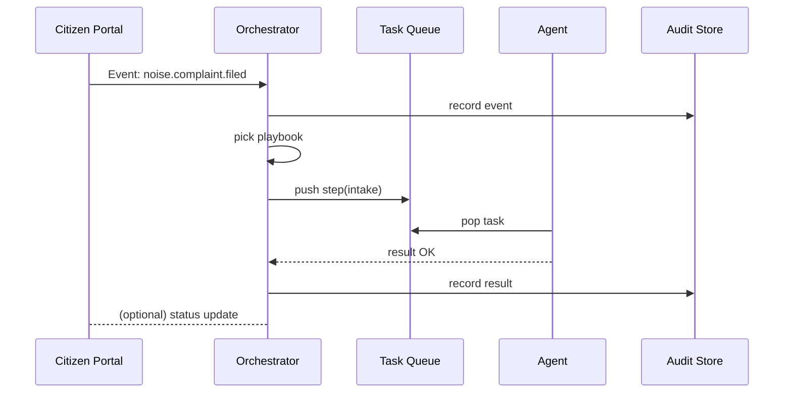

# Chapter 7: Workflow Orchestrator (HMS-ACT / OMS)

*(Continues from [Chapter 6: Management & Service Layer (HMS-SVC / OMS / ACT)](06_management___service_layer__hms_svc___oms___act__.md))*  

---

## 1. Why do we need a Workflow Orchestrator?

Imagine a resident of **Maple Falls** files an online **Noise Complaint** at 11 p.m.

Behind the curtain several things must happen—**in order** and **without losing track**:

1. **Intake** – log the complaint and capture evidence.  
2. **Triage** – classify “night-time construction” vs. “loud party.”  
3. **Assignment** – pick the right city inspector or an AI bot.  
4. **Inspection** – gather on-site decibel readings.  
5. **Resolution** – notify the resident and, if needed, issue a citation.

Each step lives in a different micro-service or human desk.  
If we chain them manually with ad-hoc calls, sooner or later a step fails, nobody notices, and citizens lose trust.

**HMS-ACT / OMS** acts like an **air-traffic controller** for these tasks.  
It:

* Listens for an event (“noise complaint filed”),  
* Looks up the correct **playbook** (“NoiseComplaint.v1”),  
* Routes every step to the right AI or human **agent**,  
* Records a full, tamper-evident **audit trail** along the way.

Result: No task is forgotten, and managers see the exact status at any moment.

---

## 2. Key Concepts (Beginner Friendly)

| Term | Think of it as… | Why it matters |
|------|-----------------|----------------|
| **Event** | The “ding!” when a new form arrives | Triggers a workflow automatically |
| **Playbook** | A recipe card | Lists the ordered steps (“do A, then B…”) |
| **Step** | One line in the recipe | Points to an agent & includes rules (“retry 3×”) |
| **Agent** | A worker that does the step | Could be a human clerk or an AI model |
| **Workflow Instance** | A cake in the oven | A live run of the playbook for one citizen |
| **Audit Trail** | CCTV camera | Immutable log of who did what & when |

Keep these six words in mind—everything else is plumbing!

---

## 3. Quick-Start: Orchestrate a Noise-Complaint Playbook  

We will:

1. Declare a tiny playbook in YAML.  
2. Fire an event.  
3. Watch HMS-ACT march through each step.

### 3.1 Declare the playbook

Create `playbooks/noise_complaint.yaml` (16 lines):

```yaml
id: NoiseComplaint.v1
description: Handle citizen noise complaints
steps:
  - id: intake
    agent: ai.auto_intake            # AI parses form
  - id: triage
    agent: ai.classifier
  - id: assign_inspector
    agent: human.dispatcher          # city clerk
  - id: inspection
    agent: human.field_inspector
    retry: 2                         # try twice if failed
  - id: resolution
    agent: ai.compose_response
```

Explanation  
• Five ordered **steps**.  
• Each points to an **agent** label (registered elsewhere—more in a second).  
• If the *inspection* step fails, ACT retries up to 2 times before escalation.

### 3.2 Register the playbook

```python
# file: register_playbook.py   (12 lines)
from hms_act import ACTClient

act = ACTClient()
act.register_playbook("playbooks/noise_complaint.yaml")
print("Playbook loaded!")
```

*What happens?*  
The YAML is validated and stored; its checksum goes into the governance audit log.

### 3.3 Simulate an incoming event

```python
# file: fire_event.py   (13 lines)
from hms_act import ACTClient
import uuid, datetime

act = ACTClient()
event = {
    "type": "noise.complaint.filed",
    "id": str(uuid.uuid4()),
    "time": datetime.datetime.utcnow().isoformat(),
    "payload": {"address": "123 Oak St", "evidence": "phone_video.mp4"}
}
act.emit(event)
print("Event emitted:", event["id"])
```

Explanation  
• `emit()` drops the event onto OMS.  
• The Orchestrator matches `type=noise.complaint.filed` to our playbook and starts a **workflow instance**.

### 3.4 Watch it run (CLI)

```bash
$ hms-act watch NoiseComplaint.v1 --last 1
🛫 Workflow wf_9123 started
  ✔ intake               by ai.auto_intake   (1.2 s)
  ✔ triage               by ai.classifier    (0.4 s)
  ✔ assign_inspector     by clerk#7          (15 s)
  ✔ inspection           by inspector#3      (6 m 11 s)
  ✔ resolution           by ai.compose_response (0.5 s)
🏁 COMPLETED in 6 m 28 s – audit log id: log_9123
```

Congrats—your first orchestrated workflow!

---

## 4. How does ACT decide *who* does each step?

Agents—AI or human—are advertised via small JSON files:

```json
// agents/human.field_inspector.json (8 lines)
{
  "id": "human.field_inspector",
  "skills": ["noise-meter","photos"],
  "shift": "8:00-22:00",
  "queue": "inspection.queue"
}
```

When the **inspection** step becomes ready, ACT:

1. Filters agents with skill = `noise-meter`.  
2. Checks who is on shift.  
3. Places a task in that agent’s queue (remember [OMS queues](06_management___service_layer__hms_svc___oms___act__.md)).  
4. Waits for the task result.

Everything is auto-logged.

---

## 5. What happens under the hood?



Every arrow is also an audit entry—nothing slips through the cracks.

---

## 6. Tiny Peeks at the Implementation

### 6.1 Event Listener (10 lines)

```python
# file: act/event_listener.py
import redis, yaml, json

bus = redis.Redis()
playbooks = load_all_pb()             # dict event_type ➜ playbook

while True:
    _, raw = bus.blpop("events")
    evt = json.loads(raw)
    pb = playbooks.get(evt["type"])
    if pb:
        start_workflow(pb, evt)       # create workflow instance
```

The loop blocks on the Redis **event bus** and boots a workflow when a match appears.

### 6.2 Starter for Each Step (15 lines)

```python
def start_step(wf_id, step):
    task = {
        "workflow": wf_id,
        "step": step["id"],
        "payload": current_data(wf_id)
    }
    queue = agent_queue(step["agent"])
    oms.enqueue(queue, task)
    audit("TASK_ENQUEUED", task)
```

• Finds the right agent **queue**.  
• Drops the task via the OMS client.  
• Calls `audit()` to persist a signed journal entry.

### 6.3 Retry Logic (13 lines)

```python
def handle_result(task, status):
    if status == "FAILED" and task["retries"] < step_retry(task):
        task["retries"] += 1
        start_step(task["workflow"], step_meta(task))
    else:
        advance_workflow(task, status)
```

If the step allows retries, it simply re-queues the same task.

---

## 7. Where does HMS-ACT sit in the big picture?

```
Event Source (portal, sensor, API)
              │
              ▼
      Workflow Orchestrator ─────────┐
              │                      │
     pushes tasks to OMS queues      │
              ▼                      │
         Agents (AI/Human)           │
              ▼                      │
      [Data Core](05_data_core__hms_dta__.md) / external APIs
```

Supporting layers:

* **OMS & Workers** – see [Chapter 6](06_management___service_layer__hms_svc___oms___act__.md) for queue mechanics.  
* **HMS-OPS** monitors every agent’s health (see [Chapter 1](01_operations___monitoring_hub__hms_ops__.md)).  
* **HMS-GOV** can require approvals before certain steps (policy-driven guardrails).

---

## 8. Beginner FAQ

**Q: Do I need to write code for every workflow?**  
Not always. Most small workflows are pure YAML playbooks plus short agent scripts.

**Q: How do I pause or cancel a running workflow?**  
`hms-act pause wf_9123` or `hms-act cancel wf_9123` from the CLI or REST API.

**Q: Can one step run in parallel (e.g., multiple inspectors)?**  
Yes. Set `mode: fan-out` in the step; ACT will fork tasks to all matching agents and wait for their combined results.

**Q: Where are audit logs stored?**  
By default in `s3://hms-audit/` with Write-Once-Read-Many (WORM) locking.

---

## 9. Recap

You have:

1. Written a 16-line YAML playbook.  
2. Fired an event that spun up a full citizen workflow.  
3. Watched HMS-ACT route each step to AI and human agents, with automatic retries and a rock-solid audit trail.  
4. Peeked at the minimal code that powers event listening, task dispatching, and retry logic.

Your workflows now flow smoothly—but sometimes they need to cross agency borders (e.g., send the complaint to the county sheriff).  
For that we need a reliable, policy-aware message highway.

Continue to [Chapter 8: Inter-Agency Communication Bus (HMS-A2A)](08_inter_agency_communication_bus__hms_a2a__.md).

---

Generated by [AI Codebase Knowledge Builder](https://github.com/The-Pocket/Tutorial-Codebase-Knowledge)