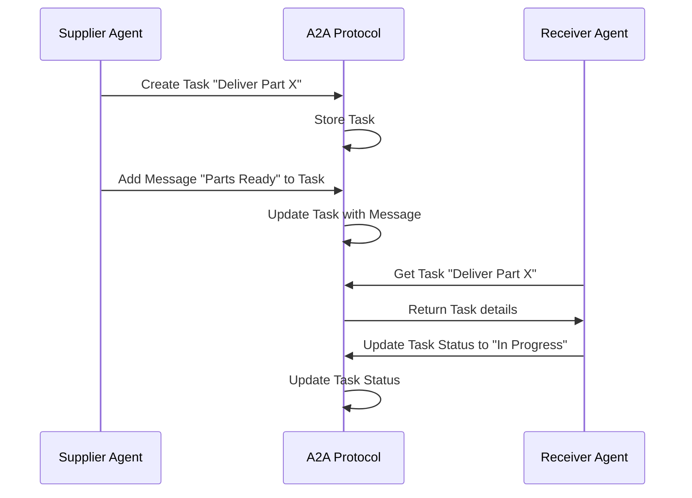

# Chapter 8: A2A (Agent-to-Agent) Protocol

Following on from our understanding of the [MCP (Model Context Protocol)](07_mcp__model_context_protocol_.md), we'll now explore how [Agents](04_agent.md) communicate directly with each other using the *A2A (Agent-to-Agent) Protocol*.

Imagine our factory needs to coordinate the delivery of parts between two robots. One robot, the "Supplier," has the parts, and the other, the "Receiver," needs them.  How do they communicate their needs and confirm the delivery?  That's where the A2A protocol comes in.

## Understanding A2A

The A2A protocol is like a messaging system specifically designed for our factory robots. It allows them to create tasks, assign them to each other, update their status, and share information related to the task.  Think of it as a sophisticated walkie-talkie system with added features for managing tasks.

## Key Concepts of A2A

1. **Tasks:** These represent actions that need to be performed, like "deliver part X to location Y."
2. **Messages:** These are short communications between agents regarding a task, like "Parts are ready for pickup" or "Delivery confirmed."
3. **Artifacts:** These are files or documents related to a task, like a blueprint or a delivery confirmation slip.

## Using A2A: Example - Delivering Parts

Let's see how our Supplier and Receiver robots would use A2A to coordinate the delivery:

1. **Supplier creates a task:**

```rust
// Simplified example - details omitted for clarity
use a2a::{Task, TaskStatus};

// ... other code ...

let task = Task {
    id: "delivery_123".to_string(),
    title: "Deliver Part X".to_string(),
    description: "Deliver Part X to Receiver Robot at Station A".to_string(),
    status: TaskStatus::Open,
    // ... other fields
};

let created_task = supplier_agent.create_task(task).await.unwrap();

// ...
```

This code snippet shows the Supplier robot creating a new task using the `create_task` function. This task is then stored and can be accessed by other agents.

2. **Supplier sends a message to Receiver:**

```rust
// Simplified example - details omitted for clarity
use a2a::Message;

// ... other code ...

let message = Message {
    sender: supplier_agent.get_agent_card().id,
    content: "Parts are ready for pickup at Station B".to_string(),
    // ... other fields
};

supplier_agent.add_task_message(&created_task.id, message).await.unwrap();

// ...
```

The Supplier adds a message to the task, informing the Receiver that the parts are ready.

3. **Receiver updates task status:**

```rust
// Simplified example - details omitted for clarity
use a2a::TaskStatus;

// ... other code ...

receiver_agent.update_task_status(&created_task.id, TaskStatus::InProgress).await.unwrap();

// ...
```

Upon receiving the message, the Receiver updates the task status to "In Progress," indicating they are working on it.


## Inside A2A: Implementation

Here's a sequence diagram illustrating the interaction:



The core A2A logic is implemented in `src/protocols/a2a.rs`.  Here's a simplified snippet for creating a task:

```rust
// src/protocols/a2a.rs
#[async_trait]
impl A2AProtocol for A2AAgent {
    // ... other code ...

    async fn create_task(&self, task: Task) -> Result<Task, String> {
        // ... (Implementation details omitted)
        // This function stores the task in the task store
    }

    // ... other functions for updating status, adding messages, etc.
}
```

This code defines the `create_task` function, which receives a `Task` object and stores it.  Similar functions exist for other A2A operations.

## Conclusion

The A2A protocol provides a structured way for [Agents](04_agent.md) to communicate and collaborate on tasks.  This is essential for coordinating actions within our factory, like the delivery of parts between robots. Next, we'll explore the [Standards Registry](09_standards_registry.md).


---

Generated by [AI Codebase Knowledge Builder](https://github.com/The-Pocket/Tutorial-Codebase-Knowledge)