# Chapter 8: Activity Orchestration (HMS-ACT & HMS-OMS)

*(If you just arrived, peek at the domain “wings” we snapped on in [Chapter 7: Domain-Specific Modules](07_domain_specific_modules__hms_med__hms_uhc__hms_mbl__etc___.md).)*  

---

## 1. Why Do We Need “Air-Traffic Controllers” for Workflows?

Story time:

> Jazmin renews her **U.S. Passport** online.  
>  1. The form is OCR-scanned by an **AI agent**.  
>  2. A **human clerk** confirms Jazmin’s photo meets ICAO specs.  
>  3. An **external printing plant** schedules a batch run at 3 a.m.  
>  4. Jazmin’s dashboard shows live status: *“Printing — ETA 5 days.”*

If any step stalls—say the printer is back-ordered—citizens call support and managers scramble.

**HMS-ACT** and **HMS-OMS** are the tower and runway lights that keep every take-off and landing safe:

| Piece | Nickname | Job |
|-------|----------|-----|
| **HMS-ACT** | “Flight Log” | Records every task, status change, and hand-off. |
| **HMS-OMS** | “Tower Sequencer” | Decides *who works next* and *when*, rerouting when priorities shift. |

---

## 2. High-Level Bird’s-Eye View

```mermaid
flowchart LR
  UI["Citizen Portal"] --> API["HMS-API"]
  API --> OMS["🛫 HMS-OMS (sequencer)"]
  OMS --> ACT["📒 HMS-ACT (log)"]
  OMS -->|assign| AGT["🤖 AI Agent"]
  OMS -->|assign| CLK["👩‍💼 Human Clerk"]
  OMS -->|assign| EXT["🏭 External Printer"]
  ACT --> DASH["📊 Manager Dashboard"]
```



* Every assignment is logged in **ACT**.  
* **OMS** re-orders or re-assigns when something blocks.  
* Managers watch **DASH** and can force reroutes in one click.

---

## 3. Key Concepts — One-by-One

| Term | Beginner Analogy | Description |
|------|------------------|-------------|
| **Activity** | A single flight | The smallest unit of work (e.g., *“Validate photo”*). |
| **Workflow** | Full flight plan | Ordered list of activities. |
| **Lane** | Runway | A resource pool (AI lane, Clerk lane, Printer lane). |
| **Token** | Boarding pass | ID handed to next lane so they know what to do. |
| **OMS Plan** | Control tower schedule | JSON/YAML file describing lanes & rules. |
| **ACT Ledger** | Black box | Append-only log of every status change for audits. |

---

## 4. Creating a Workflow — 3 Tiny Files

We’ll build the **Passport Renewal** workflow.

### 4.1 Define the Plan (10 lines)

```yaml
# file: passport.plan.yaml
id: passport_renewal
lanes:
  - ai_extract
  - human_verify
  - external_print
sequence:
  - ai_extract
  - human_verify
  - external_print
retry_policy: {attempts: 3, backoff_sec: 30}
```

*The tower knows the order and how to retry.*

### 4.2 Tiny Service to Kick Off a Job (18 lines)

```python
# file: create_job.py
import httpx, uuid, json
plan = "passport_renewal"
ticket = str(uuid.uuid4())

payload = {"plan": plan, "reference": ticket}
r = httpx.post("http://oms/start", json=payload)
print(r.json())
```

Output example:

```json
{"job_id":"JOB-123","state":"queued"}
```

### 4.3 Minimal AI Agent Stub (≤ 20 lines)

```python
# file: ai_agent.py
import requests, time, os, json

OMS = os.getenv("OMS_URL","http://oms")
while True:
    task = requests.get(f"{OMS}/pull?lane=ai_extract").json()
    if not task:                       # no work
        time.sleep(2); continue
    # 🎯 pretend we processed OCR
    result = {"passport_no":"987654321"}
    requests.post(f"{OMS}/complete", json={
        "task_id": task["task_id"],
        "output": result
    })
```

*Agent keeps polling its runway (`lane=ai_extract`).*

---

## 5. What Happens Under the Hood?


1. **OMS** creates tasks, logs them in **ACT**.  
2. Each worker pulls a task, reports back, next lane activates.  
3. **ACT** is append-only → perfect audit trail.

---

## 6. Peeking Inside OMS (Code-Light)

### 6.1 Task Table Schema (SQL-lite, 8 lines)

```sql
CREATE TABLE tasks (
  task_id    TEXT PRIMARY KEY,
  job_id     TEXT,
  lane       TEXT,
  status     TEXT,   -- queued / running / done / failed
  payload    JSON,
  created_at DATETIME DEFAULT CURRENT_TIMESTAMP
);
```

### 6.2 Scheduler Loop (Python, 14 lines)

```python
# file: oms/scheduler.py
def next_task(lane):
    cur = db.execute("""
      SELECT task_id,payload FROM tasks
      WHERE lane=? AND status='queued'
      ORDER BY created_at LIMIT 1""", (lane,))
    row = cur.fetchone()
    if row:
        db.execute("UPDATE tasks SET status='running' WHERE task_id=?", (row[0],))
    return row
```

*First-come-first-serve, **< 15 lines**.*

---

## 7. Manager Dashboards — Reading the Log

```python
# file: dashboard.py  (17 lines)
import pandas as pd, httpx

logs = httpx.get("http://act/stream?job=JOB-123").json()
df = pd.DataFrame(logs)          # id, status, lane, ts
print(df.pivot("lane","status","ts"))
```

Managers can filter by lane, status, or age.

---

## 8. Rerouting on the Fly

A clerk is overloaded; reassign the task to another lane:

```bash
curl -X POST http://oms/reroute \
     -d '{"task_id":"TASK-55","new_lane":"human_verify_backup"}'
```

OMS updates the row; ACT logs *“rerouted”*.

---

## 9. Common Beginner Questions

| Question | Quick Answer |
|----------|--------------|
| “Do I need Kafka?” | No. SQLite + REST works for small loads. Scale later with Postgres + RabbitMQ. |
| “How does an external system authenticate?” | Use the JWT guard at the gateway from [Chapter 4](04_backend_api_layer__hms_svc___hms_api__.md). |
| “Can OMS branch (if/else)?” | Yes—`sequence` accepts `when:` clauses. Start simple; add logic later. |

---

## 10. How ACT & OMS Connect to the Rest of HMS

```mermaid
graph TD
  OMS["🛫 HMS-OMS"] --> ACT["📒 HMS-ACT"]
  OMS --> API["🔗 HMS-API"]
  ACT --> OPS["🔭 HMS-OPS (logs)"]
  OMS --> AGT["🤖 HMS-AGT"]   %% next chapter
```

*   **OMS** gives assignments to agents built in [HMS-AGT](09_hms_agt___core_agent_framework__.md) (next chapter).  
*   All logs flow to **HMS-OPS** for metrics and alerts.  
*   APIs are exposed through the gateway you mastered in [Chapter 4](04_backend_api_layer__hms_svc___hms_api__.md).

---

## 11. Summary & What’s Next

You just learned:

1. **Why** we need orchestration (avoid mid-air collisions).  
2. The roles of **HMS-ACT** (log) and **HMS-OMS** (sequencer).  
3. How to define a plan, start a job, and watch AI & human lanes coordinate.  
4. Where rerouting, auditing, and dashboards plug in.

Now that the tower is ready, we need **pilots**—smart agents that actually _do_ the work.  
Meet them in [HMS-AGT  (Core Agent Framework)](09_hms_agt___core_agent_framework__.md).

---

---

Generated by [AI Codebase Knowledge Builder](https://github.com/The-Pocket/Tutorial-Codebase-Knowledge)