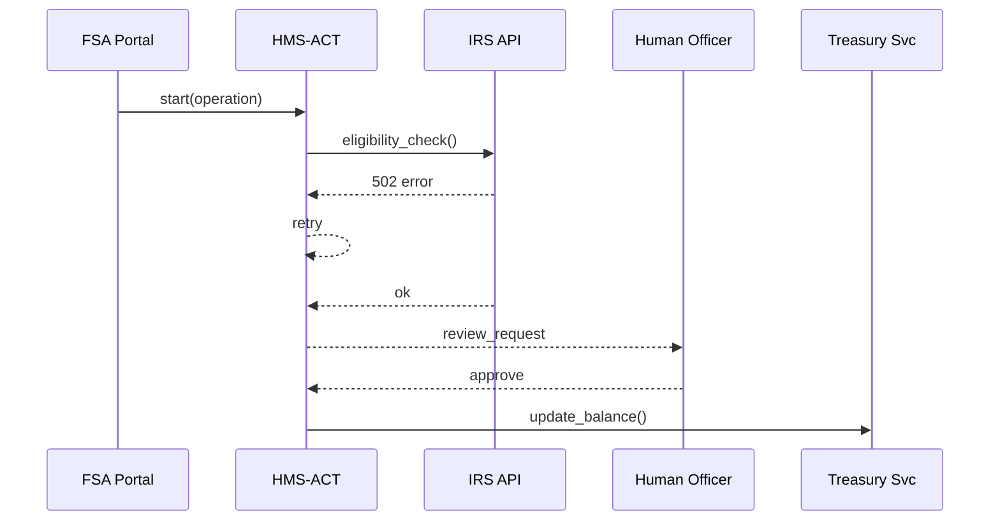

# Chapter 8: Activity & Workflow Orchestrator (HMS-ACT / HMS-OMS)

*(continuing from [Chapter 7: Human-in-the-Loop Oversight (HITL)](07_human_in_the_loop_oversight__hitl__.md))*  

---

## 1 · Why Do We Need an “Air-Traffic Controller”?

Imagine the **Federal Student Aid Office (FSA)** launches an online *“Loan-Forgiveness”* form.  
Behind that single “Submit” button hide many steps:

1. Validate the form fields.  
2. Check eligibility against income data.  
3. Ask a human reviewer to confirm edge cases.  
4. Notify Treasury to update the borrower’s balance.  
5. Send a status email to the applicant.

If any step stalls—**Who notices?**  
If an AI agent overrides a rule—**Who approved?**  
If the applicant calls—**Who can replay what happened?**

**HMS-ACT** (the engine) + **HMS-OMS** (the dashboard) solve these headaches.  
They turn every request, button-click, or batch job into a **tracked operation** you can pause, replay, or audit—just like an airport tower tracks every plane.

---

## 2 · Key Concepts (Plain Words)

| Term | Beginner Analogy | What It Means |
|------|------------------|---------------|
| Operation | A flight ID | One citizen request from start ➜ finish |
| Step | A waypoint | Single task inside an operation |
| Timeline | Flight recorder | Ordered log you can replay |
| SLA | Arrival time | Max allowed time per step |
| Retry | “Go-around” | Automatic re-attempt if a step fails |
| Checkpoint | Customs desk | Human approval before moving on |

---

## 3 · Five-Minute Quick-Start  
Let’s launch and watch one *Loan-Forgiveness* operation.

```python
# start_loan_flow.py  (18 lines)
from hmsact import Orchestrator, Step, Checkpoint

act = Orchestrator()                    # 1️⃣ connect

flow = [
    Step("validate_form", svc="FSA"),
    Step("eligibility_check", svc="IRS", sla="2m"),
    Checkpoint("human_review", role="fsa.officer"),
    Step("update_balance", svc="Treasury"),
    Step("notify_applicant", svc="Email")
]

op = act.start(name="loan_forgiveness", steps=flow)   # 2️⃣ launch
print(f"Operation ID: {op.id}")                       # 3️⃣ display
```

What happened?  
1. We connected to the orchestrator.  
2. `start()` created an **Operation** with 5 steps and stored it.  
3. The console prints something like `op_9f2e`.

---

### Watching Progress

```python
# poll.py
for evt in act.events(op.id):
    print(evt)
```

Example output:

```
00:00 VALIDATE_FORM → done
00:01 ELIGIBILITY_CHECK → failed, retry 1/3
00:03 ELIGIBILITY_CHECK → done
00:03 HUMAN_REVIEW → pending (waiting on officer)
```

---

## 4 · What’s Happening Under the Hood?



Only **five** actors; every message is timestamped and signed for audits.

---

## 5 · Deep Dive: Minimal Engine Internals

### 5.1 In-Memory State (simplified)

```python
# hmsact/state.py
operations = {}   # {op_id: {"cursor":0, "steps":[...]}}
```

### 5.2 Execution Loop (≤ 20 lines)

```python
# hmsact/engine.py
def tick(op_id):
    op = operations[op_id]
    step = op["steps"][op["cursor"]]

    if step.blocked():                 # waiting on human?
        return

    ok = step.run()                    # do the work
    timeline.log(op_id, step.name, ok)

    if not ok and step.can_retry():
        step.retry += 1
    elif ok:
        op["cursor"] += 1              # next step
```

Explanation  
• `blocked()` is `True` for a `Checkpoint` until someone approves via [HITL](07_human_in_the_loop_oversight__hitl__.md).  
• `timeline.log()` writes an immutable record to [Central Data Repository](19_central_data_repository__hms_dta__.md).  
• The loop is called by a scheduler every few seconds—simple!

---

## 6 · Playing Detective: Replaying a Timeline

```python
# replay.py
for line in act.timeline(op.id):
    print(line.pretty())
```

Sample replay:

```
[10:02:15] validate_form ✅
[10:02:16] eligibility_check ❌ (retry 1)
[10:02:18] eligibility_check ✅
[10:03:05] human_review ✋ waiting  (Officer: jdavis@fsa.gov)
```

You can answer an angry caller with real facts, not guesses.

---

## 7 · Connecting the Dots with Other Chapters

• Human approvals arrive through [HITL](07_human_in_the_loop_oversight__hitl__.md).  
• AI agents push steps via [AI Agent Framework](06_ai_agent_framework__hms_agt___hms_agx__.md).  
• Legal conflicts inside a step call [Legal Reasoning & Compliance Engine](03_legal_reasoning___compliance_engine__hms_esq__.md).  
• UI bricks show live status using `<hms-operation-banner>` in [HMS-MFE](04_micro_frontend_interface_layer__hms_mfe__.md).  

---

## 8 · Frequently Asked Beginner Questions

**Q: What happens if a step exceeds its SLA?**  
A: ACT emits `sla_breach` ➜ [Monitoring & Operations Center](20_monitoring___operations_center__hms_ops__.md) sends alerts.

**Q: Can I pause or cancel an operation?**  
A: Yes:

```python
act.pause(op.id)    # freezes at current step
act.cancel(op.id)   # marks as aborted, no further work
```

**Q: Do I need to write YAML files?**  
A: Not required. You can build flows in code (as above) or upload a JSON definition in the HMS-OMS web console.

---

## 9 · Hands-On Exercise

1. Install the SDK: `pip install hmsact`.  
2. Run `start_loan_flow.py` then `poll.py`.  
3. In the HMS-OMS dashboard, click **Approve** for the pending human review.  
4. Watch the operation finish automatically.

---

## 10 · What You Learned

1. **Operations** turn messy multi-service work into a single, traceable object.  
2. HMS-ACT enforces retries, SLAs, and checkpoints automatically.  
3. HMS-OMS lets managers replay any timeline to answer *“What happened?”*  

Ready to see where the actual business logic (services, databases, emails, etc.) lives?  
Jump ahead to [Chapter 9: Core Backend Service Layer (HMS-SVC)](09_core_backend_service_layer__hms_svc__.md).

---

Generated by [AI Codebase Knowledge Builder](https://github.com/The-Pocket/Tutorial-Codebase-Knowledge)