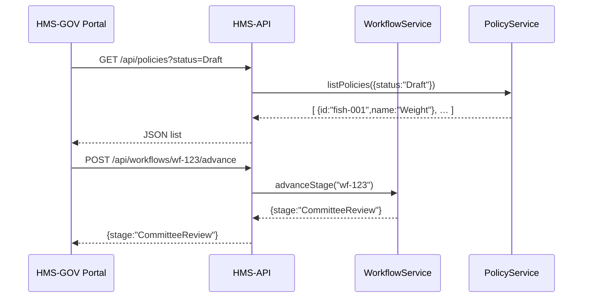

# Chapter 8: Admin/Gov Portal (HMS-GOV)

Welcome back! In [Chapter 7: Legislative Workflow](07_legislative_workflow_.md), we learned how a policy moves from **Draft** through committees, public comment, amendments, and final approval. Now it’s time to see the **Admin/Gov Portal (HMS-GOV)**—the secure “back office” web app where officials, managers, and stakeholders:

- Review AI proposals  
- Create or edit policies  
- Track and advance legislative workflows  
- Approve or reject items in their queue  

Think of it as the control room in a government agency.

---

## 1. Motivation & Central Use Case

Imagine you’re the Director of Fisheries for “State X.” You need to:

1. Log into the Admin Portal.  
2. See a dashboard of all **Draft** policies awaiting review.  
3. Open a new fishing-weight rule (from [Chapter 6: Policy](06_policy__domain_entity__.md)), read stakeholder comments, and either **Approve** or **Request Changes**.  
4. Check the AI Proposals queue—AI-generated suggestions for fish-tagging activities—and accept or reject them.  
5. Advance the legislative workflow to the “Active” stage once everything passes.

The Admin Portal brings all these actions into one place, secured by user roles and tokens.

---

## 2. Key Concepts

1. **Authentication & Roles**  
   - Officials use a Bearer token to sign in.  
   - Role-based UI shows or hides buttons (e.g., only “Managers” can activate policies).

2. **Navigation & Pages**  
   - **Dashboard**: Quick counts (Draft policies, pending AI proposals).  
   - **Policies**: List, search, and open policy cards.  
   - **Workflows**: See each policy’s current stage in the legislative pipeline.  
   - **AI Proposals**: Review and queue decisions.

3. **API Service**  
   - Wrapper around HMS-API endpoints.  
   - Adds auth headers automatically.  

4. **Approval Queue**  
   - Shows items (policies or proposals) awaiting your decision.  
   - “Approve” or “Reject” buttons call HMS-API to record your action.

---

## 3. How to Use the Admin Portal

### 3.1 Example: Viewing the Dashboard

- Open the portal at `http://localhost:4000/`.  
- The Dashboard shows:
  - Number of **Draft** policies.  
  - Number of pending AI proposals.  
  - Links to jump straight into review pages.

### 3.2 Example: Approving a Policy

1. Click **Policies** in the nav.  
2. Click on a policy card (e.g., “Fishing Weight Limit”).  
3. Read details and stakeholder feedback.  
4. Click **Approve**.  
5. Portal sends `POST /api/workflows/:id/advance` to HMS-API.  
6. You see a toast: “Policy moved to CommitteeReview.”

---

## 4. Under the Hood: Sequence Diagram



1. The portal requests **Draft** policies.  
2. HMS-API asks the **PolicyService**.  
3. Portal displays cards.  
4. When you advance a workflow, the portal calls HMS-API → **WorkflowService**.  
5. Stage updates, and you get confirmation.

---

## 5. Internal Implementation

Below is a minimal React setup to illustrate how the portal ties pages and API calls together.  

### 5.1 Front-End Routing (`src/App.js`)

```javascript
import React from 'react'
import { BrowserRouter, Route, Link } from 'react-router-dom'
import Dashboard from './pages/Dashboard'
import Policies from './pages/Policies'
import Workflows from './pages/Workflows'
import Proposals from './pages/Proposals'

// Simple nav and routes
export default function App() {
  return (
    <BrowserRouter>
      <nav>
        <Link to="/">Dashboard</Link> | 
        <Link to="/policies">Policies</Link> | 
        <Link to="/workflows">Workflows</Link> | 
        <Link to="/proposals">AI Proposals</Link>
      </nav>
      <Route exact path="/" component={Dashboard}/>
      <Route path="/policies" component={Policies}/>
      <Route path="/workflows" component={Workflows}/>
      <Route path="/proposals" component={Proposals}/>
    </BrowserRouter>
  )
}
```

This sets up four pages behind a navigation bar.

---

### 5.2 API Service Wrapper (`src/services/api.js`)

```javascript
const API_URL = 'http://localhost:3000/api'
const TOKEN = 'Bearer your-admin-token'

export default {
  get: async (path) => {
    const res = await fetch(API_URL + path, { headers: { Authorization: TOKEN } })
    return res.json()
  },
  post: async (path, body) => {
    const res = await fetch(API_URL + path, {
      method: 'POST',
      headers: { 'Content-Type': 'application/json', Authorization: TOKEN },
      body: JSON.stringify(body)
    })
    return res.json()
  }
}
```

Every page imports this module to talk to HMS-API, automatically sending the admin token.

---

## 6. Next Steps

With the **Admin/Gov Portal** in place, you now have the secure UI to:

- Browse and approve policies  
- Track workflows from Draft to Active  
- Process AI-generated proposals  

In the next chapter we’ll build a focused **PolicyDashboard** component to visualize policy data.

[Chapter 9: PolicyDashboard Component](09_policydashboard_component_.md)

---

Congratulations! You’ve just seen how HMS-GOV’s back-office web app ties together policies, workflows, and AI proposals into one clean, role-based interface—just like a modern government agency control room.

---

Generated by [AI Codebase Knowledge Builder](https://github.com/The-Pocket/Tutorial-Codebase-Knowledge)