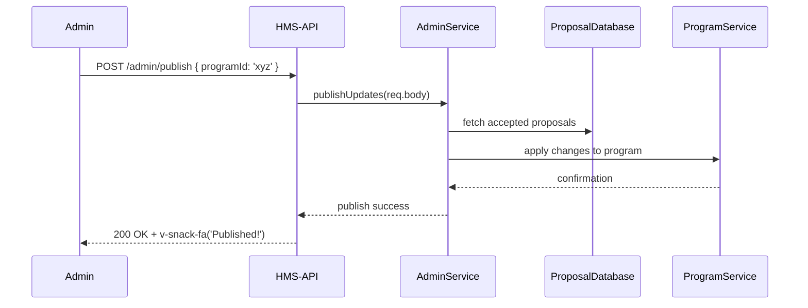

# Chapter 8: Admin Portal (HMS-GOV)

In [Chapter 7: AI Governance Framework](07_ai_governance_framework_.md) we set up rules to keep our AI components fair and transparent. Now it’s time to build the **Admin Portal**, also known as **HMS-GOV**, the governor’s dashboard where decision-makers draft, review, and publish regulations and program updates.

---

## 8.1 Why an Admin Portal?

Imagine the governor’s office needs a simple, secure web app to:

1. **Adjust program rules**  
   (e.g., change the income threshold for a “Green Energy Subsidy”)
2. **Review agent proposals**  
   (e.g., AI or county office suggestions to tweak policy)
3. **Publish updates**  
   (e.g., push new regulations live to all citizen portals)

Without a central portal, each team emails spreadsheets. With HMS-GOV, everything lives in one control room—no copying data, no delays.

---

## 8.2 Key Concepts

1. **Dashboard**  
   A home page with metrics (pending proposals, recent publishes).

2. **Program Settings**  
   Forms for editing program parameters. Uses UI components like `v-field-addon-start` to prepend labels or `avatar-stack-medium` to show responsible officers.

3. **Proposal Review**  
   A list of agent-submitted drafts. You can accept, reject, or request changes. Feedback shows up instantly.

4. **Publish Updates**  
   A final “launch” button. Under the hood, HMS-GOV calls the same APIs as citizen portals, so code stays DRY.

---

## 8.3 Getting Started: Initialize HMS-GOV

Below is a minimal setup. We’ll create an `AdminPortal`, tell it which pages to mount, and link it into our HMS-API.

```js
// File: hms-gov/bootstrap.js
import { AdminPortal } from 'hms-cdf/admin/portal'

// 1) Configure your portal
const govPortal = new AdminPortal({
  tenantId: 'state-no-poverty',
  pages: [
    { id: 'program-settings', title: 'Program Settings' },
    { id: 'proposals',       title: 'Agent Proposals'   },
    { id: 'publish',         title: 'Publish Updates'   }
  ]
})

// 2) Initialize (register routes & UI)
govPortal.initialize()
// → Portal is live under /admin
```

Explanation:  
- We give it our `tenantId` so branding and data are scoped.  
- Each `page` defines a menu item and a route under `/admin`.  
- `initialize()` wires up Express routes and UI container.

---

## 8.4 Building a Page: Program Settings

Let’s see how the **Program Settings** page works. We need a handler to fetch programs and render a form.

```js
// File: hms-gov/pages/programSettings.js
import { ProgramService } from 'hms-cdf/core/program'

export async function renderProgramSettings(req, res) {
  // 1) Load all programs for this tenant
  const programs = await ProgramService.list({ tenantId: req.tenant.id })
  // 2) Render a simple page (using your favorite templating)
  res.render('programSettings', { programs })
}
```

Explanation:  
- We call `ProgramService.list()` to get program blueprints.  
- The template `programSettings` loops through `programs` and shows editable fields with `v-field-addon-start` to label inputs.

---

## 8.5 Under the Hood: Routing & Handlers

Here’s a simplified look at `hms-cdf/admin/portal.ts`:

```ts
// File: hms-cdf/admin/portal.ts
import express from 'express'
import { renderProgramSettings } from './pages/programSettings'
import { renderProposalReview }   from './pages/proposalReview'
import { publishUpdates }         from './pages/publishUpdates'

export class AdminPortal {
  router = express.Router()

  constructor(private cfg) {}

  initialize() {
    // 1) Authentication for admins
    this.router.use(this.authMiddleware)

    // 2) Mount pages under /admin
    this.router.get('/program-settings', renderProgramSettings)
    this.router.get('/proposals',       renderProposalReview)
    this.router.post('/publish',        publishUpdates)

    // 3) Attach to main API
    ApiRouter.use('/admin', this.router)
  }

  private authMiddleware(req, res, next) {
    // Simplified check: only admins can proceed
    if (!req.user || !req.user.isAdmin) {
      return res.status(403).send('Forbidden')
    }
    next()
  }
}
```

Explanation:  
- **`this.router.use(authMiddleware)`** protects all admin pages.  
- We mount three routes:  
  - **GET /admin/program-settings** → shows form  
  - **GET /admin/proposals**       → lists proposals  
  - **POST /admin/publish**        → sends updates live  
- Finally, we plug `router` into the main `ApiRouter` at `/admin`.

---

## 8.6 Runtime Flow

Let’s follow what happens when an admin clicks **Publish Updates**:



Step-by-step:  
1. Admin posts to **/admin/publish**.  
2. **AdminService** loads all accepted proposals.  
3. It calls **ProgramService** to write new parameters.  
4. Response goes back, and the UI shows a green snack bar using `v-snack-fa`.

---

## 8.7 Recap & Next Steps

You’ve learned how to:

- Set up an **Admin Portal** for program management, proposal review, and publishing.  
- Break pages into simple handlers like `renderProgramSettings`.  
- Protect routes with an auth middleware.  
- Wire everything into **HMS-API** under `/admin`.  

Next up, we’ll build the citizen-facing **Market Portal** in [Chapter 9: Market Portal (HMS-MKT)](09_market_portal__hms_mkt__.md).

---

Generated by [AI Codebase Knowledge Builder](https://github.com/The-Pocket/Tutorial-Codebase-Knowledge)