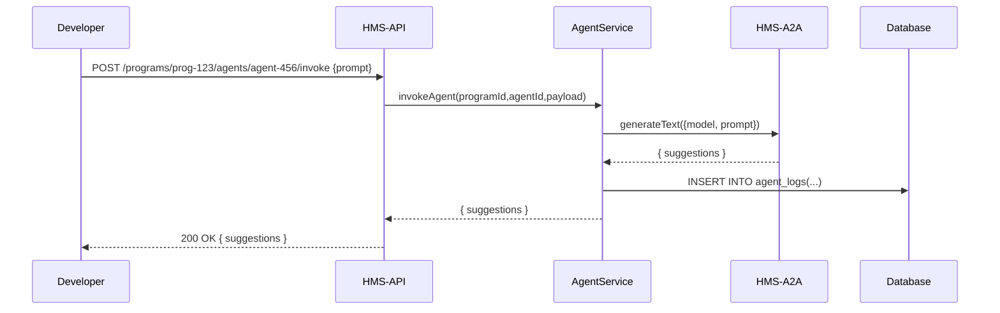
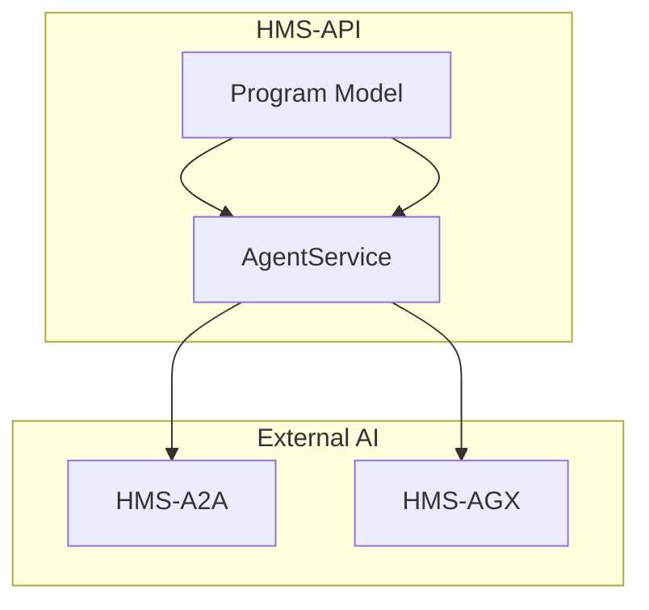

# Chapter 8: Agent Integration Layer

In [Chapter 7: Frontend Component Library](07_frontend_component_library_.md) we learned how to build consistent UIs. Now we’ll add a virtual policy aide—our **Agent Integration Layer**—that plugs AI (or human-in-the-loop) reps into HMS-API to read metrics, draft improvements, and ping managers for sign-off.

---

## 1. Motivation: Automated Policy Aid

Imagine a “Bridge Safety Inspection” program where:

- You collect daily inspection counts and delays.
- An AI agent reviews service metrics, drafts a process-improvement proposal.
- It then notifies the Program Manager with a summary.

Instead of manually analyzing charts, you register an **Agent** and call it via API—the Agent Integration Layer handles talking to external AI services (HMS-A2A for drafting text, HMS-AGX for analytics).

---

## 2. Key Concepts

• **Agent**  
  An AI or human-proxy that can be invoked to analyze data and produce suggestions.

• **Integration Layer**  
  Connects HMS-API’s domain models (Programs, Metrics) to external AI services (HMS-A2A, HMS-AGX).

• **HMS-A2A**  
  AI-to-AI service for natural-language tasks (e.g. draft memos).

• **HMS-AGX**  
  Analytics-generation service for statistical summaries and charts.

Think of Agents like “virtual interns” reading your program dashboard and drafting memos or charts on request.

---

## 3. Getting Started: Register & Invoke an Agent

### 3.1 Create an Agent

```js
// registerAgent.js
const { AgentService } = require('hms-api')

async function createAgent() {
  const agent = await AgentService.createAgent({
    name: 'BridgeSafety Analyst',
    type: 'AI',
    model: 'hms-a2a-gpt',       // chooses HMS-A2A service
    ownerProgramId: 'prog-123'
  })
  console.log('🤖 Agent ID:', agent.id)
}
createAgent().catch(console.error)
```
This sets up an AI agent tied to your Program.  

### 3.2 Invoke the Agent for Suggestions

```js
// runAgent.js
const { AgentService } = require('hms-api')

async function run() {
  const result = await AgentService.invokeAgent('prog-123','agent-456',{
    prompt: 'Review last week’s delays and suggest 3 improvements'
  })
  console.log('📋 Suggestions:', result.suggestions)
}
run().catch(console.error)
```
You get back a list of text suggestions drafted by HMS-A2A.

---

## 4. Under the Hood: Sequence Flow



---

## 5. Internal Implementation

### 5.1 Service Layer (`src/services/agent.service.ts`)

```ts
import { agentRepo } from '../repositories/agent.repo'
import { callA2A, callAGX } from '../integrations/ai-clients'

export async function invokeAgent(progId, agentId, { prompt }) {
  // 1. Load agent config
  const agent = await agentRepo.findById(agentId)
  // 2. Choose AI client
  const response = agent.model.startsWith('hms-a2a')
    ? await callA2A(agent.model, prompt)
    : await callAGX(agent.model, prompt)
  // 3. Log invocation
  await agentRepo.logInvocation({ agentId, prompt, response })
  return { suggestions: response.data }
}
```

- `callA2A` and `callAGX` wrap HTTP calls to external AI services.  
- We store every invocation for audit.

### 5.2 Integration Clients (`src/integrations/ai-clients.js`)

```js
// callA2A: wraps text-generation API
async function callA2A(model,prompt) {
  // minimal: POST to HMS-A2A endpoint
  return fetch(`https://api.hms-a2a/v1/${model}`,{
    method:'POST', body: JSON.stringify({ prompt })
  }).then(r=>r.json())
}
// callAGX: wraps analytics API
async function callAGX(model,payload) { /* similar */ }
```

These thin clients hide HTTP details from the service code.

---

## 6. Visualizing the Agent Layer



- **AgentService** acts as a bridge between your Programs and the AI endpoints.

---

## 7. Conclusion & Next Steps

You’ve learned how to:

- Register an **Agent** tied to your Program.  
- Invoke it to get text or analytics suggestions.  
- Peek under the hood at the service, repo, and AI-client layers.  

In the next chapter we’ll orchestrate these agents into full governance flows:

[Chapter 9: AI-Driven Governance Workflow](09_ai_driven_governance_workflow_.md)

---

Generated by [AI Codebase Knowledge Builder](https://github.com/The-Pocket/Tutorial-Codebase-Knowledge)