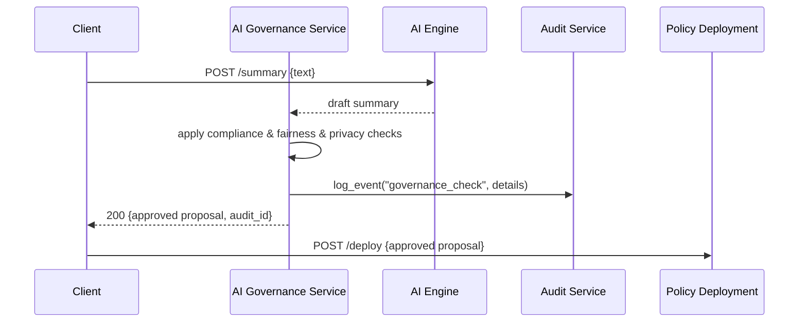

# Chapter 8: AI Governance Framework

Welcome back! In [Chapter 7: Policy Deployment Engine](07_policy_deployment_engine_.md) we saw how approved policies get packaged and rolled out to our services. Now it’s time to wrap all AI-driven processes in a layer of referees and rulebooks—our **AI Governance Framework**—to enforce transparency, fairness, safety, and privacy every step of the way.

---

## 1. Why an AI Governance Framework?

Imagine a public debate on new traffic laws. You’d hire referees and publish rulebooks so every speaker:
- Plays by the rules (fairness)  
- Uses approved facts only (safety)  
- Keeps personal data confidential (privacy)  
- Explains their arguments (transparency)  

In a government AI setting, we want the same guarantees. For example, when an AI agent suggests changes to immigration forms:
1. **Compliance Check:** Ensure suggestions follow existing statutes.  
2. **Fairness Filter:** Avoid biased language toward any group.  
3. **Privacy Guard:** Strip out sensitive personal data.  
4. **Audit Trail:** Record why and how the suggestion was made so stakeholders can verify it.

---

## 2. Key Concepts

1. **Governance Rules**  
   A set of policies (legal, ethical, privacy) loaded from a central store (see [HMS-SYS Audit Logging](01_core_system_platform__hms_sys__.md)).

2. **Enforcement Pipeline**  
   A chain of checks (compliance → fairness → privacy → explainability) that every AI output must pass.

3. **Audit & Explainability**  
   Every decision is logged with inputs, rules applied, and final verdict to help auditors and citizens trace the rationale.

4. **Governance Service**  
   A standalone microservice that wraps calls to the AI Engine and enforces these rules before releasing results.

---

## 3. Solving the Use Case

Let’s say our AI Engine generates a draft policy summary. We’ll call the **Governance Service** before using that summary.

```python
# client_request.py
import requests

# Step 1: Ask AI Engine for a draft summary
draft = requests.post("https://ai.gov/summary", json={"text": long_bill}).json()

# Step 2: Pass the draft through AI Governance
resp = requests.post(
  "https://governance.gov/enforce",
  json={"proposal": draft}
)
approved = resp.json()

print("Final Summary:", approved["text"])
print("Audit ID:", approved["audit_id"])
```

Explanation:
- We first get a raw draft from the AI Engine.
- Then we POST it to `/enforce` on the Governance Service.
- If it passes all rules, we receive a cleaned, safe, and logged proposal with an `audit_id`.

---

## 4. What Happens Under the Hood



1. **Client** requests a draft from the **AI Engine**.  
2. The draft is sent into the **Governance Service**.  
3. It runs each rule, logs decisions to **HMS-SYS**, and returns a safe, explainable proposal.  
4. Finally, the client may deploy it via the **Policy Deployment Engine**.

---

## 5. Inside the Governance Service

### a) Loading Governance Rules  
File: `governance_service/rules.py`  
```python
# governance_service/rules.py
import json

def load_rules():
    # Imagine reading from secure config or database
    return json.load(open("governance_rules.json"))
```
Explanation:  
We load a JSON file containing compliance checks, fairness thresholds, and privacy filters.

### b) Enforcement Pipeline  
File: `governance_service/enforce.py`  
```python
# governance_service/enforce.py
from .rules import load_rules
from hms_sys.audit import log_event

def enforce(proposal):
    rules = load_rules()
    # 1. Compliance check
    if not rules["legal"].check(proposal):
        raise ValueError("Compliance failed")
    # 2. Fairness check
    proposal = rules["fairness"].apply(proposal)
    # 3. Privacy filter
    proposal = rules["privacy"].sanitize(proposal)
    # 4. Log audit
    audit_id = log_event("governance_check", {"status": "passed"})
    return proposal, audit_id
```
Explanation:  
- We run compliance, fairness, and privacy in sequence.  
- We sanitize or transform the proposal if needed.  
- Finally, we log the check and return an `audit_id`.

### c) HTTP Endpoint  
File: `governance_service/app.py`  
```python
# governance_service/app.py
from flask import Flask, request, jsonify
from .enforce import enforce
app = Flask(__name__)

@app.route("/enforce", methods=["POST"])
def enforce_api():
    proposal = request.json["proposal"]
    approved, audit_id = enforce(proposal)
    return jsonify({"text": approved["text"], "audit_id": audit_id}), 200
```
Explanation:  
- We expose `POST /enforce` for clients to send AI drafts.  
- On success, we return the cleaned text and the audit identifier.

---

## 6. Summary

In this chapter, you learned how the **AI Governance Framework**:

- Loads and applies **transparency, fairness, safety, and privacy rules**  
- Wraps AI outputs in an **enforcement pipeline**  
- Logs every decision with **audit trails** via [HMS-SYS](01_core_system_platform__hms_sys__.md)  
- Returns explainable, compliant proposals ready for [Policy Deployment](07_policy_deployment_engine_.md)

Up next, we’ll see how individual citizens and clerks interact through smart agents in [Chapter 9: AI Representative Agent (HMS-A2A)](09_ai_representative_agent__hms_a2a__.md).

---

Generated by [AI Codebase Knowledge Builder](https://github.com/The-Pocket/Tutorial-Codebase-Knowledge)