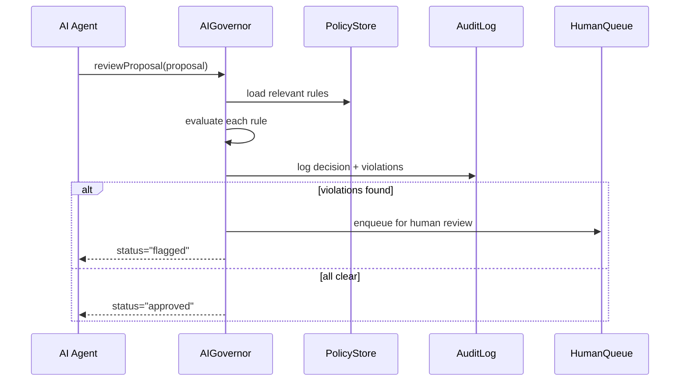

# Chapter 8: AI Governance Layer

Building on our smart agents from [Chapter 7: AI Agent Framework (HMS-A2A)](07_ai_agent_framework__hms_a2a__.md), it’s time to make sure every AI proposal follows the rules. Enter the **AI Governance Layer**—our constitutional framework for automated decision-makers.

## Why an AI Governance Layer?

Imagine the Chief Acquisition Officers Council (CAOC) uses an AI agent to suggest a new vendor-selection workflow. Or the U.S. Sentencing Commission runs an agent that proposes revised sentencing guidelines. Before those ideas go live, we need:

- A **policy rulebook** that codifies ethics, safety, transparency, privacy and statutory limits  
- A **review board** that automatically flags or rejects proposals violating regulations  
- A **log book** to record every decision for audits  
- A hand-off to **human approvers** when nuance or exceptions apply  

This layer sits above your services so no AI suggestion ever bypasses government regulations. Let’s see how it works!

## Key Concepts

1. **Policy Definitions**  
   Machine-readable rules (e.g., “No contract award > \$10M without human sign-off”).

2. **Proposal Review**  
   A function that runs each AI agent’s output against policies.

3. **Audit Logging**  
   Every check, pass, fail or human override is recorded for traceability.

4. **Flagging & Escalation**  
   Violations automatically move a proposal into a “needs human review” queue.

5. **Approval Workflow**  
   When policies pass, a proposal can auto-approve or await manual sign-off based on severity.

## Using the Governance Layer

Here’s a minimal example showing how an AI agent’s proposal flows through governance checks.

```javascript
// File: app.js
const { AIGovernor } = require('hms-gov-layer');

// 1. Initialize governance with a set of policies
const gov = new AIGovernor({
  policyServer: 'https://policies.fed.gov',
  humanApprovalThreshold: 10000000 // $10M
});

// 2. An AI agent builds a proposal
const proposal = {
  id: 'prop-001',
  type: 'acquisition-workflow',
  details: { estimatedValue: 12000000, steps: [...] }
};

// 3. Submit for review
const result = await gov.reviewProposal(proposal);

// 4. Check status
if (result.status === 'approved') {
  console.log('Auto-approved – safe to deploy');
} else if (result.status === 'flagged') {
  console.log('Flagged for human review:', result.violations);
}
```

Explanation:  
1. We create `AIGovernor` pointing to our policy server and set a threshold.  
2. The AI agent hands in a proposal (e.g., new acquisition steps worth \$12 M).  
3. `reviewProposal()` checks rules, logs its decisions, and returns a status.  
4. If `flagged`, the UI or a human-in-the-loop system picks it up.

### Example Output

```json
{
  "status": "flagged",
  "violations": [
    "Value exceeds auto-approval threshold of 10000000"
  ],
  "proposalId": "prop-001"
}
```

## What Happens Under the Hood?



1. **Agent → Governor**: AI agent submits its proposal.  
2. **Governor → PolicyStore**: Loads policies that apply to this proposal type.  
3. **Policy Evaluation**: Checks every rule (value thresholds, privacy filters, etc.).  
4. **AuditLog**: Records the outcome, including any flagged rules.  
5. **Flagging**: If violations exist, route to a HumanQueue; otherwise approve automatically.

## Inside the Governance Layer

Let’s peek at two core files: a policy checker and the governor itself.

### policyChecker.js

```javascript
// File: hms-gov-layer/policyChecker.js
function check(proposal, rules) {
  const violations = [];
  rules.forEach(rule => {
    if (!rule.predicate(proposal)) {
      violations.push(rule.message);
    }
  });
  return violations;
}
module.exports = { check };
```

- `rules` is an array of `{ predicate, message }`.  
- Each `predicate` is a function that returns `true` if the proposal passes.  
- Returns a list of `message` for failed rules.

### governor.js

```javascript
// File: hms-gov-layer/governor.js
const { check } = require('./policyChecker');
const { fetchRules } = require('./policyStore');
const { logDecision } = require('./auditLog');

class AIGovernor {
  constructor(config) { this.config = config; }
  async reviewProposal(proposal) {
    const rules = await fetchRules(proposal.type);
    const violations = check(proposal.details, rules);
    await logDecision(proposal.id, violations);
    if (violations.length) {
      // send to human if any violation
      await this._enqueueHuman(proposal, violations);
      return { status: 'flagged', violations, proposalId: proposal.id };
    }
    return { status: 'approved', proposalId: proposal.id };
  }
  // ... enqueue to human queue omitted
}
module.exports = { AIGovernor };
```

- `fetchRules()` gets the active policy definitions.  
- `check()` runs the rules, returning any violations.  
- `logDecision()` records everything for audits.  
- `_enqueueHuman()` passes flagged proposals to a human queue.

## Conclusion

In this chapter you learned how the **AI Governance Layer**:

- Encodes transparency, safety, ethics, truth and privacy into executable rules  
- Reviews every AI agent proposal against policy definitions  
- Logs all decisions and violations for auditing  
- Flags or auto-approves items, routing policy breaches to human reviewers  

Up next, we’ll dive into those human reviews and approvals in  
[Chapter 9: Human-in-the-Loop Oversight](09_human_in_the_loop_oversight_.md).

---

Generated by [AI Codebase Knowledge Builder](https://github.com/The-Pocket/Tutorial-Codebase-Knowledge)