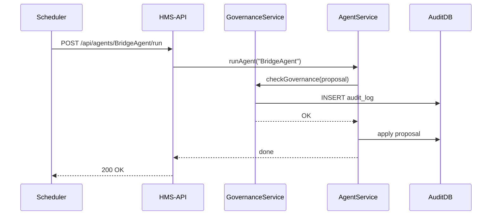

# Chapter 8: AI Governance Values

In [Chapter 7: External System Synchronization](07_external_system_synchronization_.md) we learned how HMS-AGX keeps all systems in sync when data or policies change. Now we’ll explore the “constitution” for our AI—**AI Governance Values**—the core principles that ensure every automated decision is transparent, truthful, safe, ethical, and respectful of privacy.

---

## 1. Why AI Governance Values?

Imagine the Department of Transportation uses an AI agent to prioritize pothole repairs. Without clear rules, the AI might:

- Send crews into unsafe zones (violating safety).
- Hide why one neighborhood got fixed before another (no transparency).
- Share citizen complaints publicly (privacy breach).

Just like a federal agency follows statutes and codes of conduct, our AI needs a “constitution” of values. These values guarantee that every decision is:

- Auditable  
- Aligned with public interest  
- Accountable to oversight  

### Central Use Case

A citizen files a bridge-inspection request in a high-traffic area. The AI agent suggests accelerating that inspection. Before applying that change, the system must verify:

1. Transparency: Log the decision and reasoning.  
2. Truth: Ensure the inspection data is correct.  
3. Safety: Confirm the inspector team is certified.  
4. Ethics: No favoritism (e.g., VIP privileges).  
5. Privacy: Don’t expose citizen location publicly.

Only if all checks pass does the action go live.

---

## 2. Key Concepts

1. Transparency  
   Every AI decision and its rationale is recorded for audits.

2. Truth  
   Data inputs are verified—no decisions on stale or incorrect data.

3. Safety  
   Actions must not put people or infrastructure at risk.

4. Ethics  
   AI must avoid biased or unfair outcomes.

5. Privacy  
   Personal data must be protected and not over-shared.

---

## 3. Applying Governance Values

We’ll build a tiny **governanceService** that:

1. Receives an AI proposal.  
2. Runs each value check.  
3. Logs the decision.  
4. Approves or rejects the proposal.

### 3.1 Governance Service

```js
// src/services/governanceService.js
async function checkGovernance(proposal) {
  // Simplified checks
  if (!proposal.reason) throw Error("Transparency failed");
  if (!verifyData(proposal.data)) throw Error("Truth failed");
  if (!isSafe(proposal)) throw Error("Safety failed");
  if (isBiased(proposal)) throw Error("Ethics failed");
  if (exposesPII(proposal)) throw Error("Privacy failed");
  await logProposal(proposal);
}
module.exports = { checkGovernance };
```
Explanation:
- We throw an error if any value fails.  
- `logProposal` writes details to an audit table.

### 3.2 Using the Governance Service

Before applying any AI action, call `checkGovernance`. Here’s how we integrate it into our agent runner:

```js
// src/services/agentService.js (excerpt)
const { checkGovernance } = require('./governanceService');

async function runAgent(name) {
  const agent = require(`../agents/${name}.js`);
  const insights = await agent.analyze();
  const proposals = agent.propose(insights);
  for (const p of proposals) {
    await checkGovernance(p);   // enforce values
    await agent.apply([p]);     // only if checks pass
  }
}
```
Explanation:
- Each proposal is vetted against our five core principles.  
- If any check throws, the action halts and an alert can be sent.

---

## 4. Under the Hood: Sequence Diagram



1. Scheduler triggers the agent.  
2. Agent generates a proposal.  
3. **GovernanceService** runs all five checks and logs the result.  
4. If everything passes, the proposal is applied.

---

## 5. Deeper Dive: Internal Implementation

### 5.1 Data Verification Helpers

```js
// src/services/governanceHelpers.js
function verifyData(data) {
  // Example: check timestamp freshness
  return Date.now() - new Date(data.timestamp) < 86400000;
}
function isSafe(p) { /* e.g., check certified inspectors */ return true; }
function isBiased(p) { return false; }
function exposesPII(p) { return false; }
async function logProposal(p) {
  await db.query(
    'INSERT INTO audit_log(agent, action, timestamp) VALUES($1,$2,NOW())',
    [p.agent, p.action]
  );
}
module.exports = { verifyData, isSafe, isBiased, exposesPII, logProposal };
```
Explanation:
- Helpers encapsulate each value check.  
- `logProposal` writes to a simple `audit_log` table.

### 5.2 Governance Service Wiring

```js
// src/services/governanceService.js
const { verifyData, isSafe, isBiased, exposesPII, logProposal } =
  require('./governanceHelpers');

async function checkGovernance(proposal) {
  if (!proposal.reason) throw Error("Missing rationale");
  if (!verifyData(proposal.data)) throw Error("Stale data");
  if (!isSafe(proposal)) throw Error("Safety violation");
  if (isBiased(proposal)) throw Error("Bias detected");
  if (exposesPII(proposal)) throw Error("Privacy breach");
  await logProposal(proposal);
}
module.exports = { checkGovernance };
```
Explanation:
- Clear errors guide developers which value failed.  
- Logging ensures audits can trace every decision.

---

## Conclusion

In this chapter, you learned how to embed core **AI Governance Values**—transparency, truth, safety, ethics, and privacy—into every automated decision. By vetting each proposal through a simple `governanceService`, we ensure our AI behaves like a trustworthy public servant.  

Next up: building the broader control framework in our [Governance Layer](09_governance_layer_.md).

---

Generated by [AI Codebase Knowledge Builder](https://github.com/The-Pocket/Tutorial-Codebase-Knowledge)