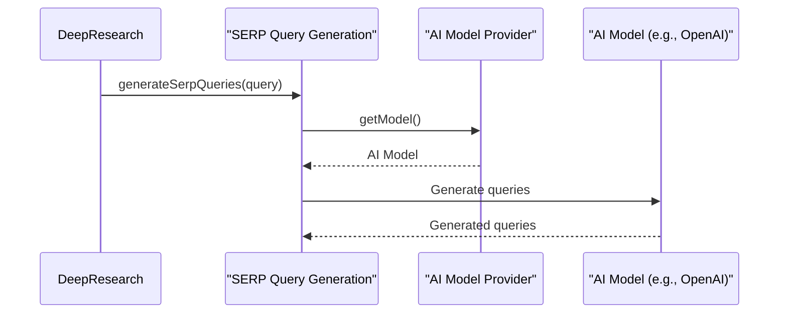

# Chapter 8: AI Model Provider

In the previous chapter, [Report Generation](07_report_generation_.md), we learned how the Deep Research Agent compiles its findings into a report. Now, let's explore the brains behind many of the agent's actions: the *AI Model Provider*.

Imagine you're asking for directions. You could ask a local, use a map app, or even ask a friendly robot! Each provides directions, but they might have different strengths and weaknesses. Similarly, the AI Model Provider lets HMS-AGX choose which "brain" (AI model) it uses for tasks like generating queries and extracting learnings.

## What is the AI Model Provider?

The AI Model Provider is like a switchboard that connects HMS-AGX to different AI models.  It's responsible for selecting and providing access to the AI model that powers tasks like [SERP Query Generation](04_serp_query_generation_.md), [Learning Extraction](05_learning_extraction_.md), and [Report Generation](07_report_generation_.md).  This allows HMS-AGX to be flexible and use different AI models depending on the task and available resources.

## Using the AI Model Provider

You don't directly interact with the AI Model Provider.  Instead, other parts of the code, like the functions for generating SERP queries and extracting learnings, use it behind the scenes.  Think of it like the engine in your car – you don't directly control the pistons, but they're essential for making the car move.

The `getModel` function is the main way to access the chosen AI model.  Here's a simplified example:

```typescript
// src/ai/providers.ts
export function getModel(): LanguageModelV1 {
  // ... (Logic to select the appropriate model)
  return model;
}
```

This function returns the selected AI model, which can then be used for various tasks.

## Inside the AI Model Provider

Here's a simplified sequence diagram showing how the AI Model Provider is used:



1.  A function like `generateSerpQueries` needs to use an AI model.
2.  It calls `getModel()` from the AI Model Provider.
3.  The AI Model Provider returns the selected AI model.
4.  The function then uses the AI model to perform its task.

Here's a simplified look at how the `getModel` function selects a model:

```typescript
// src/ai/providers.ts
export function getModel(): LanguageModelV1 {
  if (customModel) {
    return customModel; // Use a custom model if specified
  }

  const model = deepSeekR1Model ?? o3MiniModel; // Choose between available models
  if (!model) {
    throw new Error('No model found'); // Throw an error if no suitable model is found
  }

  return model;
}
```

The `getModel` function prioritizes a custom model if one is specified. Otherwise, it chooses between available models like `deepSeekR1Model` and `o3MiniModel`.  This allows for flexibility and allows you to use different AI models depending on your needs and available API keys.

## Conclusion

This chapter explained how the AI Model Provider acts as a central point for accessing different AI models. This allows HMS-AGX to be flexible and use the best model for each task.  In the next chapter, [Text Splitter](09_text_splitter_.md), we'll learn how HMS-AGX handles large texts that exceed the AI model's input limits.


---

Generated by [AI Codebase Knowledge Builder](https://github.com/The-Pocket/Tutorial-Codebase-Knowledge)